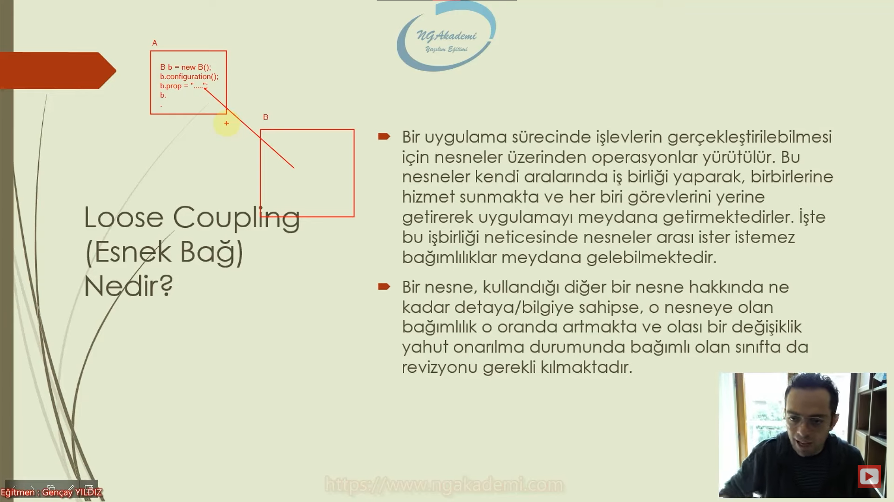
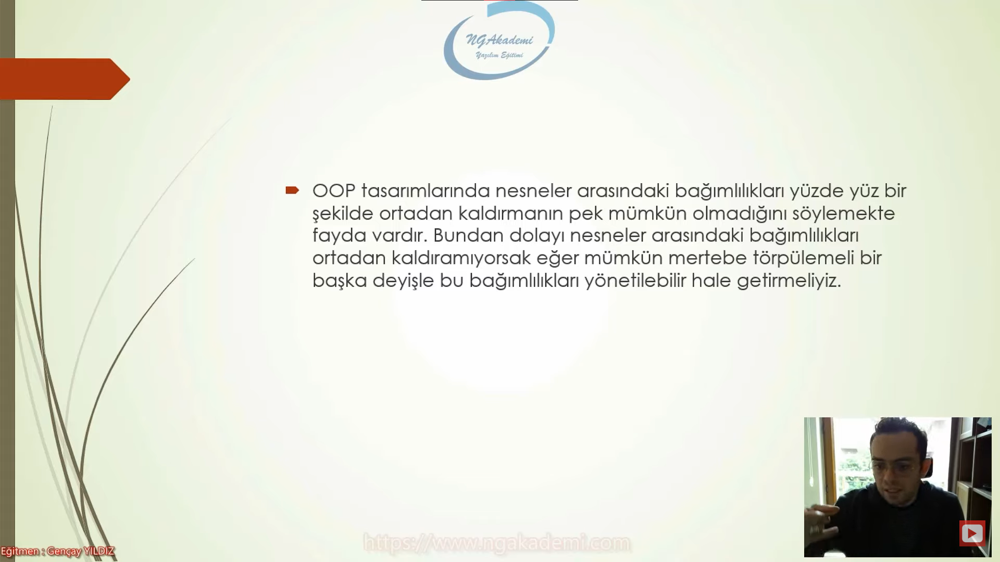
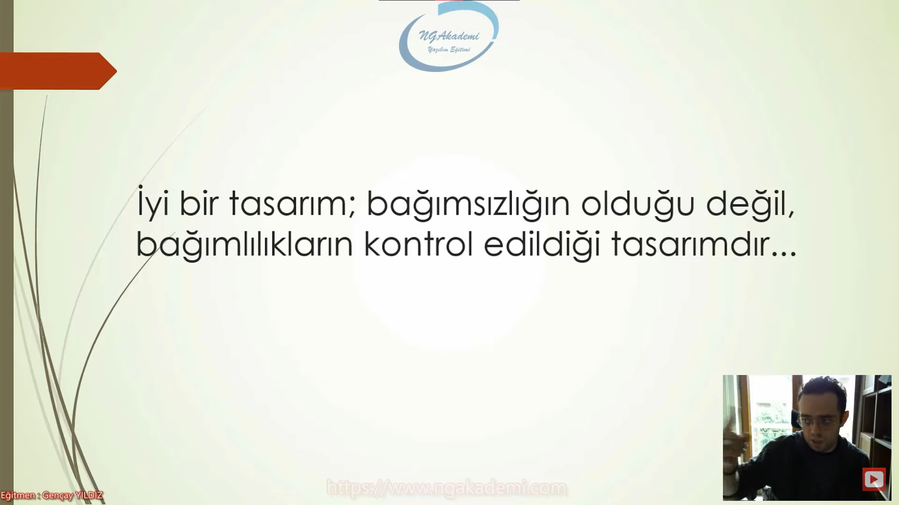
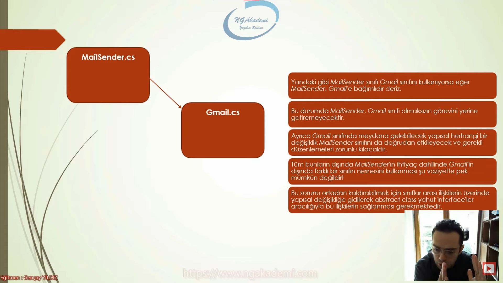
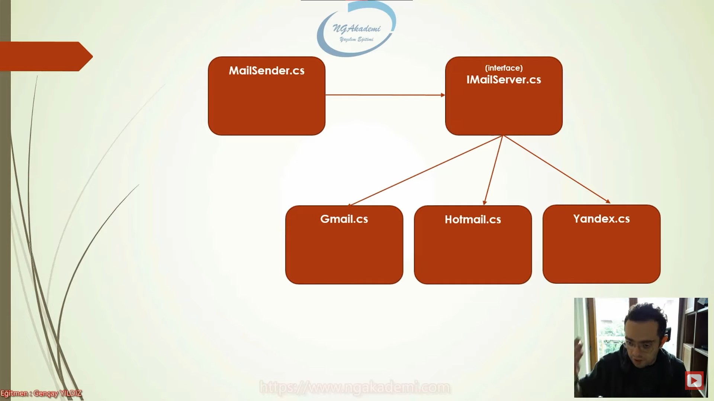

# Loose Coupling
- Prensipler senaryolara uygun bir şekilde davranışları dayatmaktan ziyade o senaryolardaki gidişatın farkındalığını sağlayan şeylerdir. 
- Bu prensipler bizim her daim doğruyu yaptığımızın inancını sağlayacak temel davranışlarımızın ilkeleridir.
# Loose Coupling(Esnek Bağ) Nedir?
- Kod yazarken kod inşa etme sürecinde nesneleriniz arasında bir işbirliği varsa bu işbirliğini tight coupling'ten(Sıkı bağımlılık) ziyade mümkün mertebe loose coupling(esnek bağımlılık) olarak tasarlamızı ister.
- Bir uygulama sürecinde işlevlerin gerçekleştirilebilmesi için nesneler üzerinden operasyonlar yürütülür. Bu nesneler kendi aralarında iş birliği yaparak birbirlerine hizmet sunmakta ve her biri görevlerini yerine getirerek uygulamayı meydana getirmektedirler.İşte bu işbirliği neticesinde nesneler arası ister istemez bağımlılıklar meydana gelebilmektedir.
- İki nesne aralarında işbirliği yapıyorsa yani bir nesne farklı bir nesneyi kullanıyorsa burada bir bağımlılık var demektir.
- Her şeyde bağımlılık olacak bağımlılık yok diye bir durum yok Loose Coupling bu bağımlılığı mümkün mertebe esnek bir şekilde tasarla kardeşim diyor.
- Bir nesne kullandığı diğer bir nesne hakkında ne kadar detaya/bilgiye sahipse o nesneye olan bağımlılık o oranda artmakta ve olası bir değişiklik yahut onarılma durumunda bağımlı olan sınıfta da revizyonu gerekli kılmaktadır.

***



***

- OOP tasarımlarında nesneler arasındaki bağımlılıkları yizde yiz bir şekilde ortadan kaldırmanın pek mümkün olmadığını söylemekte fayda vardır. Bundan dolayı nesneler arasındaki bağımlıkları ortadan kaldıramıyorsak eğer mümkün mertebe törpülemeli bir başka deyişle bu bağımlıkları yönetilebilir hale getirmeliyiz.

***



***

## <span style="color : greenyellow">İyi bir tasarım; bağımsızlığın olduğu değil, bağımlılıkların kontrol edildiği tasarımdır...</span>

***




***

# Dependency
```C#
namespace Loose_Coupling_Dependency;
class MailSender
{
    public void Send()
    {
        // Gmail gmail = new();
        // gmail.Send("musa.uyumaz@gmail.com");
        Hotmail hotmail = new();
    }
}
class Gmail
{
    public Gmail()
    {

    }
    public void Send(string to)
    {
        //..
    }
}
class Hotmail
{

}
```
***



***

# Dependency
```C#
namespace Loose_Coupling_Dependency;
class MailSender
{
    public void Send(IMailServer mailServer)
    {
        mailServer.Send("filanca@falanca.com","LayyHn")
    }
}
interface IMailServer
{
    void Send(string to, string body);
}
class Gmail : IMailServer
{
    public void Send(string to, string body)
    {
        //..
    }
}
class Hotmail : IMailServer
{
    public void Send(string to, string body)
    {
        //..
    }
}
class Yandex : IMailServer
{
    public void Send(string to, string body)
    {
        //..
    }
}
```

## <span style="color : greenyellow">Bağımlılık arz eden nesneler kendi aralarında direkt tight coupling(sıkı bağımlılık) kurmaktansa bu bağımlıkları interfacelerle(arayüzlerle) abstract classlarla yönetilebilir hale getir. </span>