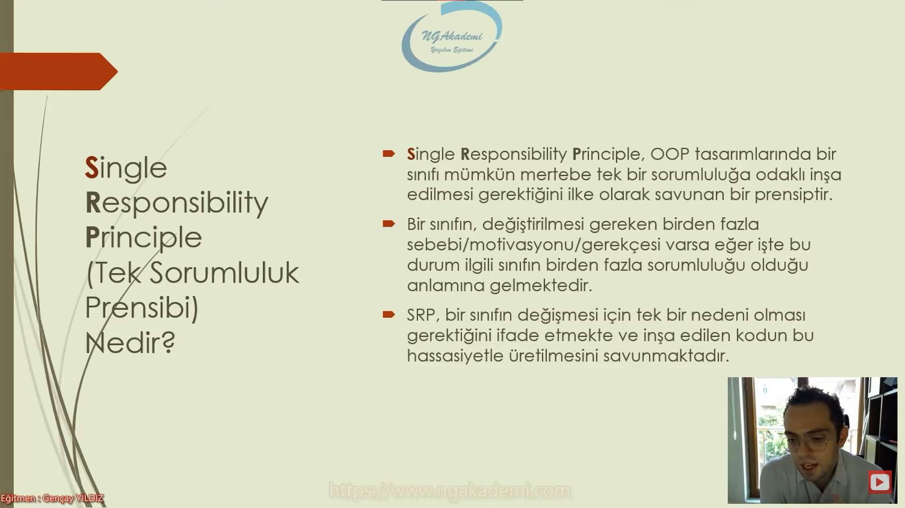
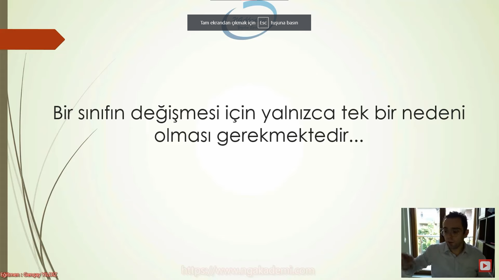
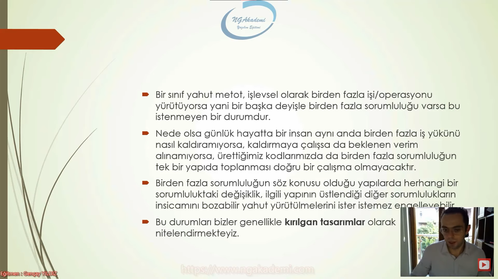
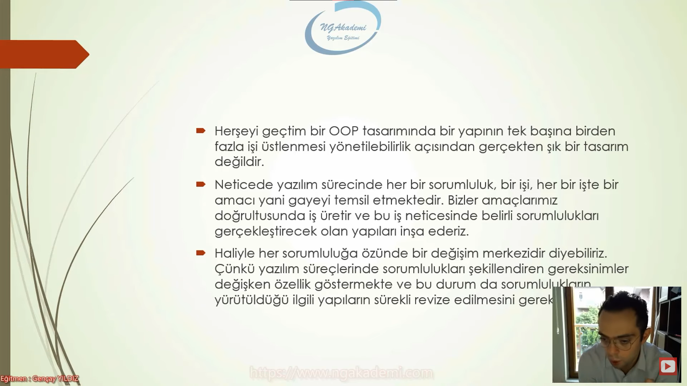
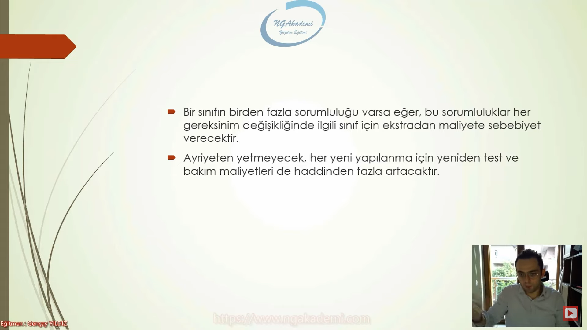
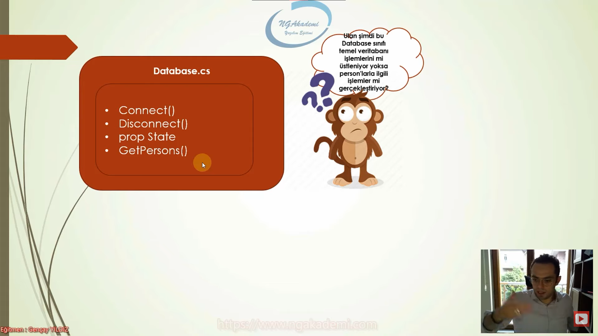

# Single Responsibility Principle (Tek Sorumluluk Prensibi) Nedir?
- Prensipler gerçek hayattan alınan burada/yazılım süreçlerinde uygulanan aklın yolu bir olmanın sonuçlarıdır.
- Aynı anda/zamanda birden fazla işi yapmaya çalışmanın maliyeti hiç yapmamaktan daha fazladır.
- Aynı zamanda birden fazla işi yapmanın riski/kritiği çok fazladır. Yani risk oranı artmaktadır.
- Single Responsibility Principle OOP tasarımında bir sınıfı mümkün mertebe tek bri sorumluluğa odaklı inşa edilmesi gerektiğini ilke olarak savunan bir prensiptir.
- Bir sınıfın değiştirilmesi gereken birden fazla sebebi/motivasyonu/gerekçesi varsa eğer işte bu durum ilgili sınıfın birden fazla sorumluluğu olduğu anlamına gelmektedir.
- SRP bir sınıfın değişmesi için tek bir nedeni olması gerektiğini ifade etmekte ve inşa edilen kodun bu hassasiyetle üretilmesini savunmaktadır.

***



***

- Bir sınıfın değişmesi için yalnızca tek bir nedeni olması gerekmektedir...

***



***

- Bir sınıf yahut metot, işlevsel olarak birden fazla işi/operasyonu yürütüyorsa yani bir başka deuişle birden fazla sorumluluğu varsa bu istenmeyen bir durumdur.
- Nede olsa günlük hayatta bir insan aynı anda birden fazla iş yükünü nasıl kaldıramıyorsa, kaldırmaya çalışsa da beklenen verim alınamıyorsa , üretiiğimiz kodlarımızda da birden fazla sorumluluğun tek bir yapıda toplanması doğru bir çalışma olmayacaktır.
- Birden fazla sorumluluğun söz konusu olduğu yapılarda herhangi bir sorumluluktaki değişiklik, ilgili yyapının üstlendiği diğer sorumlulukların insicamını bozabilir yahut yürütülmelerini ister istemez engelleyebilir.
- bu durumları bizler genellikle kırılgan tasarımlar olarak nitelendirmekteyiz.

***



***

- Herşeyi geçtim bir OOP tasarımında bir yapının tek başına birden fazla işi üstlenmesi yönetilebilirlik açısından gerçekten şık bir tasarım değildir.
- Neticede yazılım sürecinde her bir sorumluluk bir işi her bir işte bir amacı yani gayeyi temsil etmektedir. Bizler amçlarımız doğrultusunda iş üretir ve bu iş neticesinde belirli sorumlulukları gerçekleştirecek olan yapıları inşa ederiz.
- Haliyle her sorumluluğa özünde bir değişim merkezidir. Çünkü yazılım süreçlerinde sorumlulukları şekillendiren gereksinimler değişken özellik göstermekte ve bu durum da sorumluklarınn yürütüldüğü ilgili yapıların sürekli revize edilmesini gerektirmektedir.

***



***

- Bir sınıfın birden fazla sorumluluğu varsa eğer bu sorumluluklar her gereksinim değişikliğinde ilgili sınıf için ekstradan maliyete sebebiyet verecektir.
- Ayriyeten yetmeyecek her yeni yapılanma için yeniden test ve bakım amliyetleri de haddinden fazla artacaktır.
- Herhangi bir operasyon gerçekleştireceksen o operasyonu barındıracak olan sınıf o operasyonun genel manadaki sorumluluğuna odaklanmış bir sınıf olması gerekiyor.
***



***

# Örnek
***




***

# İdeal Olmayan Kod
```C#
class Database 
{
    public coid Connect()
    {
        //...
        Console.WriteLine("Veritabanı bağlantısı sağlanmıştır.");
    }
    public void Disconnect()
    {
        //...
        Console.WriteLine("Veritabanı bağlantısı kesilmiştir.");
    }
    public string State { get; set; }
    public List<Person> GetPersons()
    {
        return new() {
            new() {Name ="Hilmi", Surname ="Celayir"},
            new() {Name ="Mustafa", Surname ="Yıldız"},
            new() {Name ="Cafer", Surname ="Muiddinoğlu"}
        };
    }

}
```

# İdeal Kod
```C#
class Database 
{
    public coid Connect()
    {
        //...
        Console.WriteLine("Veritabanı bağlantısı sağlanmıştır.");
    }
    public void Disconnect()
    {
        //...
        Console.WriteLine("Veritabanı bağlantısı kesilmiştir.");
    }
    public string State { get; set; }
    
}
class PersonService
{
    public List<Person> GetPersons()
    {
        return new() {
            new() {Name ="Hilmi", Surname ="Celayir"},
            new() {Name ="Mustafa", Surname ="Yıldız"},
            new() {Name ="Cafer", Surname ="Muiddinoğlu"}
        };
    }
}
```