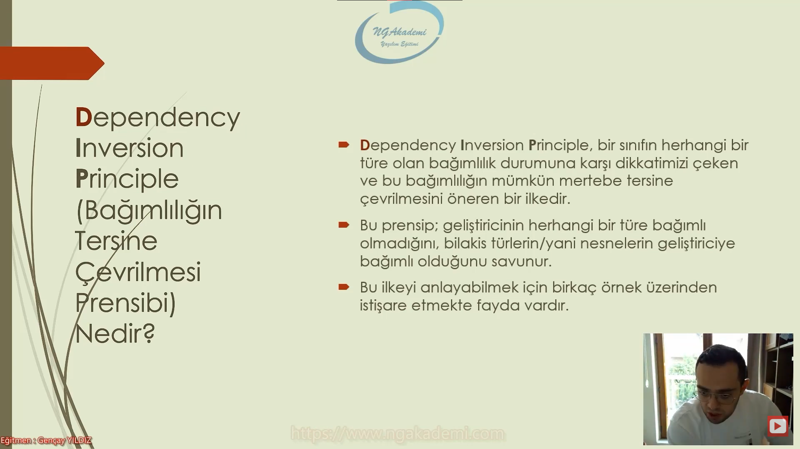
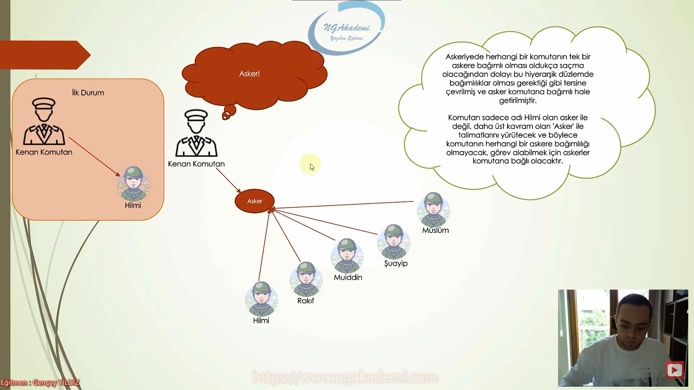
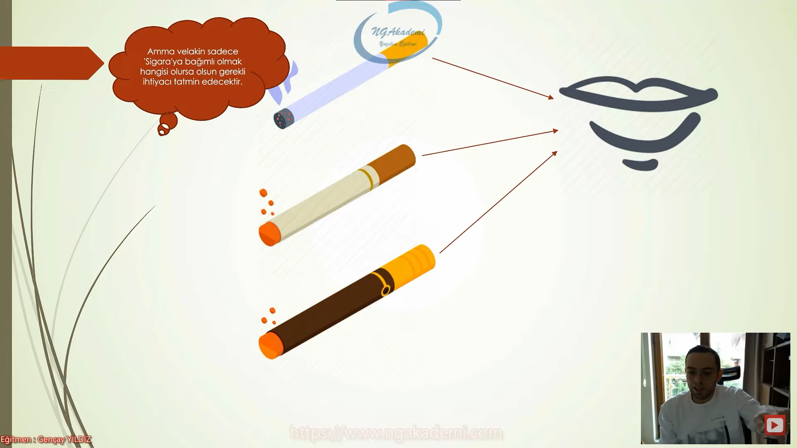
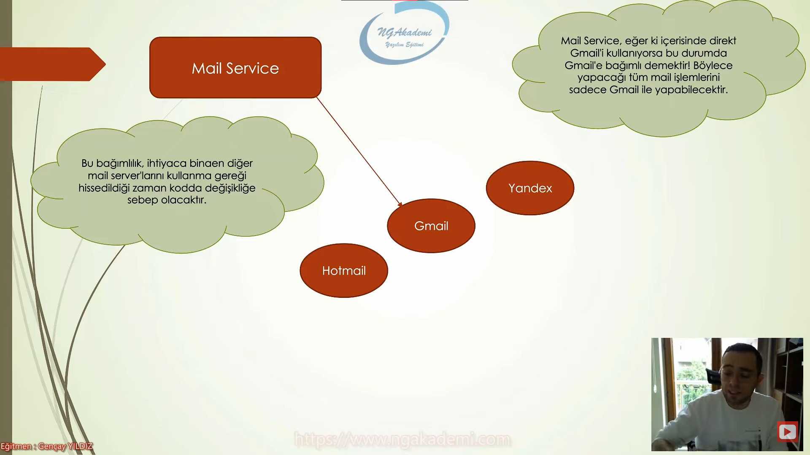
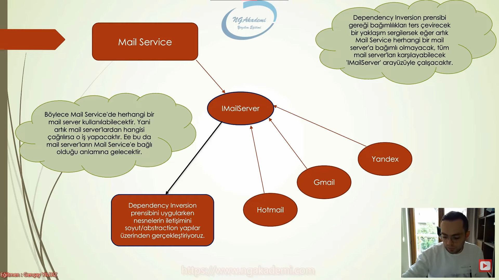
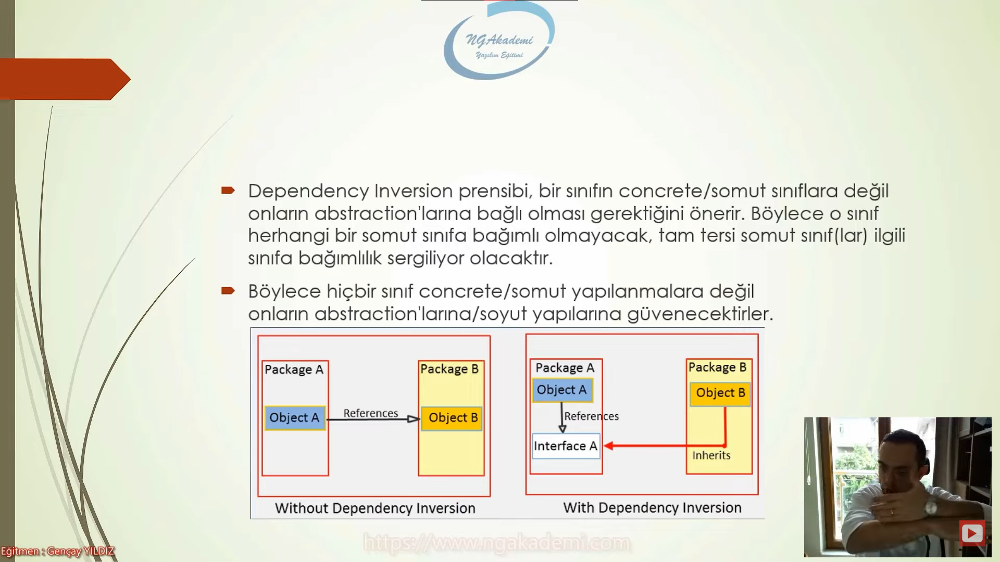
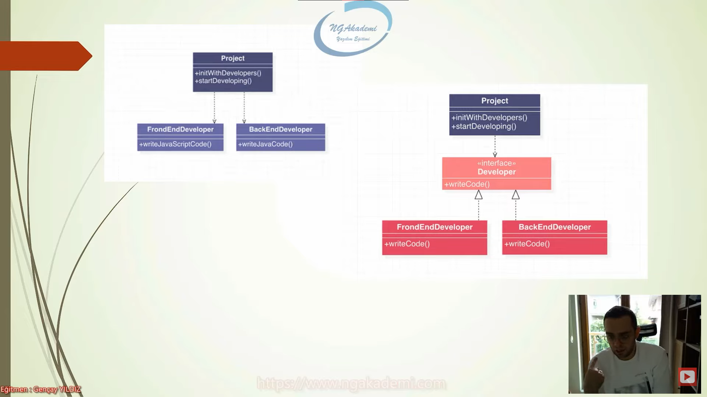
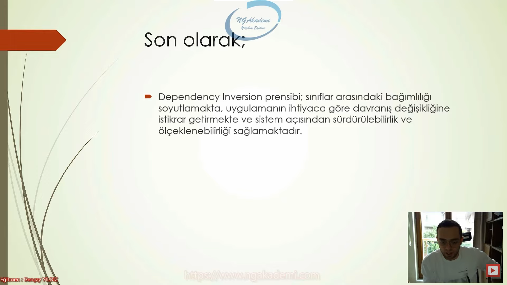

# Dependency Inversion Principle(Bağımlılığın Tersine Çevrilmesi Prensibi) Nedir?
- Dependency Inversion Principle günümüzde yoğun bir şekilde kullanmış olduğumuz bir davranışın temelini oluşturan bir ilkedir. Bu davranış IoC(Inversion of Control) dediğimiz mantığın temilini oluşturuyor.

- Inversion of Control(IoC) mekanizmalarını kullanabilmek için biz Dependency Injection dediğimiz bir tasarımı(Design Pattern)'ı uyguluyoruz 

- Bu prensibin teknik boyutu yoğun olarak kullanılan Dependency Injection'ının ta kendisidir.

- Bağımlıkları tersine çevir. Mümkün mertebe olayı hani bir kurgudaki aktörü herhangi bir davranışa bağımlı kılma davranışları sen aktöre bağımlı kıl.

- Dependency Inversion Principle, bir sınıfın herahngi bir türe olan bağımlılık durumuna karşı dikkatimizi çeken ve bu bağımlılığın mümkün mertebe tersine çevrilmesini öneren bir ilkedir.

- Bu prensip; geliştiricinin herhangi bir türe bağımlı olmadığını bilakis türlerin/yani nesnelerin geliştiriciye bağımlı olduğunu savunur.

***






***
- Dependency Inversion prensibini uygularken nesnelerin iletişimini soyut/abstraction yapılar üzerinden gerçekleştiriyoruz.
- Bu prensibi/mantığı uygularken koduna bu mantığı inşa ederken arayüzleri kullanıyorsun.

***



***

# İdeal Olmayan Kod
```C#
class MailService
{
    public void SendMail(Gmail gmail)
    {
        gmail.Send("...");
    }
}

class Gmail
{
    public void Send(string mail)
    {
        //...Send Mail...
    }
}
class Yandex
{
    public void SendMail(string mail, string to)
    {
        //...Send Mail...
    }
}
class Hotmail
{
    public void Send(string mail)
    {
        //...Send Mail...
    }
}

#region Not Ideal Code
MailService mailService = new();
mailService.SendMail(new Gmail());
#endregion
```
```C#
class MailService
{
    public void SendMail(IMailServer mailServer, string to, string body)
    {
        mailServer.Send(to, body);
    }
}

interface IMailServer
{
    void Send(string to, string body);
}
class Gmail : IMailServer
{
    public void Send(string to, string body)
    {
        //...Send Mail...
    }
}
class Yandex : IMailServer
{
    public void Send(string to, string body)
    {
        //...Send Mail...
    }
}
class Hotmail : IMailServer
{
    public void Send(string to, string body)
    {
        //...Send Mail...
    }
}

#region Ideal Code
MailService mailService = new();
mailService.SendMail(new Gmail(), "...", "...");
mailService.SendMail(new Hotmail(), "...", "...");
#endregion
```
***
<h1 style="color:yellowgreen"> Yazılımda gidişat tek bir davranışa bağımlı olmamalı, bilakis davranışlar sizin kararınıza bağımlı olmalı</h1>

- Sen yazılımda herhangi bir operasyon çekeceksen eğer o operasyonu bir nesneye/sınıfa/davranışa bağımlı hale getirmeyeceksin davranışları/sınıfları/nesneleri orada iradenle kullanabilecek şekilde sana bağımlı halde modelleyeceksin.   

***


***

- Dependency Inversion prensibi bir sınıfın concrete/somut sınıflara değil onların abstraction'larına bağlı olmasını gerektiğini önerir. Böylece o sınıf herhangi bir somut sınıfa bağımlı olmayacak, tam tersi somut sınıf(lar) ilgili sınıfa bağımlılık sergiliyor olacaktır. 

- Böylece hiçbir sınıf concrete/somut yapılanmalara değil onların abstraction'larına/soyut yapılarına güvenecektir. 

- Interface denen kavram bir sözleşmedir. Haliyle sen davranışa değil sözleşmeye güvenirsin O sözleşmeye göre ortaya davranış çıkar.

- Seninle bir sözleşme yapacağım. Ben burada senin yapacağın işe güvenmiyorum. Ben sözleşmeye güveniyorum. Bu sözleşme neticesinde senden o davranışı bekliyorum.

- Dependency Inversion'da sınıflar arasındaki ilişkileri sağlarken somut yapılanmalar yerine abstractionları tercih etmemiz bizim davranışlarda abstractionlara güvenmemiz demek oluyor.

- Bir sınıf başka bir sınıfın davranışını içerisine alıp çalıştıracaksa/tetikleyecekse burada bir tane sınıf bile olsa sen bunu interface ile al ki ideal kodun temellerini atmış ol

- Bir sınıfın içerisinde farklı bir sınıfın instance'ını davranış olarak kullanacaksan artık bu sınıfı sen interface aracılığı ile bu sınıfın içine alacaksın. 

***




***

- Dependency Inversion Prensibi sınıflar arasındaki bağımlılığı soyutlamakta, uygulamanın ihtiyaca göre davranış değişikliğine iskitkrar getirmekte ve sistem açısından sürdürülebilirlik ve ölçeklenebiliriliği sağlamaktadır.

***



***