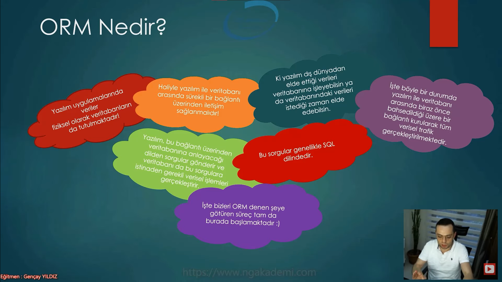
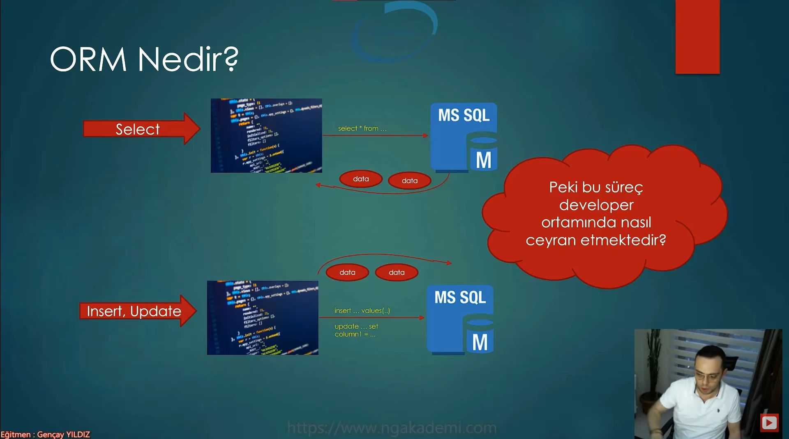
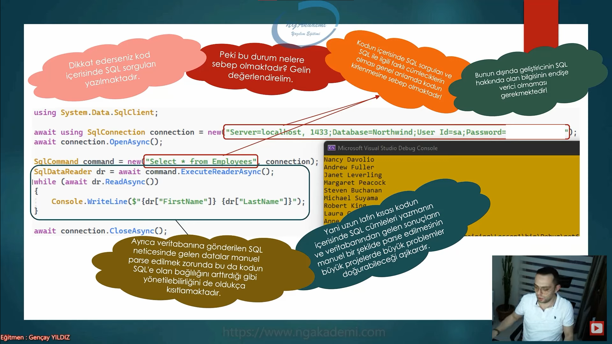
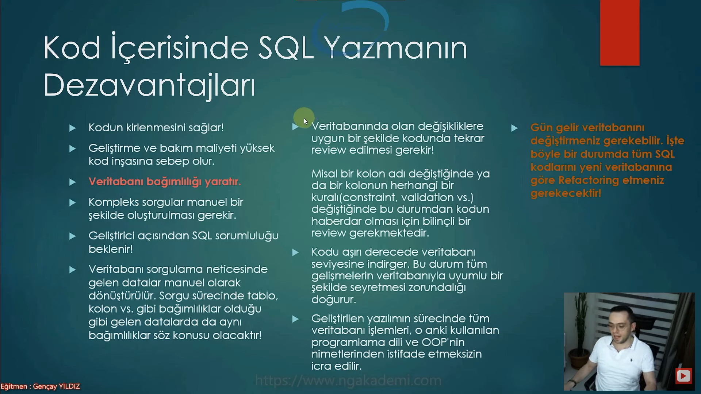
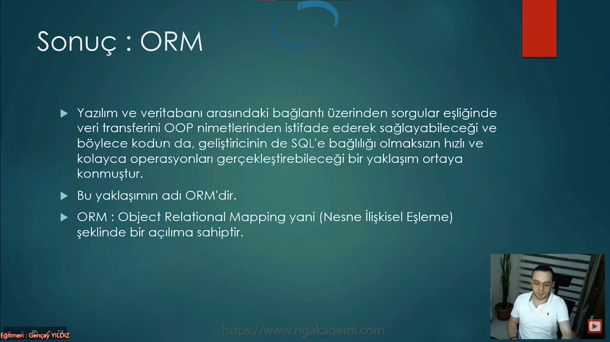
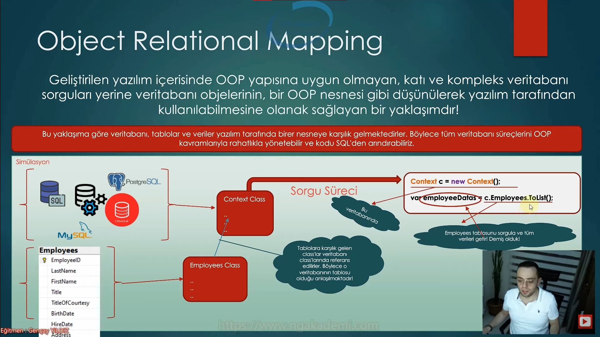
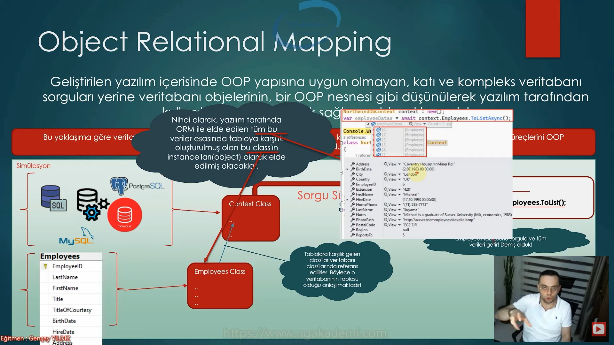
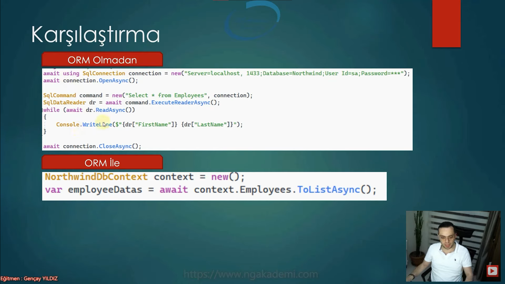
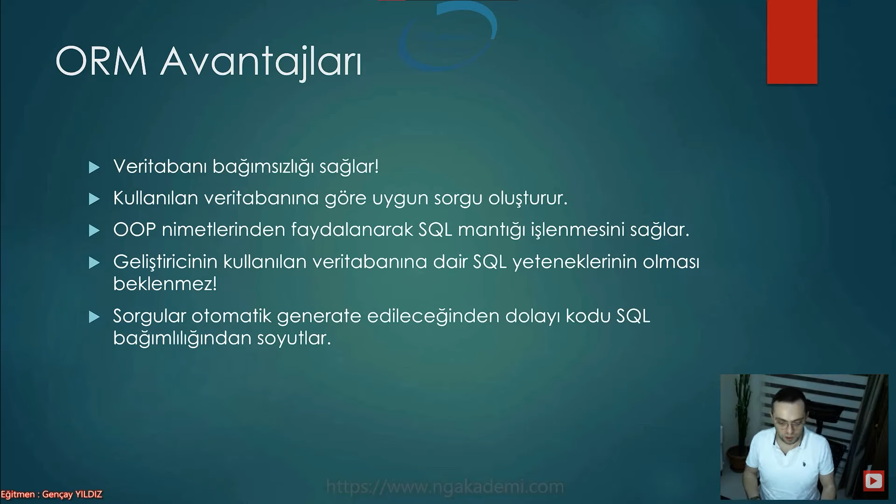

# Yazılım ve Veritabanı Arasındaki Temel İlişki Hakkında Konuşalım
- Yazılım uygulamalarında veriler fiziksel olarak veritabanların da tutulmaktadır.
- Haliyle yazılım ile veritabanı arasında sürekli bir bağlantı üzerinden iletişim sağlanmalıdır Ki yazılım dış dünyadan elde ettiği verileri veritabanına işleyebilsin ya da veritabanındaki verileri istediği zaman elde edebilsin.
- İşte böyle bir durumda yaılım ile veritabanı arasında biraz önce bahsedildiği üzere bir bağlantı kurularak tüm verisel trafik gerçekleştirilmektedir.
- Yazılım, bu bağlantı üzerinden veritabanına anlayacağı dilden sorgular gönderir ve veritabanıda bu sorgulara istinaden gerekli verisel işlemleri gerçekleştirir.
- Bu sorgular genellikle SQL dilindedir.

***

***

***
# Yazılım ve Veritabanı Arasındaki Temel İlişki Modeli

***

# Kodun İçerisine Gömülü SQL Cümleciği 
- Kodun içerisinde SQL sorguları ve SQL ile ilgili farklı cümleciklerin olması genel anlamda kodun kirlenmesine sebeb olmaktadır!
- Bunun dışında geliştiricinin SQL hakkında olan bilgisinin endişe verici olmaması gerekmektedir!
- Ayrıca veritabanına gönderilen SQL neticesinde gelen datalar manuel parse edilmek zorunda bu da kodun SQL'e olan bağlılığını arttırdığı gibi yönetilebilirliğini de oldukça kısıtlamaktadır.
- Yani uzun lafın kısası kodun içerisinde SQL cümleleri yazmanın ve veritabanından gelen sonuçların manuel bir şekilde parse edilmesinin büyük projelerde büyük problemler doğurabileceği aşikardır.

***

***

# Kod İçerisine SQL Yazmanın Dezavantajları Nelerdir?
- Kodun Kirlenmesini sağlar!
- Geliştirme ve bakım maliyeti yüksek kod inşasına sebeb olur.
- Veritabanı bağımlılığı yaratır.
- Kompleks sorgularmanuel bir şekilde oluşturulması gerekir.
- Geliştirici açısından SQL sorumluluğu beklenir!
- Veritabanı sorgulama neticesinde gelen datalar manuel olarak dönüştürülür. Sorgu sürecinde tablo, kolon vs. gibi bağımlılıklar olduğu gibi gelen datalarda da aynı bağımlılıklar söz konusu olacaktır!
- Veritabanında olan değişikliklere uygun bir şekilde kodunda tekrar review edilmesi gerekir! 
    * Misal bir kolon adı değiştiğinde ya da bir kolonun herahngi bir kuralı(constraint, validation vs.) değiştiğinde bu durmdan kodun haberdar olması için bilinçli bir review gerekmektedir. 
- Kodu aşırı derecede veritabanı seviyesine indirger. Bu durum tüm gelişmelerin veritabanıyla uyumlu bir şekilde seyretmesi zorundalığı doğurur. 
- Geliştirilen yazılımın sürecinde tüm veritabanı işlemleri, o anki kullanılan programlama dili ve OOP'nin nimetlerinden istifade etmeksizin icra edilir.
- Gün gelir veritabanını değiştimeniz gerekebilir. İşte böyle bir durumda tüm SQL kodlarını yeni veritabanına göre Refactoring etmeniz gerekecektir!

***

***

# ORM Nedir?
- Yazılım ve veritabanı arasındaki bağlantı üzerinden sorgular eşliğinde veri transferinin OOP nimetlerinden istifade ederek sağlayabileceği ve böylece kodun da geliştiricinin de SQL'e bağlılığı olmaksızın hızlı ve kolayca operasyonları gerçekleştirebileceği bir yaklaşım ortaya konmuştur.
- ORM : Object Relational Mapping yanşi (Nesne İlişkisel Eşleme) şeklinde bir açılıma sahiptir.

***

***

# ORM Simülasyonu
- Geliştirilen yazılım içerisinde OOP yapısına uygun olmayan katı ve kompleks veritabanı sorguları yerine veritabanı objelerinin, bir OOP nesnesi gibi düşünülerek yazılım tarafından kullanabilmesine olanak sağlayan bir yaklaşımdır!
- Bu yaklaşıma göre veritabanı, tablolar ve veriler yazılım tarafında birer nesneye karşılık gelmektedirler. Böylece tüm veritabanı süreçlerini OOP kavramlarıyla rahatlıla yönetebilir ve kodu SQL'den arındırabiliriz.

# ORM'siz Kod İle ORM'li Kod Karşılaştırması
***

***

# ORM Avantajları Nelerdir?
- Veritabanı bağımsızlığı sağlar
- Kullanılan veritabanına göre uygun sorgu oluşturur.
- OOP nimetlerinden faydalanarak SQL mantığı işlemesini sağlar
- Geliştiricinin kullanılan veritabanına dair SQL yeteneklerinin olması beklenmez!
- Sogular otomatik generate edileceğinden dolayı kodu SQL bağımlılığından soyutlar.

***

***