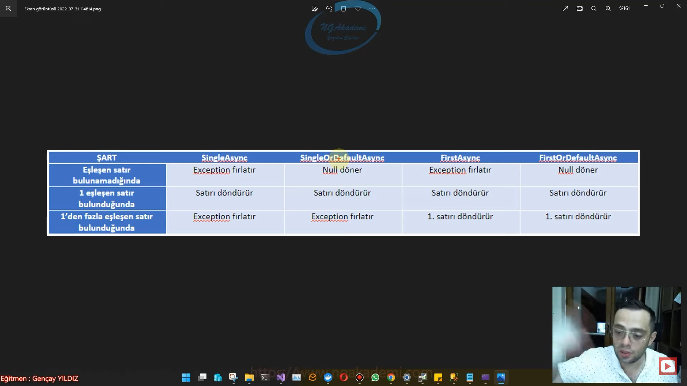

# Tekil Veri Getiren Sorgulama Fonksiyonları
- Buradaki fonksiyonlar kullanıldığında tekil veri getirmektedir.
- Bunları biz execute ettiğimizde veritabanından belirli durumlara/davranışlara uygun tekil verileri tek bir satırı bizlere getirecek fonksiyonlardır.
# SingleAsync
- Sen bir sorgu oluşturacaksın ve oluşturacağın sorguda eğer ki sade ve sadece tek bir sonucun gelmesini istiyorsan birden fazla sonuç geliyorsa ya da hiç gelmiyorsa hata fırlatılmasını istiyorsan bu fonksiyonları kullanabilirsin.
- Yapılan sorguda sade ve sadece tek bir verinin gelmesi amaçlanıyorsa Single ya da SingleOrDefault fonksiyonları kullanılabilir.
- Eğer ki, sorgu neticesinde birden fazla veri geliyorsa ya da hiç gelmiyorsa her iki durumda da exception fırlatır.
- Bu Exception yazılım tarafında gerçekleşir Veritabanı tarafında herhangi bir sıkıntı olmaz.
- Eğer ki yapmış olduğun sorguda gelecek olan verilerin sade ve sadece tek bir veri olduğundan emin olmak istiyorsan yapacağın çalışmanın mantığında birden fazla verinin geldiği durumda bir patlamayla yazılımı uyarmak istiyorsan böyle bir kritik durum söz konusuysa burada kullanman gereken temel sorgulayıcı fonksiyonu Single veya SingleOrDefault fonksiyonudur.
- Örneğin Veritabanında kullanıcılarla ilgili bir tablom var ve kullanıcıların her birinin Unique emailleri var şimdi burada unique email olması durumunda tekrar eden birden fazla kullanıcı da birden fazla tekrar eden mükerrer email'in olduğu durumda bir tutarsızlık meydana gelir. İşte biz bunun güvencesini almak istiyorsak yani bne kesinlikle %100 bir email üzerinden sorgulama yaptığımda tekil verinin geleceğinden eminsem bu eminliğin arkasında Single ya da SingleOrDefault sorgulama yapmam gerekiyor.
- Single'daki amaç tekil verinin gelmesi ne fazla gelecek ne az gelecek tek bir tane veri geliyorsa problem yok.
## Tek Kayıt Geldiğinde
```C#
var urun = await context.Urunler.SingleAsync(u => u.Id == 55);
Console.WriteLine();
```
## Hiç Kayıt Gelmediğinde
```C#
var urun = await context.Urunler.SingleAsync(u => u.Id == 5555);
Console.WriteLine();
```
## Çok Kayıt Geldiğinde
```C#
var urun = await context.Urunler.SingleAsync(u => u.Id > 55);
```

# SingleOrDefaultAsync
- Eğer ki sorgu neticesinde birden fazla veri geliyorsa exception fırlatır hiç veri gelmiyorsa null döner.
## Tek Kayıt Geldiğinde
```C#
var urun = await context.Urunler.SingleOrDefaultAsync(u => u.Id == 55);
```
## Hiç Kayıt Gelmediğinde
```C#
var urun = await context.Urunler.SingleOrDefaultAsync(u => u.Id == 5555);
```
## Çok Kayıt Geldiğinde
```C#
var urun = await context.Urunler.SingleOrDefaultAsync(u => u.Id > 55);
```

# FirstAsync
- Yapılan sorguda tek bir verinin gelmesi amaçlanıyorsa First ya da FirstOrDefault fonksiyonları kullanılabilir.
- Ben sadece tek bir veri elde edeceksem yapmış olduğum sorgulama neticesinde tek bir veriye odaklanıyorsam ama bu mükerrer olabilen verilerden de bir tanesi olabilir olmayan da olabilir benim için bu verinin sade ve sadece tek olarak dönmesi değil amaç bu verinin tekil olarak elde edilmesi.
- Örneğin Ahmet değerine karşılık gelen kullanıcılardan bir tanesini elde etmek istiyorsun işte böyle bir derdin varsa First ya da FirstOrDefault'u kullanabilirsin.Birden fazla Ahmet var ilgili sorguyu çalıştırdığında toplu bir veri gelebilir bunlardan bir tanesini elde etmek istiyorsan First ya da FirstOrDefault'u tercih edebilirsin
- Sorgu neticesinde elde edilen verilerden ilkini getirir. Eğer ki hiç veri gelmiyorsa hata fırlatır.
- Ne kadar veri geliyorsa gelsin bunlardan sana ilkini geri döndürecek.Hiç getirmiyorsa o zaman da patlayacak.

## Tek Kayıt Geldiğinde
```C#
var urun = await context.Urunler.FirstAsync(u => u.Id == 55);
```
## Hiç Kayıt Gelmediğinde
```C#
var urun = await context.Urunler.FirstAsync(u => u.Id == 5555);
```
## Çok Kayıt Geldiğinde
```C#
var urun = await context.Urunler.FirstAsync(u => u.Id > 55);
```

# FirstOrDefaultAsync
- Sorgu neticesinde elde edilen verilerden ilkini getirir. Eğer ki hiç veri gelmiyorsa null değerini döndürür.
## Tek Kayıt Geldiğinde
```C#
var urun = await context.Urunler.FirstOrDefaultAsync(u => u.Id == 55);
```
## Hiç Kayıt Gelmediğinde
```C#
var urun = await context.Urunler.FirstOrDefaultAsync(u => u.Id == 5555);
```
## Çok Kayıt Geldiğinde
```C#
var urun = await context.Urunler.FirstOrDefaultAsync(u => u.Id > 55);
```

# SingleAsync, SingleOrDefaultAsync, FirstAsync, FirstOrDefaultAsync Karşılaştırması

***



***


# FindAsync
- Biz genellikle veritabanı tablolarımızda primary key kolonu üzerinden(unique/benzersiz/eşşiz) kolon olduğu için tekil sorgulamalarımızı bu kolon üzerinden gerçekleştiriyoruz.
- Örneğin ben bir ürüne karşılık bir işlem yapacaksam o ürünün benzersiz olan değeri olan primary key yani Id dediğimiz kolonu üzerinden sorgulayıp o ürünü elde edip ona göre çalışmayı gerçekleştiriyorum.
- Primary key kolonuna özel arama yapcaksan beni kullanabilirsin direkt vermiş olduğun değere karşılık aramayı gerçekleştiririm.
- Find fonksiyonu primary key kolonuna özel hızlı bir şekilde sorgulama yapmamızı sağlayan bir fonksiyondur.
- Özellikle Repository Design Pattern uygularken orada Id bazlı sorgulama fonksiyonlarında kullanılır.

```C#
Urun urun = await context.Urunler.FirstOrDefaultAsync(u => u.Id == 55);

Urun urun = await context.Urunler.FindAsync(55);
```

# Composite Primary Key Durumu
```C#
UrunParca u = await context.UrunParca.FindAsync(2, 5);
```

# FindAsync İle SingleAsync, SingleOrDefaultAsync, FirstAsync, FirstOrDefaultAsync, Fonksiyonlarının Karşılaştırılması
***


***

# LastAsync
- Gelen verilerden sonuncusunu alır.
- Bu fonksiyonu kullanırken OrderBy fonksiyonunu kullanmamız gerekmektedir.
- Sorgu neticesinde gelen verilerden en sonuncusunu getirir. Eğer ki hiç veri gelmiyorsa hata fırlatır. OrderBy kullanılması mecburidir.
```C#
var urun = await context.Urunler.OrderBy(u=>u.Fiyat).LastAsync(u => u.Id > 55);
```

# LastOrDefaultAsync
- Sorgu neticesinde gelen verilerden en sonuncusunu getirir. Eğer ki hiç veri gelmiyorsa null döner. OrderBy kullanılması mecburidir.
```C#
var urun = await context.Urunler.OrderBy(u => u.Fiyat).LastOrDefaultAsync(u => u.Id > 55);
```

```C#
public class ETicaretContext : DbContext
{
    public DbSet<Urun> Urunler { get; set; }
    public DbSet<Parca> Parcalar { get; set; }
    public DbSet<UrunParca> UrunParca { get; set; }
    protected override void OnConfiguring(DbContextOptionsBuilder optionsBuilder)
    {
        optionsBuilder.UseSqlServer("Server=localhost;Database=ETicaretDB;Trusted_Connection=true;");
    }
    protected override void OnModelCreating(ModelBuilder modelBuilder)
    {
        modelBuilder.Entity<UrunParca>().HasKey(up => new { up.UrunId, up.ParcaId });
    }
}
public class Urun
{
    public int Id { get; set; }
    public string UrunAdi { get; set; }
    public float Fiyat { get; set; }
    public ICollection<Parca> Parcalar { get; set; }

}
public class Parca
{
    public int Id { get; set; }
    public string ParcaAdi { get; set; }
}
public class UrunParca
{
    public int UrunId { get; set; }
    public int ParcaId { get; set; }

    public Urun Urun { get; set; }
    public Parca Parca { get; set; }
}
```