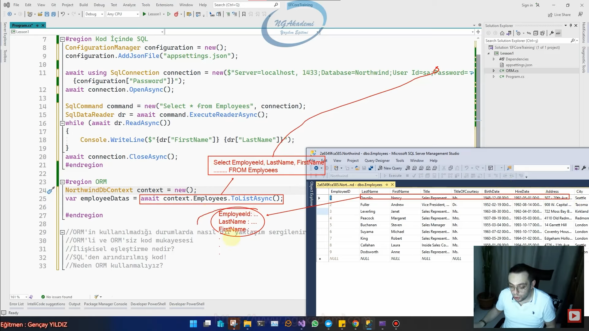

# ORM'in kullanılmadığı durumlarda nasıl bir yaklaşım sergilenir?
- Yaklaşım dediğimiz dilden,platformdan,framework'ten her şeyden bağımsızdır. Bu bir stratejidir,bir mantıktır.
- Sen ORM yaklaşımını istediğin herhangi bir dilde istediğin herhangi bir platformda uygulayabilirsin.
- ORM kullanılmayan bir kod birçok SQL koduna maruz kalmış bir kod olacaktır.
- Bu kodlar veritabanı seviyesinde inşa edilir.
- Yönetilebilirlik oldukça düşüktür.
- SQL sorguları manuel olarak(amelius felsefesi) generate edilir.

***

```C#
#region Kod İçinde SQL
ConfigurationManager configuration = new();
configuration.AddJsonFile("appsettings.json");

await using SqlConnection connection = new($"Server=localhost;Database=Northwind;User Id=sa;Password={configuration["Password"]}");
await connection.OpenAsync();

SqlCommand command = new("Select * from Employees", connection);
SqlDataReader dr = await command.ExecuteReaderAsync();
while (await dr.ReadAsync())
{
    Console.WriteLine($"{dr["FirstName"]} {dr["LastName"]}");
}
await connection.CloseAsync();
#endregion
```

***

- ORM Veritabanındaki tüm veritabanı nesnelerini OOP'nin nimetlerinden istifade edebilecek şekilde kullanabilmemizi,sorgulayabilmemizi yani veritabanı ile yapacağımız iletişim sürecini olabilecek en programatik nimetlerden istifade ederek ortaya koymamızı sağlayabilen bir yaklaşım sergiliyor
- Maliyeti düşük yönetilebilirliği yüksek olan SQL cümleciklerine bağlı olmayan herhangi bir veritabanına bağımlılığı olmayan bir kod söz konusudur.
- ORM Veritabanını da veritabanı içindeki tabloları da yazılımsal class'larla modelliyor bu class modelleri üzerinden veritabanı üzerinden hangi tabloyu sorgulayacaksanız ya da o tablo üzerinde işlem yapacaksanız o tabloya karşılık gelen property üzerinden işlem yapmanızı sağlıyor.
- ORM yaklaşımı buradaki mantığa uygun SQL cümleciğini otomatik generate ediyor ve hedef veritabanı neyse ona uygun fıtratta semantikte SQL cümleciğini oluşturuyor ve bu oluşturulmuş/generate etmiş olduğu execute ettikten sonra gelecek olan dataları da manuel bir şekilde parse etmenize gerek kalmaksızın ilgili tabloya karşılık oluşturduğumuz class'ın instance'ları yani objeleri olarak sizlere sunuyor.
- Aslında veritabanında bulunan her bir veri arka planda oluşturduğumuz sınıfın nesneleri olarak karşımıza çıkıyor.
- Veritabanındaki herhangi bir tablonun satırını yazılım kısmında bir nesne olarak modelliyor.
- Kodlar SQL'den arındırılmıştır.
- Maliyeti düşüktür.

***



***

***

```C#
NorthwindDbContext context = new();
var employeeDatas = await context.Employees.ToListAsync();

#region Veritabanı Bağlantısını Yöneten Merkez Class
using Microsoft.EntityFrameworkCore;
using Microsoft.Extensions.Configuration;

namespace Lesson2
{
    public class NorthwindDbContext : DbContext
    {
        public DbSet<Employee> Employees { get; set; }
        protected override void OnConfiguring(DbContextOptionsBuilder optionsBuilder)
        {
            ConfigurationManager configuration = new();
            configuration.AddJsonFile("appsettings.json");
            optionsBuilder.UseSqlServer($"Server=localhost, 1433;Database=Northwind;User Id=sa;Password={configuration["Password"]}");
        }
    }
#endregion
#region Oluşturduğumuz Veritabanı Tablosunu Karşılayacak Olan Class/Entity Modeli
    public class Employee
    {
        public int EmployeeID { get; set; }
        public string LastName { get; set; }
        public string FirstName { get; set; }
        public string? Title { get; set; }
        public string? TitleOfCourtesy { get; set; }
        public DateTime? BirthDate { get; set; }
        public DateTime? HireDate { get; set; }
        public string? Address { get; set; }
        public string? City { get; set; }
        public string? PostalCode { get; set; }
        public string? Country { get; set; }
        public string? HomePhone { get; set; }
        public string? Extension { get; set; }
        public string? Notes { get; set; }
        public int? ReportsTo { get; set; }
        public string? PhotoPath { get; set; }
        public string? Region { get; set; }
    }
}
#endregion
```

***