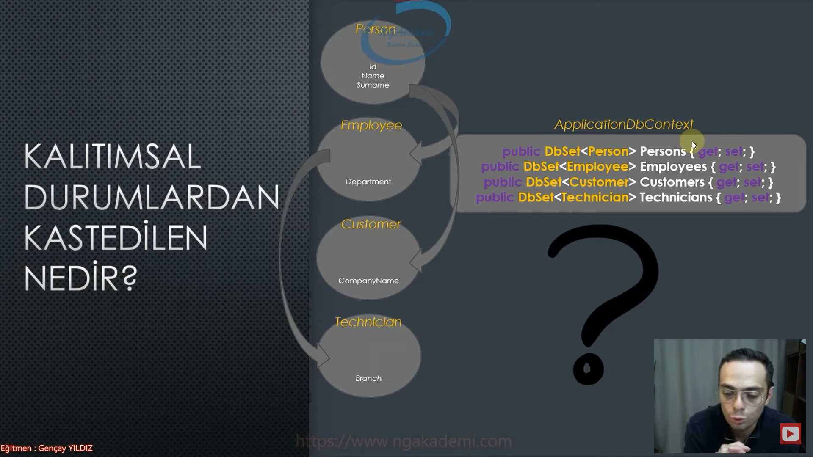
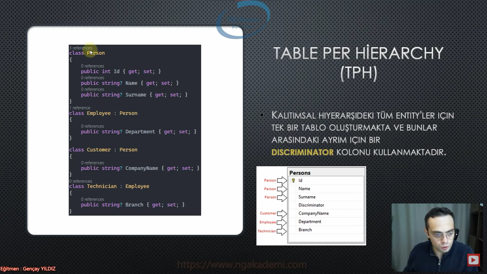
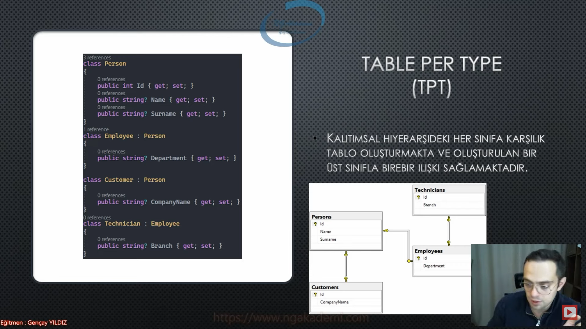
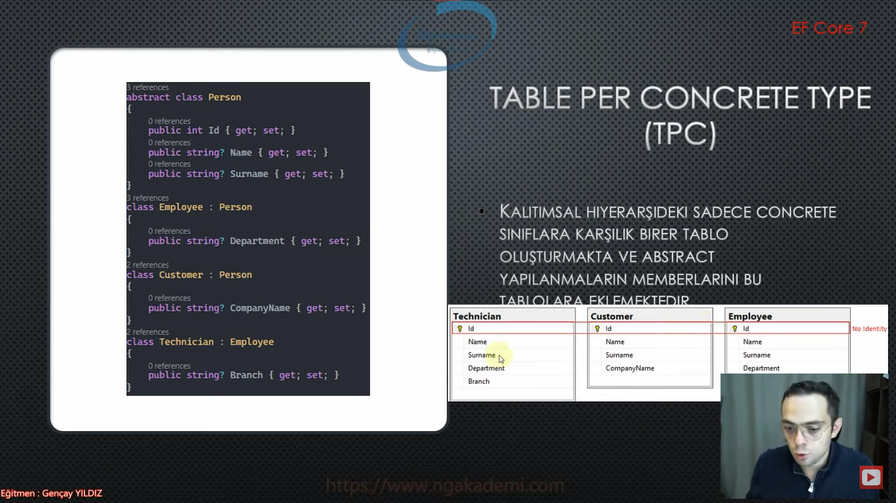

# Kalıtımsal Durumlarda EF Core Davranışları
# Kalıtımsal Durumlardan Kastedilen Nedir?
- Kalıtımsal durumlardan kastettiğimiz birden fazla entity'nin kendi aralarında olan fiziksel mirasıdır. Yani bildiğimiz programatik olarak entity'ler kalıtım veriyorlarsa birbirlerine bu tarz durumlarda tasarladığımız DbContext'in yani EF Core'un davranışı inceleyeceğiz.

- EF Core entity'ler kendi aralarında kalıtımsal ilişkiye sahipken 3 tane davranış sergiler. Bunlar;
    * TABLE PER HİERARCHY(TPH)
    * TABLE PER TYPE(TPT)
    * TABLE PER CONCRETE(TPC)(EF CORE 7 ile gelecek)

# TABLE PER HİERARCHY(TPH)(Hiyerarşi Başına Tablo)
- Hiyerarşi başına tek bir tablo oluşturarak o tablo üzerinden operasyonlarını, verisel işlemlerinmi yürütmeye Table Per Hierarchy denir.

- Kalıtımsal hiyerarşideki tüm entity'ler için tek bir tablo oluşturmakta ve bunalr arasındaki ayrım için bir DISCRIMINATOR kolonu bulunmaktadır.

- Migration oluşturup bu tabloyu migrate edersen tüm entity'lerin içindeki kolonları kümülatif olarak içeren bir tablo oluşacaktır. Bunun yanında bu tablonun adı hiyerarşi'deki en tepedeki tablonun ismi neyse o şekilde tasarlanmaktadır.

- TPH davranışını EF Core'a siz uygulatıyorsanız eğer EF Core hiyerarşideki herhangi bir entity'den gelen kaydın ilgili tablodaki farkını ortaya koyabilmek için discriminator kolonunu kendisi otomatik olarak kullanacak ve buradaki davranışı biz bir daha ekstradan bir işlem yapmaksızın kendisi sergiliyor olacak.

- Hiyerarşi başına tablo oluşturmak istiyorsanız onu tek bir tablo olarak oluşturup discriminator kolonuyla ayırt edilebilirlik özelliği kazandırmamızı sağlayan davranışa Table Per Hierarchy diyoruz.

# TABLE PER TYPE(TPT)(Tür Başına Tablo)
- EF Core'da eğer ki table per type davranışını sergilersek burada EF Core kalıtımdaki her bir türe karşılık bir tablo oluşturacaktır. Ve bu tabloyu oluştururken de normal bildiğiniz kalıtımsal davranışı sergileyecektir. Ama buradaki tablolar arasında birebir bir ilişki kuracaktır.

- Table Per Type'da her tür başına tablo oluştururken bu tabloları ilişkisel oldukları base class'larıyla birebir şekilde ilişkilendirecek.

- Kalıtımsal hiyerarşideki her sınıfa karşılık tablo oluşturmakta ve oluşturulan bir üst sınıfla birebir ilişki sağlamaktadır.

# Table Per Concrete Type(TPC)(Somut Türlerin Başına Tablo)
- EF Core 7 ile gelecek.

- Abstract class olarak modellenmiş olan hangisiyse ona karşılık bir tablo oluşturmayacak.

- Bu tarz hiyerarşik senaryonun söz konusu olduğu durumlarda sadece concrete(somut) yani abstract olmayan entitylere karşılık bir tablo oluşturmak istiyorsak bu yaklaşımı kullanabilirsiniz.

- Kalıtımsal hiyerarşideki sadece concrete sınıflara karşılık birer tablo oluşturmakta ve abstract yapılanmaların memberlarını bu tablolara eklemektedir. 

- Farklı tablolardaki id kolonunu btün olarak kabul etmemizi sağlayan bir davranışa sahip.

