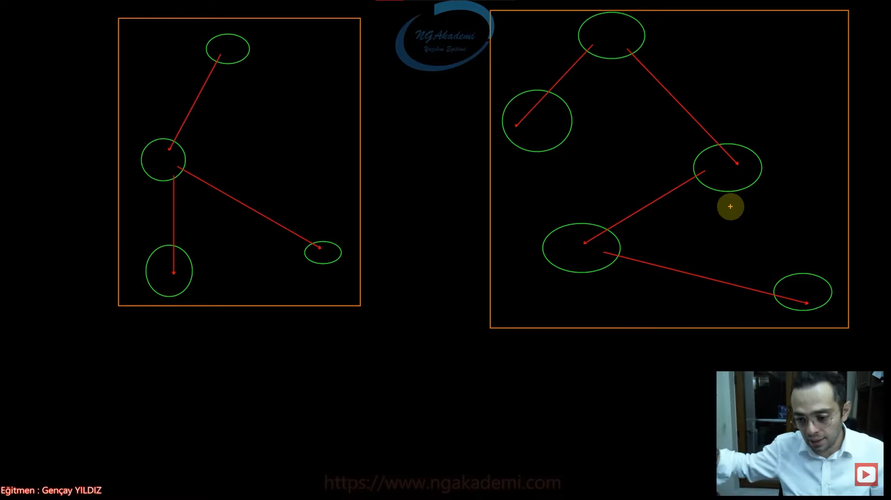
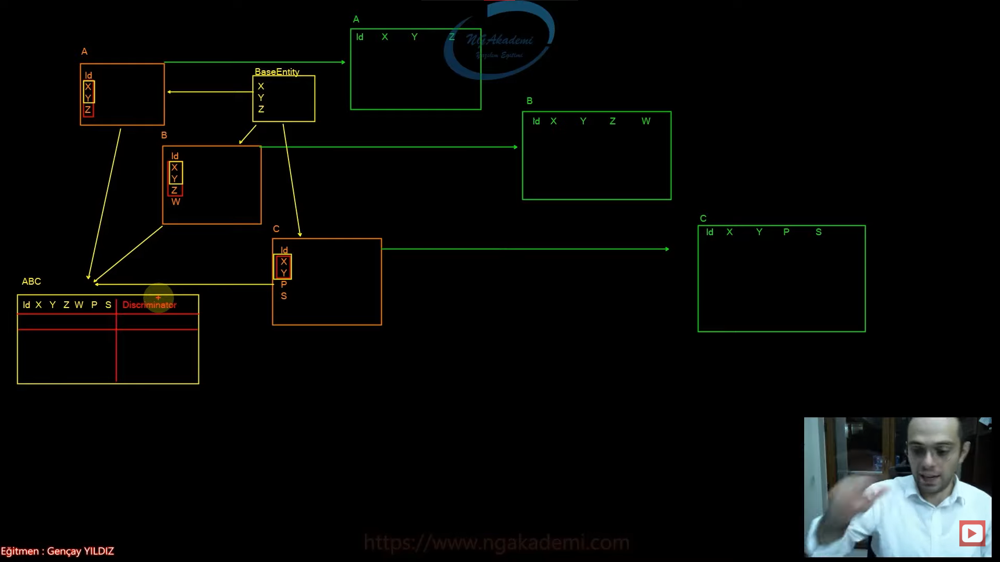
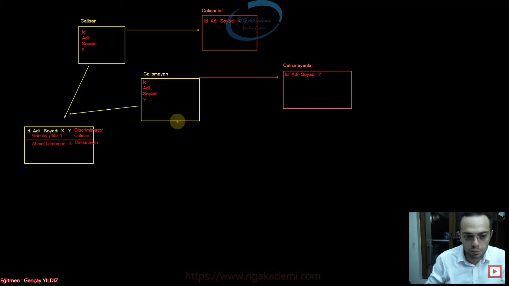

# Table Per Hierarchy (TPH) Nedir?
- EF Core'da entity'ler kendi aralarında ilişkisel tasarıma sahiplerse her bir hiyerarşiye karşılık bir tablo oluşturmamızı sağlayacak olan davranıştır.

- Kalıtımsal ilişkiye sahip olan entitylerin olduğu senaryolarda her bir hiyerarşiye karşılık bir tablo oluşturan davranıştır.



# Neden Table Per Hierarchy Yaklaşımında Bir Tabloya İhtiyacımız Olsun?
- Benzer kolonlara sahip entity'leri direkt kendilerine has tablolarda modelleyebiliriz. Ama bazı senaryolarda biz benzer kolonlara sahip olan entity'leri tekil bir tablo da bir discriminator eşliğinde tutmak isteyebiliriz. İşte bu şekilde bir davranış sergilemek istiyorsak Table Per Hierarchy davranışını uygulamamız gerekir.

- Bu tablolarda verileri crud operasyonlarına tabi tutacağımız zaman bu satırların verilerin farkını yani ayrımını Discriminator ismini verdiğimiz bir kolon ekleyeceğiz. Bu kolonda gerekli farkı oluşturuyor olacağız. Yani her bir satırda o satırın hangi entity'den geldiğine dair bilgiyi discriminator'da tutacağız.

- Bu bildiğimiz veritabanı çalışmalarında birden fazla tablo yerine daha az maliyetli tablolar ortaya koyabilmek için uyguladığımız bir strateji. Bu stratejiyi uygulamamızı sağlayan EF Core'daki davranış Table Per Hierarchy davranışıdır.

- Hem tek bir tablo oluşturarak daha az maliyetli tablolar ortaya koymamızı sağlıyor hem de oluşturulan bu tabloyu uygun bir şekilde entity'ler üzerinden veri ekleme veri silme veri sorgulama operasyonlarını gerçekleştirmemizi sağlıyor. Nihayetinde oraya discriminator kolonu koyduğumuzda discriminator'a özel bir sorgulama yapılmaksızın entity üzerinden yapılan işleme karşılık örneğin bir sorgulama yaptın o sorgu da o entity hangisiyse ona göre verileri getirecek davranışı benimseyen yapıdan bahsediyoruz.

- İçerisinde benzer alanlara sahip olan entityleri migrate ettiğimizde her entity'e karşılık bir tablo oluşturmaktansa bu entityleri tek bir tabloda modellemek isteyebilir bu tablodaki kayıtları discriminator kolonu üzerinden birbirlerinden ayırabiliriz. İşte bu tarz bir tablonun oluşturulması ve bu tarz bir tabloya göre sorgulama, veri ekleme, silme vs. gibi operasyonların şekillendirilmesi için TPH davranışını kullanabiliriz.




# TPH Nasıl Uygulanır?
- EF Core'da entity arasında temel bir kalıtımsal ilişki söz konusuysa eğer default olarak kabul edilen davranıştır.

- EF Core'da entitylerin arasında kalıtımsal bir ilişki ortaya koyduysan herhangi bir konfigürasyon yapmaksızın direkt Table Per Hierarchy'i kullanbilirsin.

- O yüzden herhangi bir konfigürasyon gerektirmez.

- Entity'ler kendi arasıdna kalıtımsal ilişkiye sahip olmalı ve bu entitylerin hepsi DbContext nesnesine DbSet olarak eklenmelidir!

- Id ve discriminator hariç hepsinin nullable(null geçilebilir.) şeklinde tasarlanır çünkü bu Table Per Hierarchy yaklaşımında bu temel esas kabuldür. Nullable olacak ki ilgili entity için geçerli olmayan property'e karşılık null değer verilebilsin yani o property'e karşılık gelen property neyse ona null değeri verilebilsin.

# Discriminator Kolonu Nedir?
- Table Per Hierarchy yaklaşımı neticesinde kümülatif olarak inşa edilmiş tablonun hangi entity'e karşılık veri tuttuğunu ayırt edebilmemizi sağlayan bir kolondur.

- EF Core tarafından otomatik olarak tabloya yerleştirilir.

- Default olarak içerisinde entity isimlerini tutar.

- Discriminator kolonunu komple özelleştirebiliriz.

# Discriminator Kolon Adı Nasıl Değiştirilir?
- Öncelikle hiyerarşinin başında hangi sınıf varsa onun Fluent API'da konfigürasyonuna gidilmeli.

- Ardından HasDiscriminator ile özelleştirilmeli.

```C#
protected override void OnModelCreating(ModelBuilder modelBuilder)
{
    modelBuilder.Entity<Person>()
        .HasDiscriminator<string>("ayirici");
}
```
# Discriminator Değerleri Nasıl Değiştirilir?
- Yine hiyerarşinin başındaki entity konfigürasyonlarına gelip HasDiscriminator fonksiyonu ile özelleştirmede bulunarak ardından HasValue fonksiyonu ile hangi entity'e karşılık hangi değerin girileceğini belirtilen türde ifade edebilirsiniz.

```C#
protected override void OnModelCreating(ModelBuilder modelBuilder)
{
    modelBuilder.Entity<Person>()
        .HasDiscriminator<string>("ayirici")
        .HasValue<Person>("A")
        .HasValue<Employee>("B")
        .HasValue<Customer>("C")
        .HasValue<Technician>("D");
}
```
# TPH'da Veri Ekleme
- Davranışların hiçbirinde veri eklerken, silerken, güncellerken vs normal operasyonların dışında bir işlem yapılmaz!

- Hangi davranışı kullanıyorsanız EF Core ona göre arkaplanda modellemeyi gerçekleştirecektir.

- Biz burada TPH kullandığımız için EF Core arka planda entity'lere karşılık tek bir tane tablo olacağını entity'ler arasındaki kalıtımsal ilişkiden anlıyor.
- Bunu anladıktan sonra gönderdiğimiz entity'lere karşılık verileri uygun şekilde tabloya işliyor. Artık ilgili entity'e karşılık hangi property'ler varsa onlara uygun değerleri oluşturup veritabanına ekleyip olmayanlara'da null değerini basacaktır.

```C#
Employee e1 = new() { Name = "Musa", Surname = "Uyumaz", Department = "Yazılım Bilgi İşlem"};
Employee e2 = new() { Name = "Serhat", Surname = "Uyumaz", Department = "Yazılım Bilgi İşlem"};
Customer c1 = new() { Name = "Ahmet", Surname = "Bilmemne", CompanyName = "Ahmet Bilmemne Halı Kilim Yıkama"};
Customer c2 = new() { Name = "Şuayip", Surname = "XYZ", CompanyName = "Şuayip Sucuk"};
Technician t1 = new() { Name = "Rıfkı", Surname = "Kıllıbacak",Department="Muhasebe",Branch="Şöför" };

await context.Employees.AddAsync(e1);
await context.Employees.AddAsync(e2);
await context.Customers.AddAsync(c1);
await context.Customers.AddAsync(c2);
await context.Technicians.AddAsync(t1);

await context.SaveChangesAsync();
```

# TPH'da Veri Silme
- TPH davranışında silme operasyonu yine entity üzerinden gerçekleştirilir.

- Eğer sorgu sırasında o türde bir veri yoksa yani o tabloda bulunsa bile biz entity bazlı silme gerçekleştirdiğimiz için o entity'nin nesnesi/verisi değilse silme gerçekleşmez hata alınır.

- Burada türe göre ilgili entity'e göre doğru veriyi getirip getirmeme sorumluluğu EF Core'dadır. EF Core bu sorgulamayı discriminator üstünden yapar.

```C#
var employee = await context.Employees.FindAsync(3);
context.Employees.Remove(employee);
await context.SaveChangesAsync();

var customers = await context.Customers.ToListAsync();
context.Customers.RemoveRange(customers);
await context.SaveChangesAsync();
```

# TPH'da Veri Güncelleme
- TPH davranışında güncelleme operasyonu yine entity üzerinden gerçekleştirilir.

```C#
var guncellenecek = await context.Employees.FindAsync(5);
guncellenecek.Name = "Hilmi";
await context.SaveChangesAsync();
```

# TPH'da Veri Sorgulama
- Veri sorgulama operasyonu bilinen DbSet property'si üzerinden sorgulamadır. Ancak burada dikkat edilmesi gereken bir husus vardır. O da şu;

```C#
var employees = await context.Employees.ToListAsync();
var techs = await context.Technicians.ToListAsync();
```

- Kalıtımsal ilişkiye göre yapılan sorgulamada üst sınıf alt sınıftaki verileri de kapsamaktadır. O yüzden üst sınıfların sorgulamalarında alt sınıfların verileri de gelecektir buna dikkat edilmelidir.

- Sorgulama süreçlerinde EF Core generate edilen sorguya bir where şartı eklemektedir.

# Farklı Entity'ler de Aynı İsimde Sütunların Olduğu Durumlar
- Entity'lerde mükerrer kolonlar olabilir. Bu kolonları EF Core isimsel olarak özelleştirip ayıracaktır.

# DbContext ve Entities
```C#
abstract class Person
{
    public int Id { get; set; }
    public string? Name { get; set; }
    public string? Surname { get; set; }
}
class Employee : Person
{
    public string? Department { get; set; }
}
class Customer : Person
{
    public int A { get; set; }
    public string? CompanyName { get; set; }
}
class Technician : Employee
{
    public int A { get; set; }
    public string? Branch { get; set; }
}
class ApplicationDbContext : DbContext
{
    public DbSet<Person> Persons { get; set; }
    public DbSet<Technician> Technicians { get; set; }
    public DbSet<Customer> Customers { get; set; }
    public DbSet<Employee> Employees { get; set; }

    protected override void OnModelCreating(ModelBuilder modelBuilder)
    {
        //modelBuilder.Entity<Person>()
        //    .HasDiscriminator<string>("ayirici")
        //    .HasValue<Person>("A")
        //    .HasValue<Employee>("B")
        //    .HasValue<Customer>("C")
        //    .HasValue<Technician>("D");

        //modelBuilder.Entity<Person>()
        //    .HasDiscriminator<string>("ayirici");
    }
    protected override void OnConfiguring(DbContextOptionsBuilder optionsBuilder)
    {
        optionsBuilder.UseSqlServer("Server=localhost, 1433; Database=ApplicationDb; User ID= SA;Password=1q2w3e4r!.;");
    }
}
```