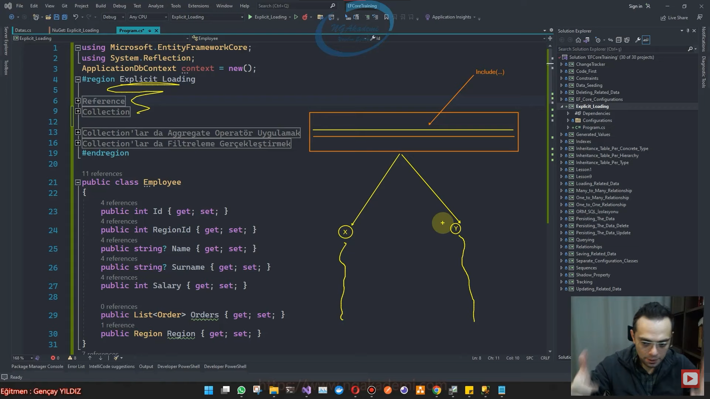

# Explicit Loading
- EF Core'da üretilen sorguda ilişkisel verilerin eklenip eklenmeyeceğini kararını daha sonradan şarta bağlı verilecekse yani ihtiyaçlara istinaden opsiyonel bir şekilde verilecekse sen buradaki çalışmayı Eager Loading ile gerçekleştirme bunu Explicit Loading yaklaşımı ile gerçekleştir.

- Ana sorguyu sen yaz ve koru ihtiyaca binaen include işlemi yapacaksan eğer bunu peşinen include ile gerçekleştirme şartların söz konusu olduğu durumlarda o zaman bunları ilgili sorguya dahil et.

- İhtiyaçlara göre ana sorguyu ilk oluşturduktan sonra ekstradan ilişkisel tabloları eklememizi sağlayan bir yaklaşımdır.

- Oluşturulan sorguya eklenecek verilerin şartlara bağlı bir şekilde/ihtiyaçlara istinaden yüklenmesini sağlayan bir yaklaşımdır.



```C#
var employee = await context.Employees.FirstOrDefaultAsync(e => e.Id == 2);
if (employee.Name == "Gençay")
{
   await context.Orders.Where(o => o.EmployeeId == employee.Id).ToListAsync();
}
```
# Reference
- Oluşturulan sorguya daha sonradan ihtiyaca istinaden eklenecek olan ilişkisel tablonun Eğer ki Navigation Property'si tekil bir türse Reference fonksiyonuyla ilgili sorguya dahil edebilmekteyiz.

- Explicit Loading sürecinde ilişkisel sorguya eklenmek istenen tablonun navigation property'si eğer ki tekil bir türse bu tabloyu reference ile sorguya ekleyebilmekteyiz

```C#
var employee = await context.Employees.FirstOrDefaultAsync(e => e.Id == 2);
//...
//...
//...
context.Entry(employee).Reference(e => e.Region).LoadAsync();
```

# Collection
- Explicit Loading sürecinde ilişkisel sorguya eklenmek istenen tablonun navigation property'si eğer ki çoğul/koleksiyonel bir türse bu tabloyu Collection ile sorguya ekleyebilmekteyiz.

```C#
var employee = await context.Employees.FirstOrDefaultAsync(e => e.Id == 2);
...
...
...
await context.Entry(employee).Collection(e => e.Orders).LoadAsync();
```

# Collection'lar da Aggregate Operatör Uygulamak
```C#
var employee = await context.Employees.FirstOrDefaultAsync(e => e.Id == 2);
//..
//..
//..
await context.Entry(employee).Collection(e => e.Orders).Query().CountAsync();
```

# Collection'lar da Filtreleme Gerçekleştirmek
```C#
var employee = await context.Employees.FirstOrDefaultAsync(e => e.Id == 2);
//..
//..
//..
await context.Entry(employee).Collection(e => e.Orders).Query().Where(q=>q.OrderDate.Day == DateTime.Now.Day).ToListAsync();
```

# Entity & DbContext
```C#
public class Employee
{
    public int Id { get; set; }
    public int RegionId { get; set; }
    public string? Name { get; set; }
    public string? Surname { get; set; }
    public int Salary { get; set; }

    public ICollection<Order> Orders { get; set; }
    public Region Region { get; set; }
}
public class Order
{
    public int Id { get; set; }
    public int EmployeeId { get; set; }
    public DateTime OrderDate { get; set; }

    public Employee Employee { get; set; }
}
public class Region
{
    public int Id { get; set; }
    public string Name { get; set; }
    public ICollection<Employee> Employees { get; set; }
}
class ApplicationDbContext : DbContext
{
    public DbSet<Region> Regions { get; set; }
    public DbSet<Employee> Employees { get; set; }
    public DbSet<Order> Orders { get; set; }

    protected override void OnModelCreating(ModelBuilder modelBuilder)
    {
        modelBuilder.ApplyConfigurationsFromAssembly(Assembly.GetExecutingAssembly());
    }
    protected override void OnConfiguring(DbContextOptionsBuilder optionsBuilder)
    {
        optionsBuilder.UseSqlServer("Server=localhost,1433;Database=ApplicationDb;User ID=SA;Password=1q2w3e4r!.;");
    }

}
```