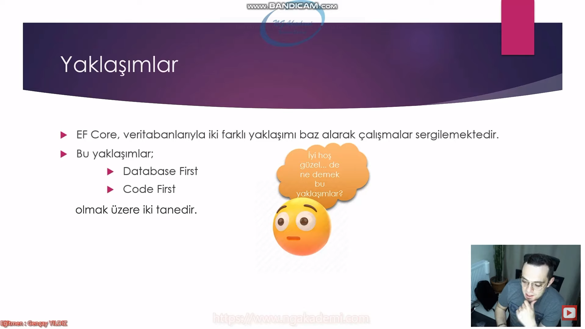
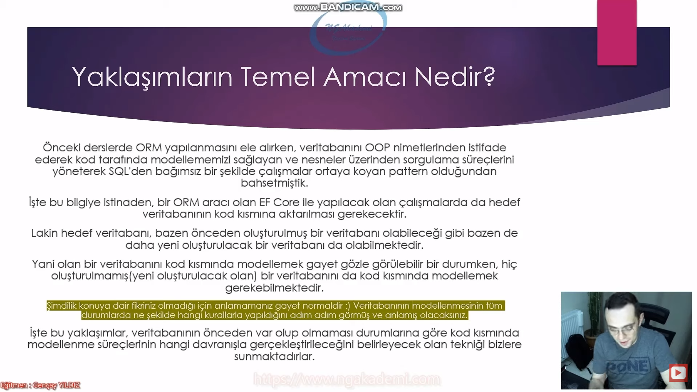
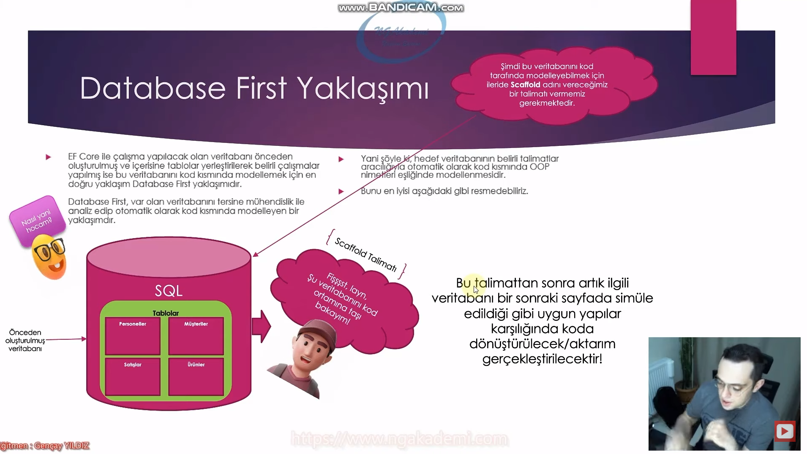
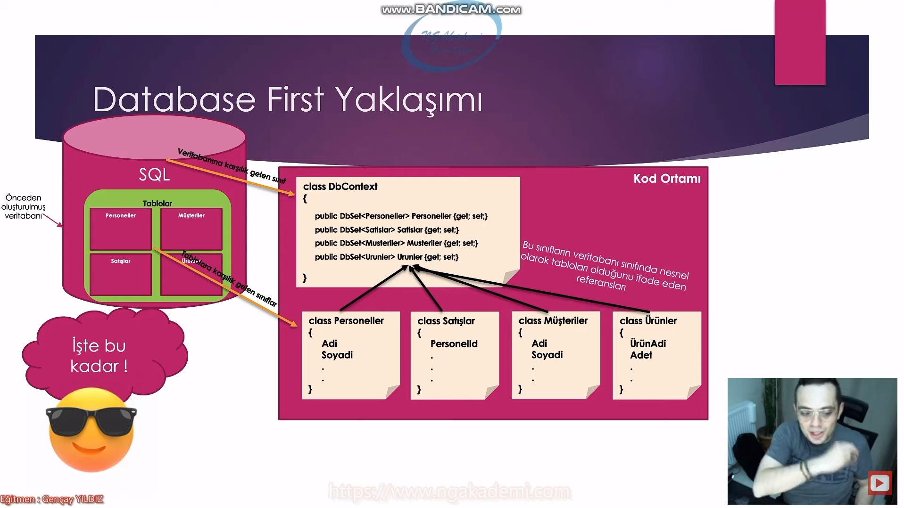
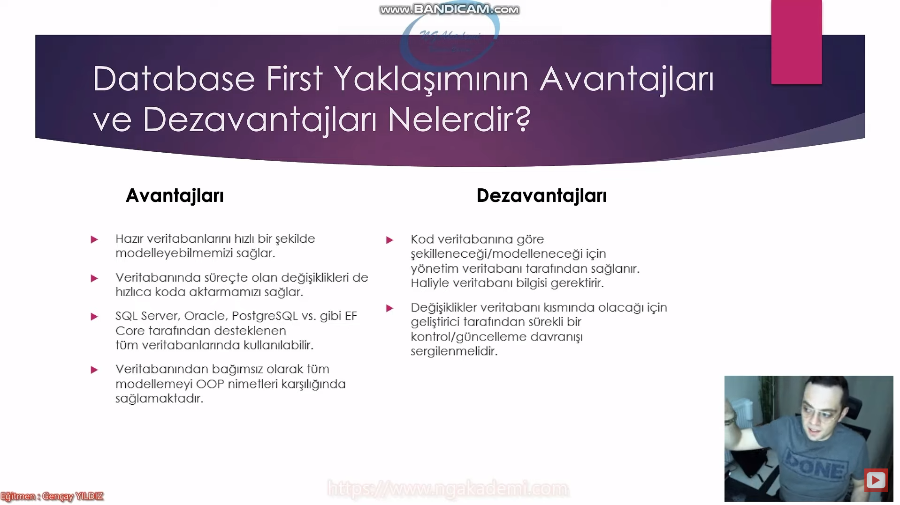
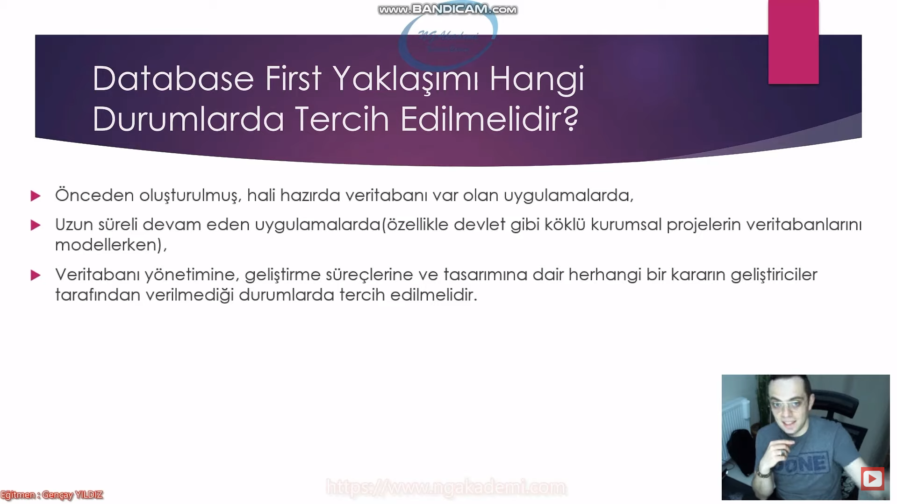
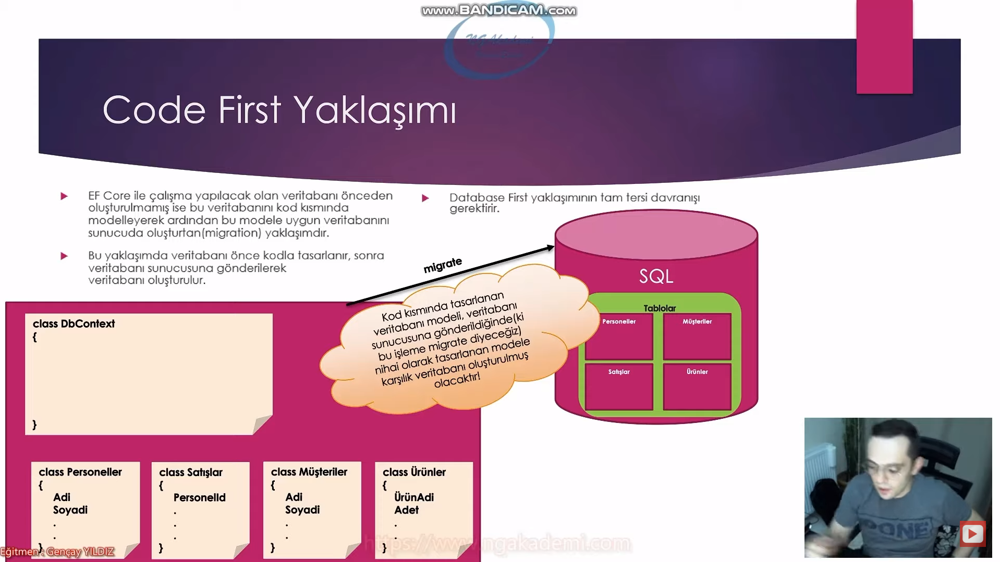
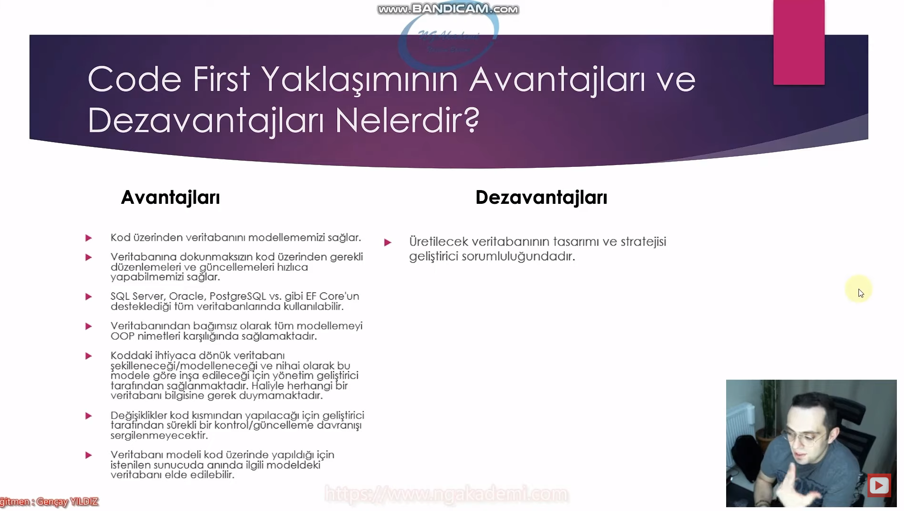
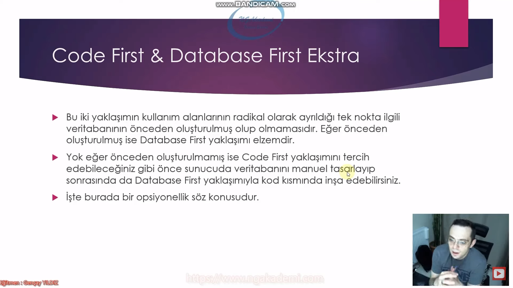
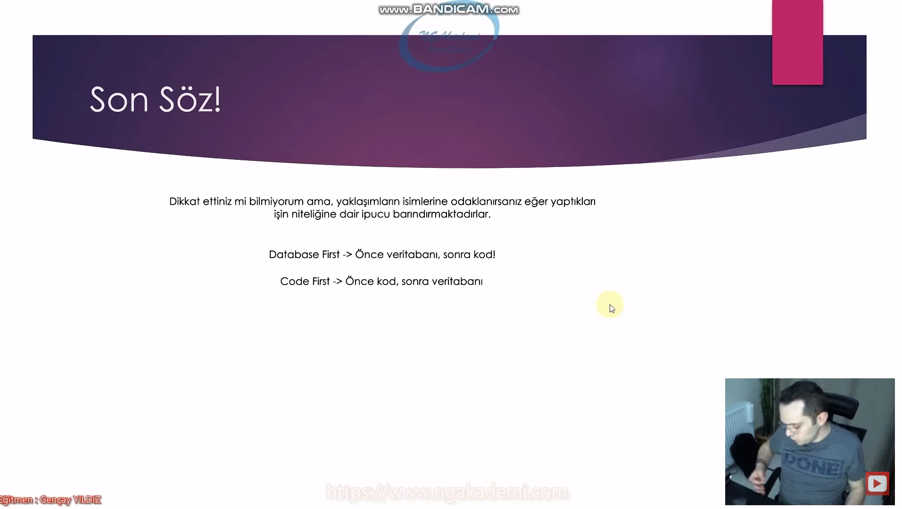

# Yaklaşımlar
- EF Core, veritabanlarıyla iki farklı yaklaşımı baz alarak çalışmalar sergilemektedir.
- Bu yaklaşımlar;
    * Database First
    * Code First
 olmak üzere iki tanedir.

***

***

 # Yaklaşım Ne Demek?
 - Yaklaşım, bir konuyu,olguyu,yapıyı,inşayı,sorunu,çözümü ele alış bir başka deyişle ona bütünsel olark bakış biçimidir.
 - Haliyle her yaklaşım bir davranışa özel subjektiftir/özneldir.
 - EF Core veritabanı çalışmaları için veritabanının önceden olup olmaması durumlarına göre farklı yaklaşımlar sunmaktadır. İşte bu durumlara göre farklı yaklaşımlar eşliğinde çözüm getirilmesi subjektif/öznel olmanın bir göstergesidir.

***

***

# Yaklaşımın Temel Amacı Nedir?
- Önceki derslerde ORM yapılanmasını ele alırken veritabanını OOP nimetlerinden istifade ederek kod tarafında modellememizi sağlayan ve nesneler üzerinden sorgulama süreçlerini yöneterek SQL'den bağımsız bir şekilde çalışmalar ortaya koyan pattern olduğundan bahsetmiştik.
- İşte bu bilgiye istinaden bir ORM aracı olan EF Core ile yapılacak olan çalışmalarda da hedef veritabanının kod kısmına aktarılması gerekecektir. 
- Lakin hedef veritabanı bazen önceden oluşturulmuş bir veritabanı olabileceği gibi bazen de daha yeni oluşturulacak bir veritabanı da olabilmektedir.
- Yani olan bir veritabanının kod kısmında modellemek gayet gözle görülebilir bir durumken hiç oluşturulmamış(yeni oluşturulacak olan) bir veritabanını da kod kısmında modellemek gerekebilmektedir.
- İşte bu yaklaşımlar veritabanının önceden var olup olmaması durumlarına göre kod kısmında modellenme süreçlerinin hangi davranışla gerçekleştirileceğini belirleyecek olan tekniği bizlere sunmaktadırlar.

***

***

# Yaklaşımlar Nerede Başlar
- Geliştirilecek bir projede yaklaşımlar o projenin veritabanının olup olmamasına göre şekillenmektedir demiştik.
- Misal olarak uzun zamandır devam eden ve veritabanı doğal olarak mevcut olan bir projeye katıldığınızı varsayalım. Ve sizlerden bu veritanamı üzerinden EF COre ORM aracı ile belirli işlemler yapmanızı bekliyorlar.
- Böyle bir durumda projedeki veritabanının var olmasından dolayı büyük ihtimalle Database First yaklaşımını tercih etmeniz gerekecektir! 
- Lakin veritabanı daha inşa edilmemiş bir projeye katılım gösteriyor olsaydınız bu durumda da ya Database First ya da Code First yaklaşımlarından birini tercih edebiliriz.
- Yani buradan anlayacağınız bir çalışmada hangi yaklaşımın kullanılcağı ve neye göre belirlenebileceği özünde temel birkaç hususun yanında birçok parametreyi değerlendirmeye bağlıdır. 
- Bunun için bu yaklaşımları tam teferruatlı bilmek ve değerlendirmek gerekir.

***

***

# Database First Yaklaşımı
- EF Core ile çalışma yapılacak olan veritabanı önceden oluşturulmuş ve içerisine tablolar yerleştirilerek belirli çalışmalar yapılmış ise bu veritabanını kod kısmında modellemek için en doğru yaklaşım Database First yaklaşımıdır.
- Database First var olan veritabanını tersine mühendislik ile analiz edip otomatik olarak kod kısmında modelleyen bir yaklaşımdır.
- Yani şöyle ki hedef veritabanının belirli talimatlar aracılığıyla otomatik olarak kod ksımında OOP nimetleri eşliğinde modellenmesidir.
- Veritabanına karşılık gelen sınıfa Context denir.

***

***

# Database First Yaklaşımının Avantajları ve Dezavantajları Nelerdir?

## Avantajları
- Hazır veitabanlarını hızlı bir şekilde modelleyebilmemizi sağlar.
- Veritabanında süreçte olan değişiklikleri de hızlıca koda aktarmamızı sağlar.
- SQL Server, Oracle, PostgreSQL, vs. gibi EF Core tarafından desteklenen tüm veritabanlarında kullanılabilir.
- Veritabanından bağımsız olarak tüm modellemeyi OOP nimetleri karşılığında sağlamaktadır.

## Dezavantajları
- Kod veritabanına göre şekilleneceği/modelleneceği için yönetim veitabanı tarafından sağlanır. Haliyle veritabanı bilgisi gerektirir.
- Değişiklikler veritabanı kısmında olacağı için geliştirici tarafından sürekli bir kontrol/güncelleme davranışı sergilenmelidir.
-  Tabi burada veritabanındakini tehdit edebilirsiniz :))

***

***

# Database First Yaklaşımı Hangi Durumlarda Tercih Edilmelidir?
- Önceden oluşturulmuş hali hazırda veritabanı var olan uygulamalarda 
- Uzun süreli devam eden uygulamalarda(özellikle devlet gibi köklü kurumsal projelerin veritabanlarını modellerken)
- Veritabanı yönetimine, geliştirme süreçlerine ve tasarımına dair herhangi bir kararın geliştiriciler tarafından verilmediği durumlarda tercih edilmelidir.

***

***

# Code First Yaklaşımı
- EF Core ile çalışma yapılacak olan veritabanı önceden oluşturulmamış ise bu veritabanını kod kısmında modelleyerek ardından bu modele uygun veritabanı sunucuda oluşturan(migration) yaklaşımıdır.
- Bu yaklaşımda veritabanı önce kodla tasarlanır, sonra veritabanı sunucusuna gönderilerek veritabanı oluşturulurç
- Database First yaklaşımının tam tersi davranışı gerektirir.
- Database First türevse Code First integraldir.

***

***

# Code First Yaklaşımının Avantajları ve Dezavantajları Nelerdir?

## Avantajları
- Kod üzerinden veritabanını modellememizi sağlar.
- Veritabanına dokunmaksızın kod üzerinden gerekli düzenlemeleri ve güncellemeleri hızlıca yapabilmemizi sağlar.
- SQL Server, Oracle, PostgreSQL vs gibi EF Core'un desteklediği tüm veritabanlarında kullanılabilir.
- Veritabanından bağımsız olarak tüm modellemeyi OOP nimetleri karşılığında sağlamaktadır.
- Koddaki ihtiyaca dönük veritabanının şekilleneceği/modelleneceği ve nihai olarak bu modele göre inşa edileceği için yönetim geliştirici tarafından sağlanmaktadır. Haliyle herhangi bir veritabanı bilgisine gerek duymamaktadır.
- Değişiklikler kod kısmından yapılacağı için geliştirici tarafından sürekli bir kontrol/güncelleme davranışı sergilenmeyecektir.
- Veritabanı modeli kod üzerinde yapıldığı için istenilen sunucuda anında ilgili modeldeki veritabanı elde edilebilir. 

## Dezavantajları
- Üretilecek veritabanının tasarımı ve stratejisi geliştirici sorumluluğundadır.

***

***

# Code First Yaklaşımı Hangi Durumlarda Tercih Edilmelidir?
- Veritabanı bilgisine ihtiyaç duyulmayan,
- Veritabanı tasarımının kod üzerinden yapılarak, geliştirici tarafından sorumluluğun üstlenilebileceği,
- Veritabanı yönetiminin kod üzerinden sağlanacağı durumlarda tercih edilebilir. 

***

***

# Code First & Database First Ekstra
- Bu iki yaklaşımın kullanım alalnlarının radikal olarak ayrıldığı tek nokta ilgili veritabanının önceden oluşturulmuş olup olmamasıdır. Eğer önceden oluşturulmuş ise Database First yaklaşımız elzemdir.
- Yok eğer önceden oluşturulmamış ise Code First yaklaşımını tercih edebileceğiniz gibi önce sunucuda veritabanını manuel tasarlayıp sonrasında da Database First yaklaşımıyla kod kısmında inşa edebilirsiniz.
- İşte burada bir opsiyonellik söz konusudur.

***

***

Yaklaşımın best practice'i olmaz doğru yerde doğru zamanlaması olur.

# Son Söz
- Dikkat ettiniz mi bilmiyorum ama, yaklaşımların isimlerine odaklanırsanız eğer yaptıkları işin niteliğine dair ipucu barındırmaktadırlar.
- Database First => Önce Veritabanı, sonra Kod
- Code First => Önce Kod, sonra Veritabanı

***

***