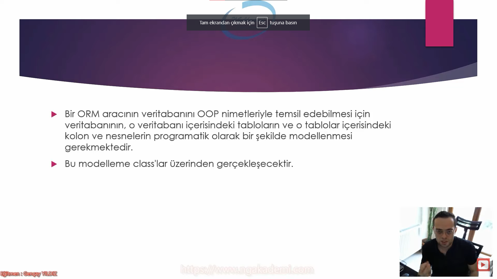
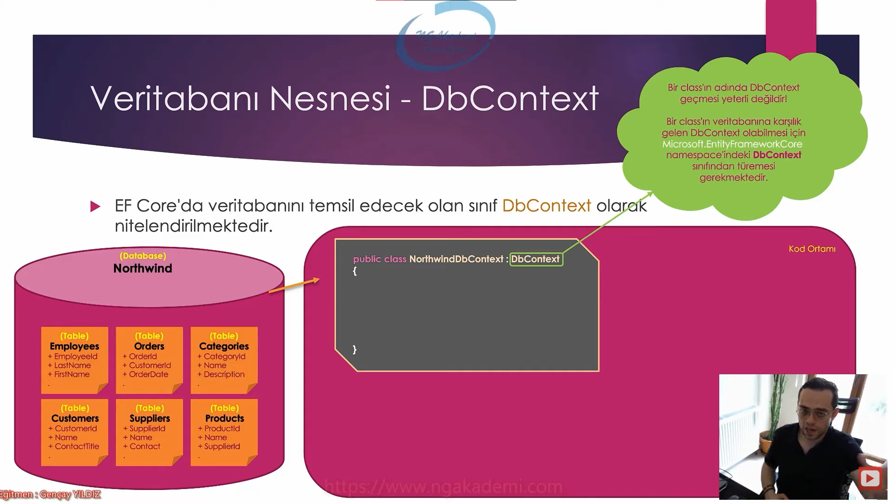
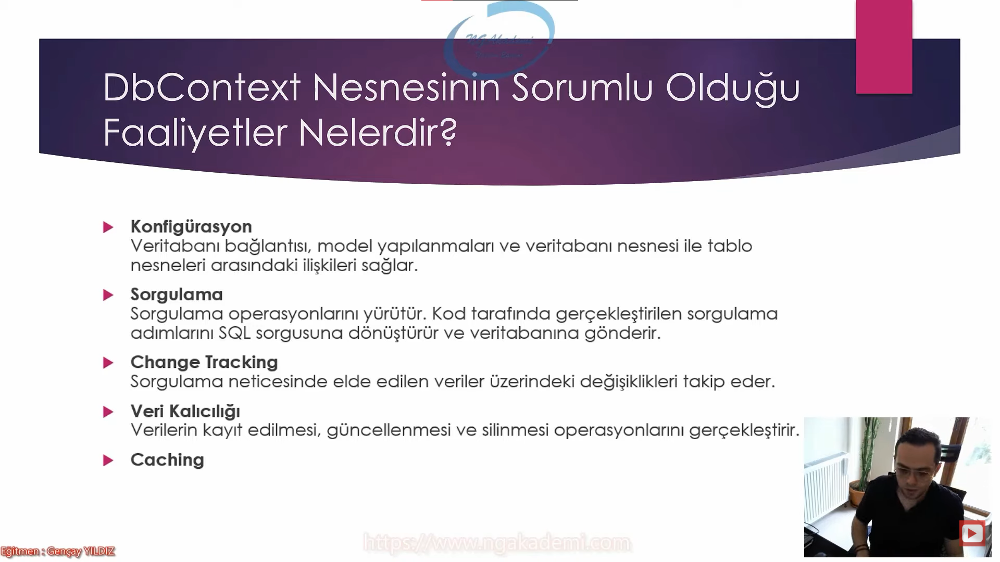
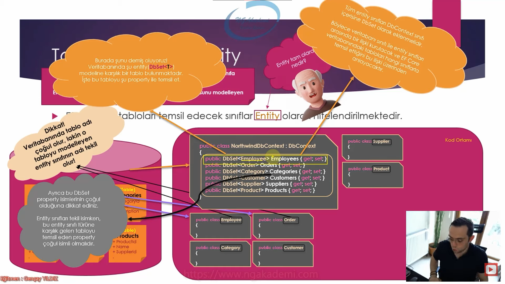
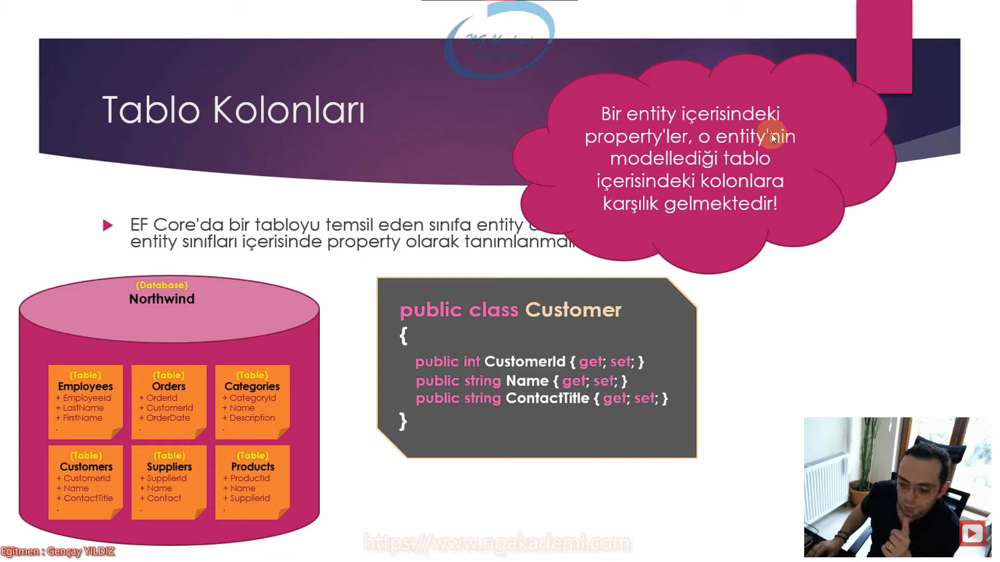
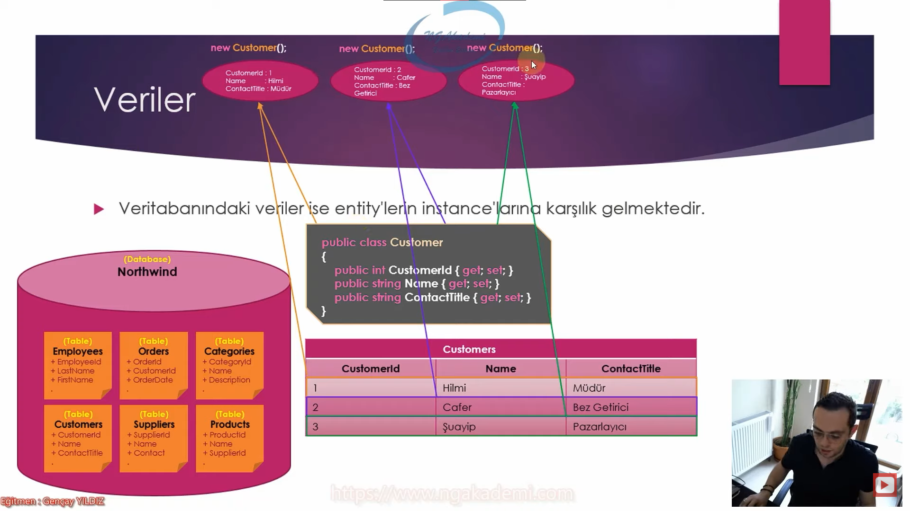
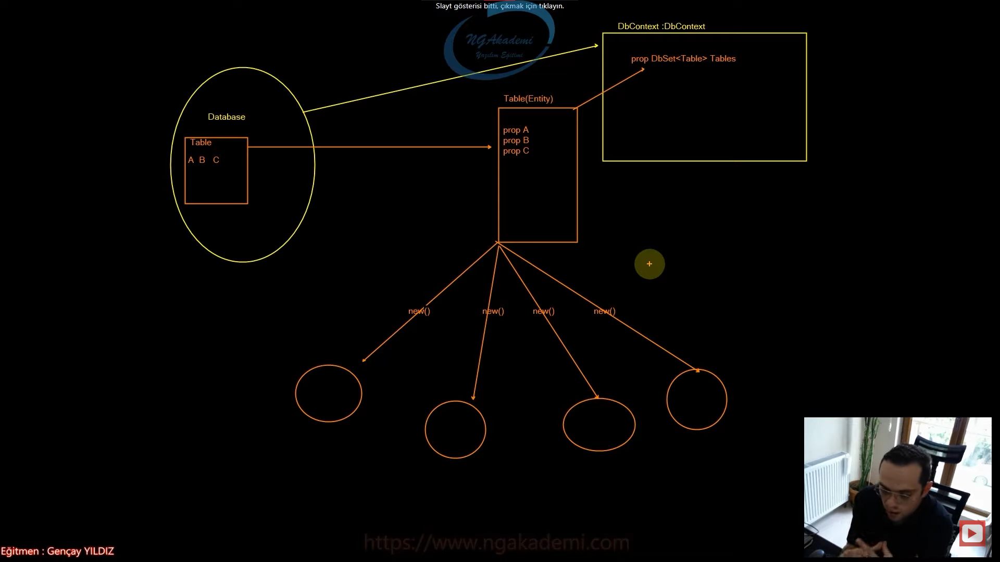

# Yapısal Olarak EF Core Aktörleri
- Bir ORM aracının veritabanını OOP nimetleriyle temsil edebilmesi için veritabanının, o veritabanı içerisindeki tabloların ve o tablolar içerisindeki kolon ve nesnelerin programatik olarak bir şekilde modellenmesi gerekmektedir.
- Bu modelleme class'lar üzerinden gerçekleşecektir

***

***

# Veritabanı Nesnesi - DbContext
- EF Core'da veritabanını temsil edecek olan sınıf DbContext olarak nitelendirilmektedir.
- Bir class'ın adında DbContext geçmesi veritabanını nitelendirmesi için yeterli değildir.
- Bir class'ın veritabanına karşılık gelen DbContext olabilmesi için Microsoft.EntityFrameworkCore namespace'indeki DbContext sınıfından türetilmesi gerekmektedir.

***

***

# DbContext Nesnesinin Sorumlu Olduğu Faaliyetler Nelerdir?
## Kongifürasyon
- Veritabanı bağlantısı, model yapılanmaları ve veritabanı nesnesi ile tablo nesneleri arasındaki ilişkileri sağlar.
## Sorgulama
- Sorgulama operasyonlarını yürütür. Kod tarafında gerçekleştirilen sorgulama adımlarını SQL sorgusuna dönüştürür ve veritabanına gönderir.
## Change Tracking
- Sorgulama neticesinde elde edilen veriler üzerindeki değişiklikleri takip eder.
## Veri Kalıcılığı
- Verilerin kayıt edilmesi, güncellenmesi ve silinmesi operasyonlarını gerçekleştirir.
## Caching

***

***

# Tablo Nesnesi - Entity
- EF Core'da tabloları temsil edecek sınıflar Entity olarak nitelendirilmektedir.
- Yeryüzündeki herhangi bir olguyu/nesneyi/objeyi modelleyen sınıfa Entity(varlık) denmektedir.
- EF Core açısından baktığımızda entity, bir veritabanı tablosunu modelleyen sınıftır.
- Dikkat! Veritabanında tablo adı çoğul olur, lakin o tabloyu modelleyen entity sınıfının adı tekil olur!
- Tüm entity sınıfları DbContext sınıfı içerisine DbSet olarak eklenmelidir. Böylece veritabanı sınıfı ile entity sınıfları arasında bir ilişki kurulacak ve EF Core veritabanındaki tabloları hangi sınıflarda temsil ettiğini bu ilişki üzerinden anlayacaktır.(
- Burada şunu demiş oluyoruz! Veritabanındaki şu entity(DbSet< T>) modeline karşılık gelen bir tablo bulunmaktadır. İşte bu tabloyu şu property ile temsil et.
- Ayrıca bu DbSet property isimlerinin çoğul olduğuna dikkat ediniz. Entity sınıfları tekil isimken, bu entity sınıfı türüne karşılık gelen tabloyu temsil eden property çoğul isimli olmalıdır.

***

***

# Tablo Kolonları
- EF Core'da bir tabloyu temsil eden sınıfa entity demiştik. Ee haliyle kolonlar da entity sınıfları içerisinde property olarak tanmımlanmalıdırlar.
- Bir entity içerisindeki property'ler o entity'nin modellediği tablo içerisindeki kolonlara karşılık gelmektedir!

***

***

# Veriler
- Veritabanındaki veriler ise entity'lerin instancelarına karşılık gelmektedir.

***

***