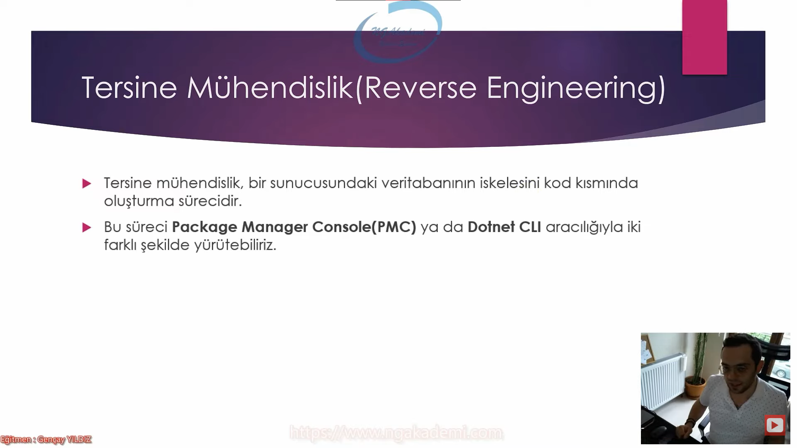
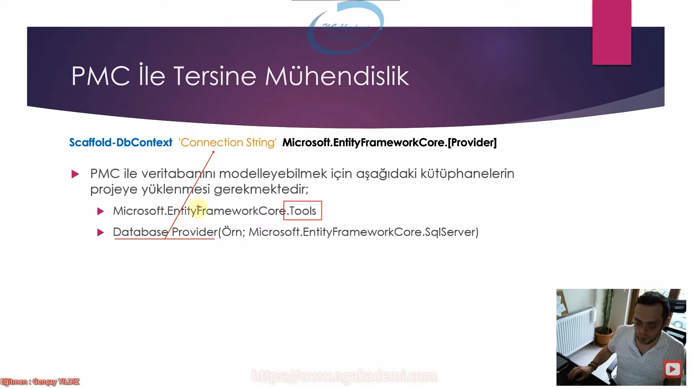
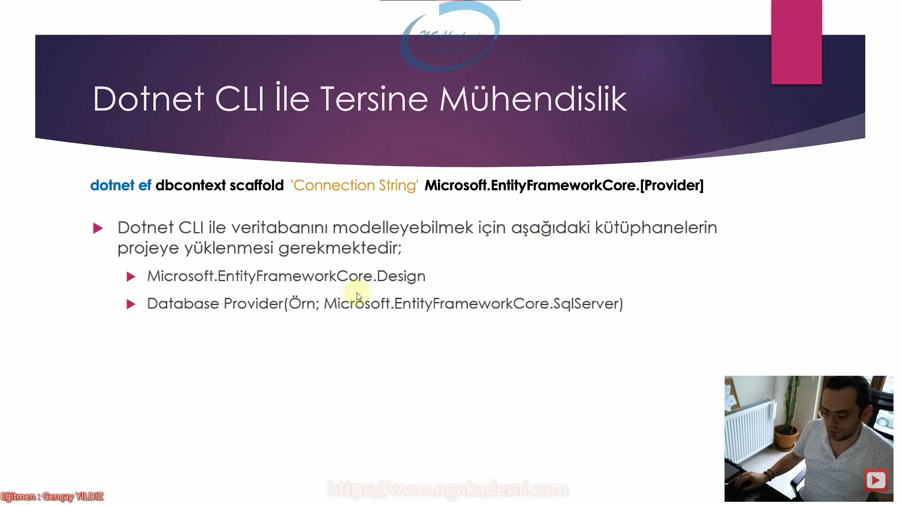
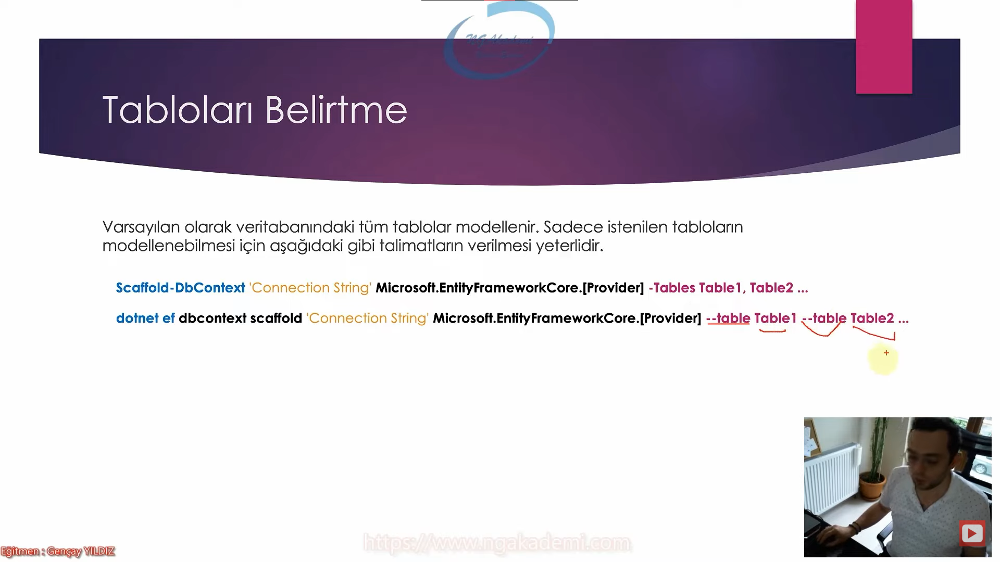
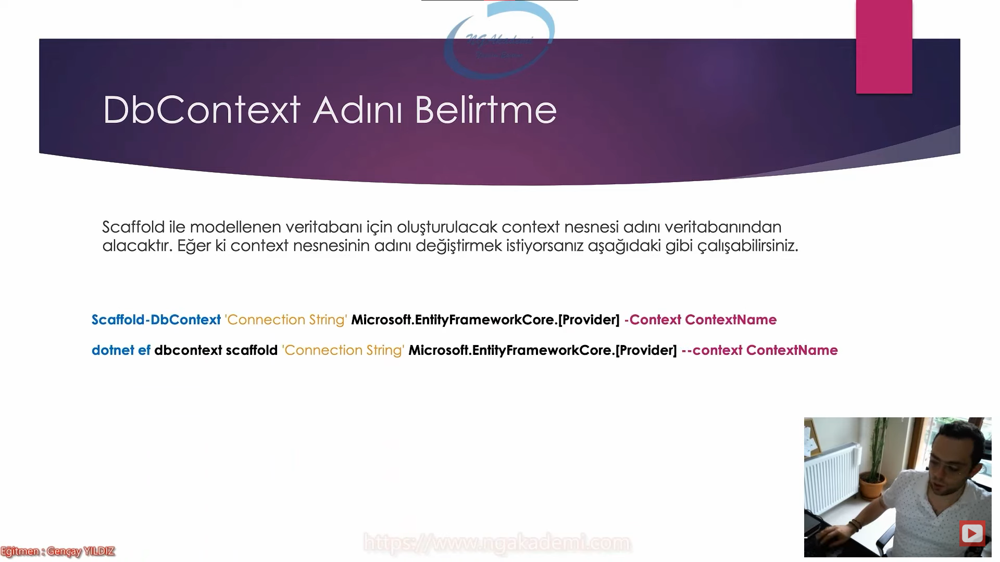
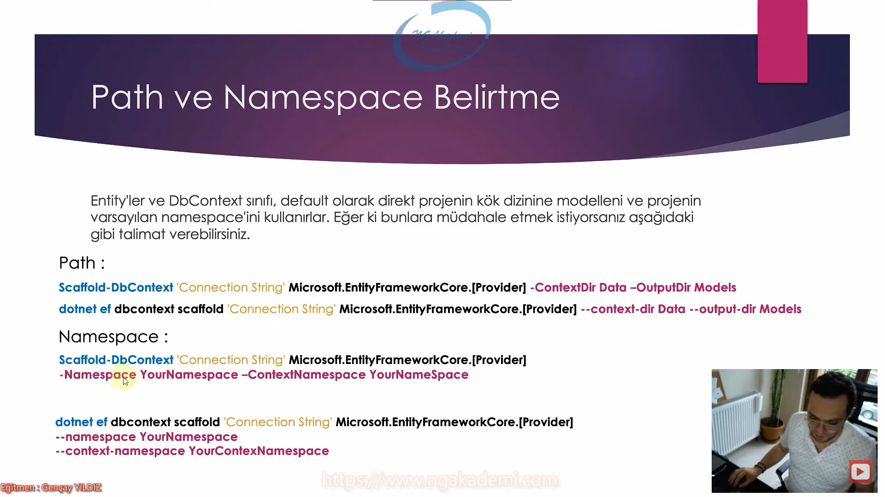
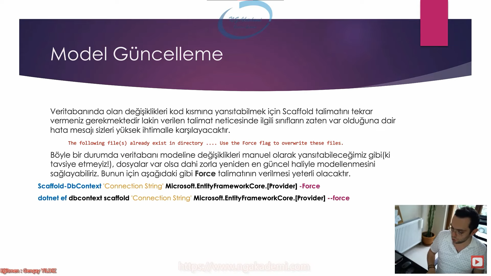
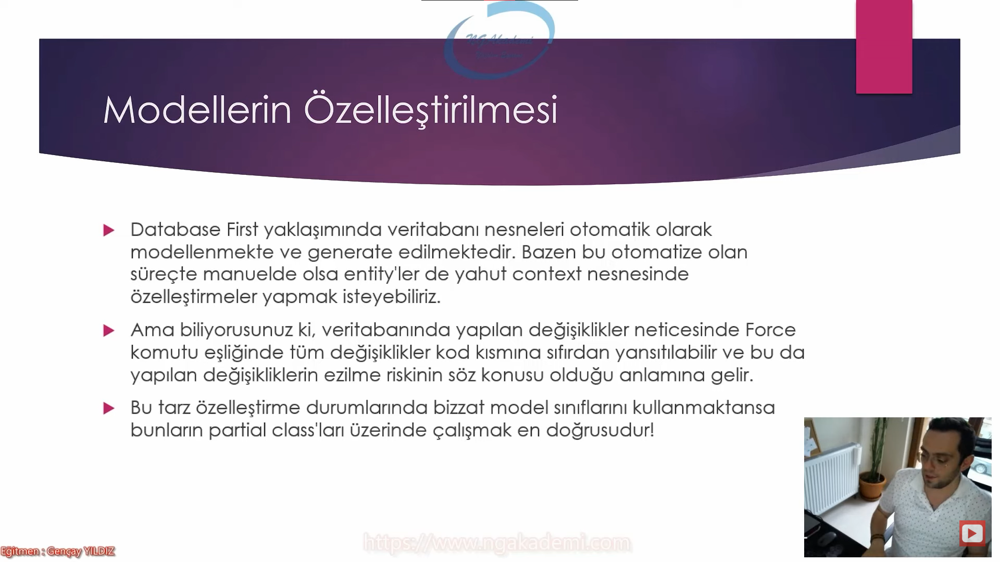

# Tersine Mühendislik
- Bu terim EF Core'da database first yaklaşımında geçerlidir.
- Bir sunucudaki veritabanının iskelesini/yapısını/modelini kod kısmında oluşturma sürecidir.
- Bu süreci Package Manager Console(PMC) ya da Dotnet CLI aracılığıyla iki farklı şekilde yürütebiliriz.

***

***

# PMC İle Tersine Mühendislik
- Scaffold-DbContext => Bu talimat hedef veritabanının kod kısmında modellenmesini sağlayan bir talimat.
- 'Connection String' => Hangi sunucudaki hangi veritabanının üzerinde çalışmak istiyorsak o veritabanını temsil edebilmek için o veritabanına bağlantı cümleciği gerekmektedir. Bu yüzden kullanılır.
- Microsoft.EntityFrameworkCore.[Provider] => Connection string'te belirttiğimiz veritabanı hangi cins/tür/tip veritabanıysa bu veritabanlarının kütüphaneleri olacak biz bunlara provider diyeceğiz.
- Scaffold-DbContext 'Connection String' Microsoft.EntityFrameworkCore.[Provider (Örn; Oracle,Sql Server,PostgreSql vb.)]
- Tüm veritabanları için [ConnectionString'ler](https://www.connectionstrings.com/)
- Tüm veritabanları için Veritabanı Sağlayıcıları[Database Providers](https://learn.microsoft.com/en-us/ef/core/providers/?tabs=dotnet-core-cli)
- PMC ile veritabanını modelleyebilmek için aşağıdaki kütüphanelerin projeye yüklenmesi gerekmektedir; 
    * Microsoft.EntityFrameworkCore.Tools
    * Database Provider(Örn; Microsoft.EntityFrameworkCore.SqlServer) 

***

***

# Dotnet CLI İle Tersine Mühendislik
- dotnet ef dbcontext scaffold 'Connection String' Microsoft.EntityFrameworkCore.[Provider (Örn; Oracle,Sql Server,PostgreSql vb.)]
- Microsoft.EntityFrameworkCore.Design
- Database Provider(Örn; Microsoft.EntityFrameworkCore.SqlServer) 

***

***

# Tabloları Belirtme
- Varsayılan olarak veritabanındaki tüm tablolar modellenir. Sadece istenilen tabloların modellenebilmesi için aşağıdaki gibi talimatların verilmesi yeterlidir.
- Scaffold-DbContext 'Connection String' Microsoft.EntityFrameworkCore.[Provider (Örn; Oracle,Sql Server,PostgreSql vb.)] -Tables Table1, Table2 ...
- dotnet ef dbcontext scaffold 'Connection String' Microsoft.EntityFrameworkCore.[Provider (Örn; Oracle,Sql Server,PostgreSql vb.)] --table Table1 --table Table2

***

***

# DbContext Adını Belirtme
- Scaffold ile modellenen veritabanı için oluşturulacak context nesnesi adını veritabanından alacaktır. Eğer ki context nesnesinin adını değiştirmek istiyorsanız aşağıdaki gibi çalışabilirsiniz.
- Scaffold-DbContext 'Connection String' Microsoft.EntityFrameworkCore.[Provider (Örn; Oracle,Sql Server,PostgreSql vb.)] -Context ContextName
- dotnet ef dbcontext scaffold 'Connection String' Microsoft.EntityFrameworkCore.[Provider (Örn; Oracle,Sql Server,PostgreSql vb.)] --context ContextName

***

***

# Path ve Namespace Belirtme
## Path : 
- Entity'ler ve DbContext sınıfı default olarak direkt projenin kök dizinine modellenir ve projenin varsayılan namespace'ini kullanırlar. Eğer ki bunlara müdahale etmek istiyorsanız aşağıdaki gibi talimat verebilirsiniz.
- Scaffold-DbContext 'Connection String' Microsoft.EntityFrameworkCore.[Provider (Örn; Oracle,Sql Server,PostgreSql vb.)] -ContextDir Data -OutputDir Models
- dotnet ef dbcontext scaffold 'Connection String' Microsoft.EntityFrameworkCore.[Provider (Örn; Oracle,Sql Server,PostgreSql vb.)] --context-dir Data --output-dir Models-

## Namespace : 
- Scaffold-DbContext 'Connection String' Microsoft.EntityFrameworkCore.[Provider (Örn; Oracle,Sql Server,PostgreSql vb.)] -Namespace YourNamespace -ContextNamespace YourNamespace
- dotnet ef dbcontext scaffold 'Connection String' Microsoft.EntityFrameworkCore.[Provider (Örn; Oracle,Sql Server,PostgreSql vb.)] --namespace Your Namespace --context-namespace YourContextNamespace

***

***

# Model Güncelleme
- Veritabanına olan değişiklikleri kod kısmına yansıtabilmek için Scaffold talimatını tekrar vermeniz gerekmektedir. lakin verilen talimat neticesinde ilgili sınıfların zaten var olduğuna dair hata mesajı sizleri yüksek ihtimalle karşılayacaktır.
    * The following file(s) already exists in directory .... Use the Force flag to overiwrite these files.
- Böyle bir durumda veritabanı modeline değişiklikleri manuel olarak yansıatabileceğimiz gibi(ki tavsiye etmeyiz!), dosyalar var olas dahi zorla yeniden en güncel haliyle modellemesini sağlayabiliriz. Bunun için aşağıdaki gibi Force talimatının verilmesi yeterli olacaktır.
- Scaffold-DbContext 'Connection String' Microsoft.EntityFrameworkCore.[Provider (Örn; Oracle,Sql Server,PostgreSql vb.)] -Force
- dotnet ef dbcontext scaffold 'Connection String' Microsoft.EntityFrameworkCore.[Provider (Örn; Oracle,Sql Server,PostgreSql vb.)] --force
- Yani force paraetresi sayesinde veritabanının var olsa dahi en son güncel halini mevcut sınıfları ezerek tekrardan buraya modelleyebiliyoruz.

***

***

# Modellerin Özelleştirilmesi
- Database First yaklaşımında veritabanı nesneleri otomatik olarak modellenmekte ve generate edilmektedir. Bazen bu otomatize olan süreçte manuelde olsa entity'ler de yahut context nesnesinde özelleştirmeler yapmak isteyebiliriz.
- Ama biliyorsunuz ki veritabanında yapılan değişiklikler neticesinde Force komutu eşliğinde tüm değişiklikler kod kısmına sıfırdan yansıtılabilir. ve bu da yapılan değişikliklerin ezilme riskinin söz konusu olduğu anlamına gelir.
- Bu tarz özelleştirme durumlarında bizzat model sınıflarını kullanmaktansa bunların partial class'ları üzerinde çalışmak en doğrusudur!
- Entity'de context sınıfları üzerinde çalışma yapacaksanız bizzat generate edilenlerin üzerinde değil partial'ları üzerinde bu çalışmaları yapmalıyız.

***

***

# EF CORE AKTÖRLERİNİ İNCELEYELİM
- Entity : Veritabanındaki tabloları modelleyen sınıflardır.
- Context : Veritabanını modelleyen sınıftır.