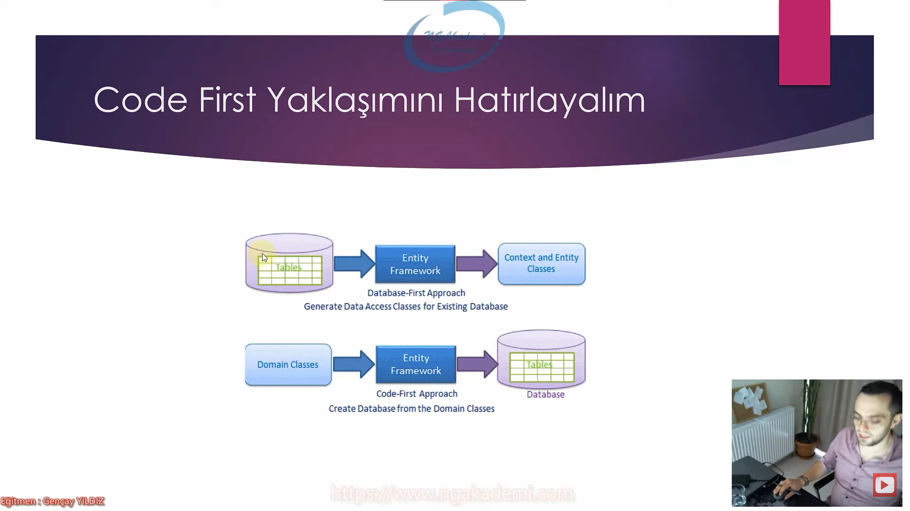
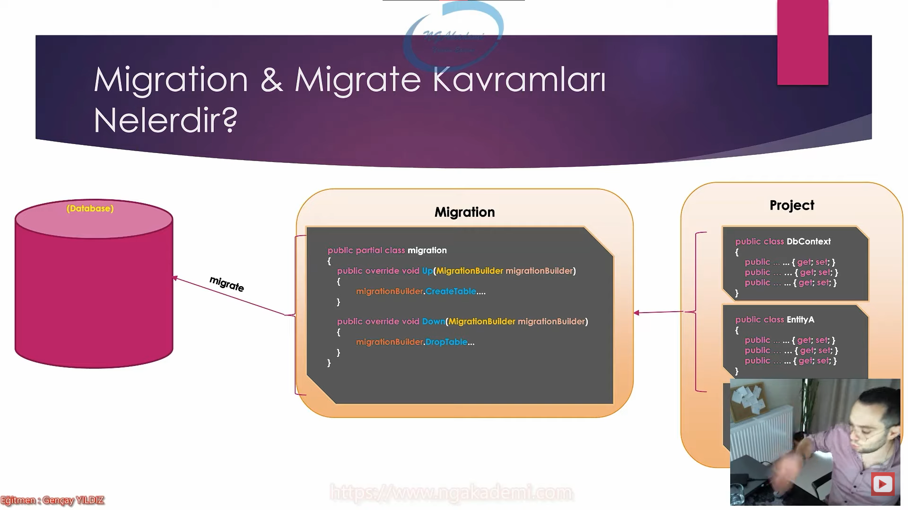
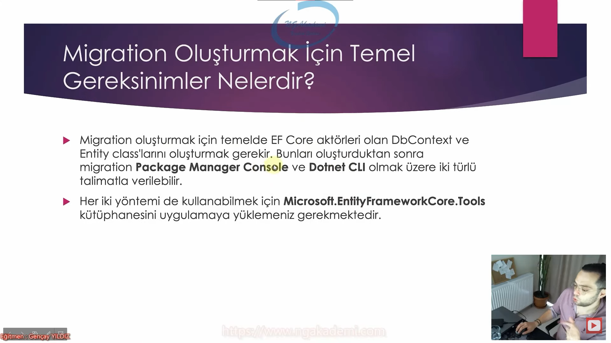
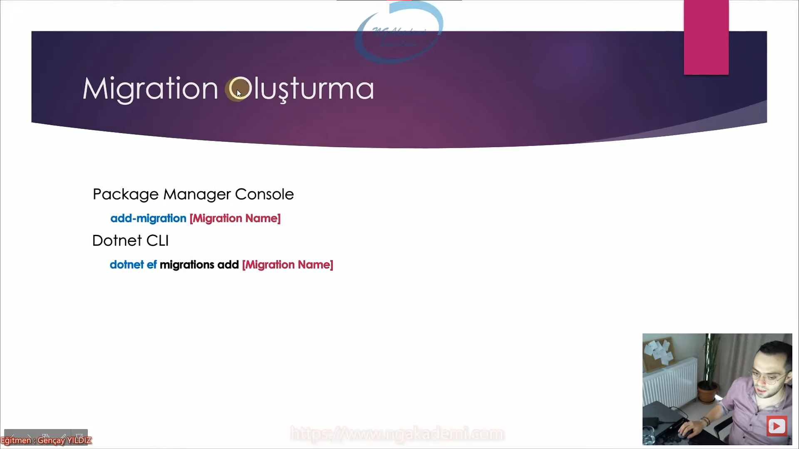
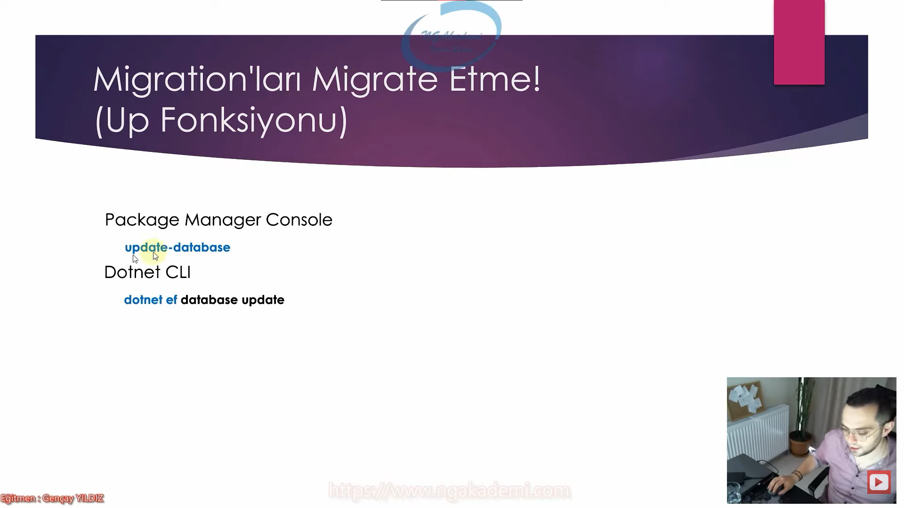
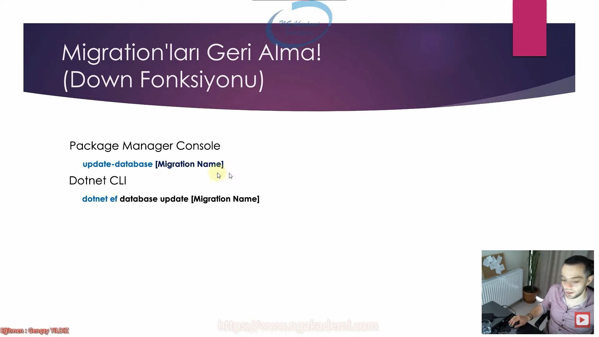
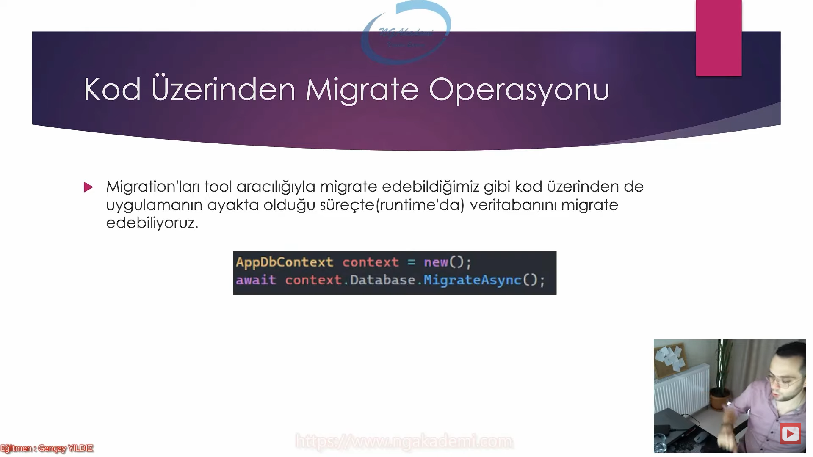
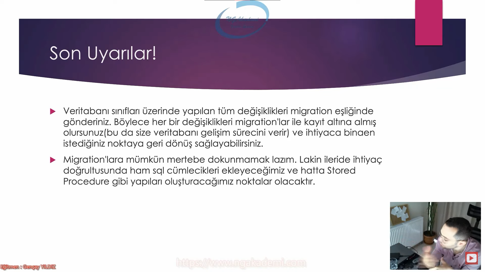

# Code First Yaklaşımını Hatırlayalım

***



***

# Migration & Migrate Kavramları Nelerdir?
- Veritabanıyla ilgili yapmış olduğumuz modellemeyi veritabanı sunucusunun anlayabileceği hale getirmemizi sağlayan bir modele/class modeline Migration denir.
- Migration'ların veritabanı sunucusunda o modele karşılık bir veritabanının oluşturulma süreci yani migrate etme/göç ettirme buradaki modeli veritabanı sunucusuna gönderilmesini ifade etmektedir.
- Migration oluşturuyorum dediğimde projede tasarlamış olduğum kod mantığının veritabanı sunucusuna göç ettirilebilecek modelini oluşturuyorum anlamına gelecek Migrate ediyorum dediğimde de işte bu migration'ı veritabanı sunucusuna gönderip orada fiziksel olarak gerekli değişiklikleri yaptırıyorum.

***



***

# Migration Oluşturmak için Temel Gereksinimler Nelerdir?
- Migration oluşturmak için temelde EF Core aktörleri olan DbContext ve Entity class'larını oluşturmak gerekir. Bunları oluşturduktan sonra migration Package Manager Console ve Dotnet CLI olmak üzere iki türlü talimatlar verilebilir.
- Her iki yöntemi de kullanabilmek için Microsoft.EntityFrameworkCore.Tools kütüphanesini uygulamaya yüklemeniz gerekmektedir.

***



***

# Migration Oluşturma
## Package Manager Console
- add-migration [Migration Name]
## Dotnet CLI
- dotnet ef migrations add [Migration Name]
- Up : O ana kadar yapılmış çalışmalarda veritabanı sunucusuna gönderilecek olanlar
- Down : Bir gün bu migration geri alınırsa yapmış olduğu neyse onu geri alanlar 

***



***

# Migration Path'i Belirleme
## Package Manager Console
- add-migration [Migration Name] -OutputDir [Path]
## Dotnet CLI
- dotnet ef migrations add [Migration Name]--output-dir [Path]

***


***

# Migration Silme
## Package Manager Console
- remove-migration 
## Dotnet CLI
- dotnet ef migrations remove

***


***

# Migration Listeleme
## Package Manager Console
- get-migration 
## Dotnet CLI
- dotnet ef migrations list

***


***

# Migration'ları Migrate Etme! (Up Fonksiyonu)
## Package Manager Console
- update-database
## Dotnet CLI
- dotnet ef database update

***



***

# Migration'ları Geri Alma! (Down Fonksiyonu)
## Package Manager Console
- update-database [Migration Name]
## Dotnet CLI
- dotnet ef database update [Migration Name]

***



***

# Kod Üzerinden Migrate Operasyonu
- Migration'ları tool aracılığıyla migrate edebildiğimşz gibi kod üzerinden de uygulamanın ayakta olduğu süreçte(runtime'da) veritabanını migrate edebiliyoruz.

```C#
AppDbContext context = new();
await context.Database.MigrateAsync();
```

***



***

# Son Uyarılar!
- Veritabanı sınıfları üzerinde yapılan tüm değişiklikleri migration eşliğinde gönderiniz. Böylece her bir değişiklikleri migration'lar ile kayıt altına almış olursunuz.(bu da size veritabanı gelişim sürecini verir) ve ihtiyaca binaen istediğiniz noktaya geri dönüş sağlayabilirsiniz.
- Migration'lara mümkün mertebe dokunmamak lazım. Lakin ileride ihtiyaç doğrultusunda ham sql cümlecikleri ekleyeceğimiz ve hatta Stored Procedure gibi yapıları oluşturacağımız noktalar olacaktır.

***



***