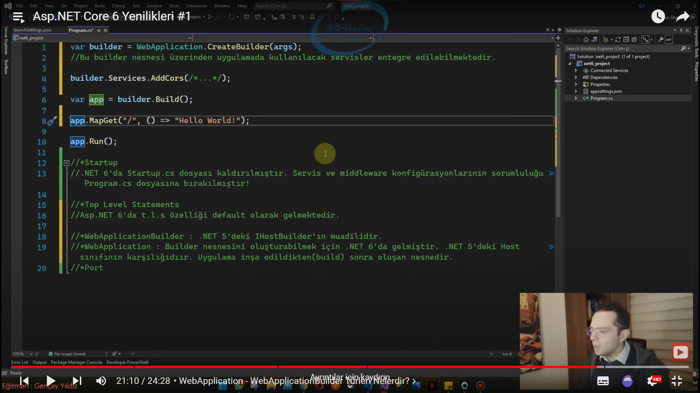

# Startup.cs Dosyasının Kaldırılması
- Startup dosyası uygulamanın temel konfigürasyonlarını yaptığımız bir dosyaydı. 
- Bu uygulamada kullanılacak servislerin ConfigureServices fonksiyonu içerinde yaparken gerekli middleware çağırımlarının da ne şekilde yapılacağını Configure fonksiyonu içerisinde yapıyorduk.
- Artık bunların hepsi program.cs içine alındı.
- .Net 6'da Startup.cs dosyası kaldırılmıştır. Servis ve middleware konfigürasyonlarının orumluluğu Program.cs dosyasına bırakılmıştır.
# Asp.NET Core 6'da ki Default Gelen Top Level Statements Özelliği
- Asp.NET 6'da t.l.s özelliği default olark gelmektedir. 
- Program.cs dosyasında çalışır. Yazılan kodu direkt Main fonksiyonu içinde varsayar
# WebApplicationBuilder -  Türleri Nelerdir?
- .NET 5'deki IHostBuilder'ın muadilidir.

```C#
var builder = WebApplication.CreateBuilder(args)
// Bu builder nesnesi üzerinden uygulamada kullanılcak servisler entegre edilebilmektedir.
```

# WebApplication
- Builder nesnesini oluşturabilmek için .NET 6'da gelmiştir. .NET 5'deki Host sınıfının karşılığıdır. Uygulama inşa edildikten(build) sonra oluşan nesnedir.
# Asp.NET Core 6'da Uygulama Bazlı Port Farklılığı
- .NET 6 öncesinde uygulamalar default 5001 ve 5000 portlarında ayağa kalkarken .NET 6'da bu port değişiklik göstermektedir. Bakmakta fayda var.

***



***

# Service Ekleme Nasıldır?
- 
```C#
var builder = WebApplication.CreateBuilder(args)


builder.Services.AddCors();
builder.Services.AddHttpContextAccessor();

var app = builder.Build();


app.Services.GetSevice<IHttpContextAccessor>();


app.MapGet("/", () => "Hello World!");

app.Run();

```

# Konfigürasyon Değerlerine Nasıl Ulaşılır?(IConfiguration)
- Middleware'ler varsa üzerinde konfigürasyonel değere erişim ihtiyacı varsa kullanılır. app.Configuration
# ConfigurationManager Sınıfı Nedir?
- Servis entegrqasyonları sürecinde bir konfigürasyonel değere ihtiyacımız varsa(appsettings.json, environment variable vs.) bu değeri bizlere getiren türdür. builder.Configuration[...]
- .NET 6'da gelen yeni bir türdür. ve .NET 6'dan önceki bir sorunu performanslı bir şekilde çözmemizi sağlar.
- .NET 6'dan önceki sorun neydi?


***


***