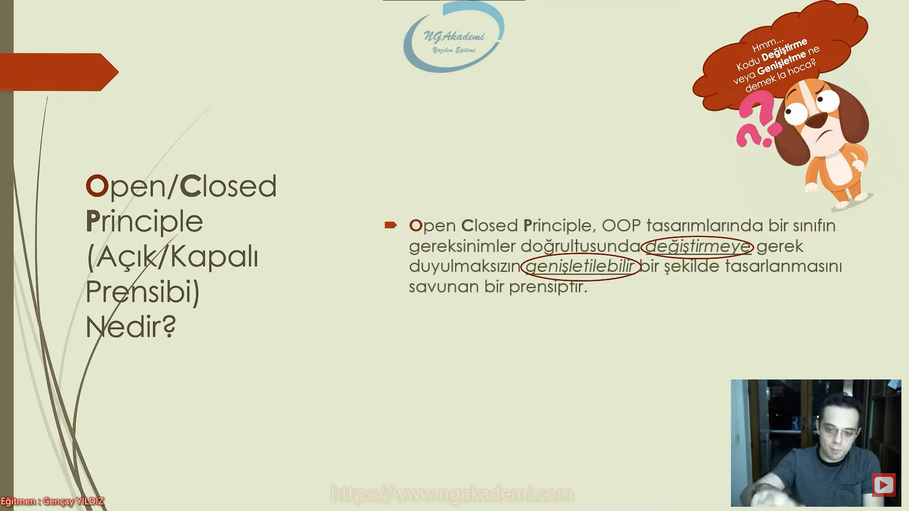
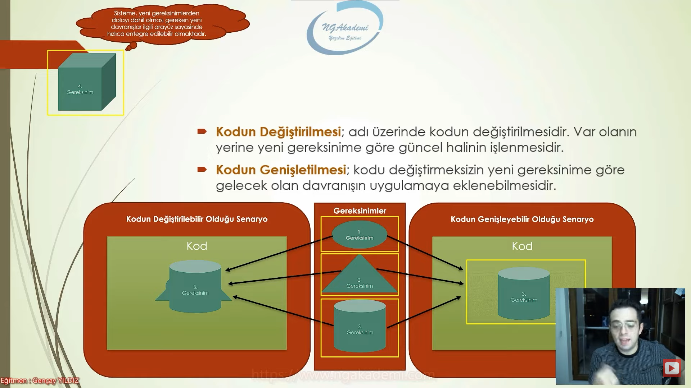

# Open - Closed Principle Nedir? (Açık/Kapalı)
- Bizler kodlarımızı belirli gereksinimlere göre inşa ederiz. Haliyle gereksinimler tabiatı itibariyle değişkenlik gösterebilir. Her bir gereksinim o anın durumu için söz konusu olabiliyor.

- Biz her gereksinim için kodumuzdaki davranışı tekrar ve tekrar modifiye etmeliyiz.

- Open - Closed Principle : Arkadaş gereksinimlerin değişmesi zaten işin tabiatında var. Bunda sıkıntı yok.Ama her gereksinime göre sen önceden inşa etmiş olduğun kodu değiştirmektense bunu öyle bir tasarla ki mümkün mertebe genişletilebilir bir hale getir. Haliyle kodu değiştirme. Kodu genişlet.

- Bu yüzden kodun genişletilmesine açık amma velakin değiştirilmesine kapalı ol diyor.

- Open Closed Principle, OOP tasarımlarında bir sınıfın gereksinimler doğrultusunda değiştirmeye gerek duyulmaksızın genişletilebilir bir şekilde tasarlanmasını savunan bir prensiptir.

***



***

- Kodun Değiştirilmesi : adı üzerinde kodun değiştirilmesidir. Var olanın yerine yeni gereksinime göre güncel halinin işlenmesidir.

- Kodun Genişletilmesi : kodu değiştirmeksizin yeni gereksinime göre gelecek olan davranışın uygulamaya eklenebilmesidir.

***



***

# İdeal Olmayan Kod
```C#
class ParaGonderici
{
    public void Gonder(int tutar)
    {
        //Garanti garanti = new();
        //garanti.HesapNo = "...";
        //garanti.ParaGonder(tutar);
        Halkbank halkbank = new();
        halkbank.GonderilecekHesapNo("123");
        halkbank.Gonder(tutar);
    }
}

class Garanti
{
    public string HesapNo { get; set; }
    public void ParaGonder(int tutar)
    {
        //...
    }
}
class Halkbank
{
    string _hesapNo;
    public void GonderilecekHesapNo(string hesapNo)
    {
        //...
    }
    public void Gonder(int tutar)
    {
        //...
    }
}
```

# İdeal Kod
```C#
class ParaGonderici
{
    public void Gonder(IBanka banka, int tutar, string hesapNo)
    {
        banka.ParaTransferi(tutar, hesapNo);
    }
}

interface IBanka
{
    bool ParaTransferi(int tutar, string hesapNo);
}
class Garanti : IBanka
{
    public string HesapNo { get; set; }
    public void ParaGonder(int tutar)
    {
        //...
    }

    public bool ParaTransferi(int tutar, string hesapNo)
    {
        try
        {

            HesapNo = hesapNo;
            ParaGonder(tutar);
            return true;
        }
        catch
        {
            return false;
        }
    }
}
class Halkbank : IBanka
{
    string _hesapNo;
    public void GonderilecekHesapNo(string hesapNo)
    {
        //...
    }
    public void Gonder(int tutar)
    {
        //...
    }

    public bool ParaTransferi(int tutar, string hesapNo)
    {
        try
        {
            GonderilecekHesapNo(hesapNo);
            Gonder(tutar);
            return true;
        }
        catch
        {
            return false;
        }
    }
}
class AhmetBank : IBanka
{
    public bool ParaTransferi(int tutar, string hesapNo)
    {
        throw new NotImplementedException();
    }
}
```

- Bir interface kullanarak mümkün mertebe bağımlılığı soyutlamış oluyoruz.

***
<h1><span style="color : yellowgreen;">Bir kod genişlemeye açık değişime kapalı olduğu taktirde ideal koddur!</span>

***


***

- Bir arayüz kullanıyorsan aslında sözleşme imzalamış oluyorsun.

# Faydaları Nelerdir?
- Koda;
    * Sürdürülebilirlik,
    * Genişletilebilirlik 
    * Yeniden kullanılabilirlik
    * Esneklik
- Kazandırır
- Böylece kodun gelen yeni gereksinimlere göre değişiklik direncini kıracak ve geliştiriciyi bu değişiklik süreçlerindeki maliyetlerin getirdiği yığınlardan soyutlayacaktır.

***


***

- Prensipler herhangi bir davranışı dayatmaz Prensipler sadece ilkeleri savunur.