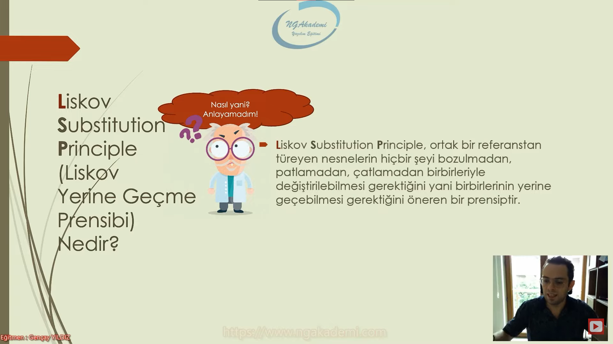
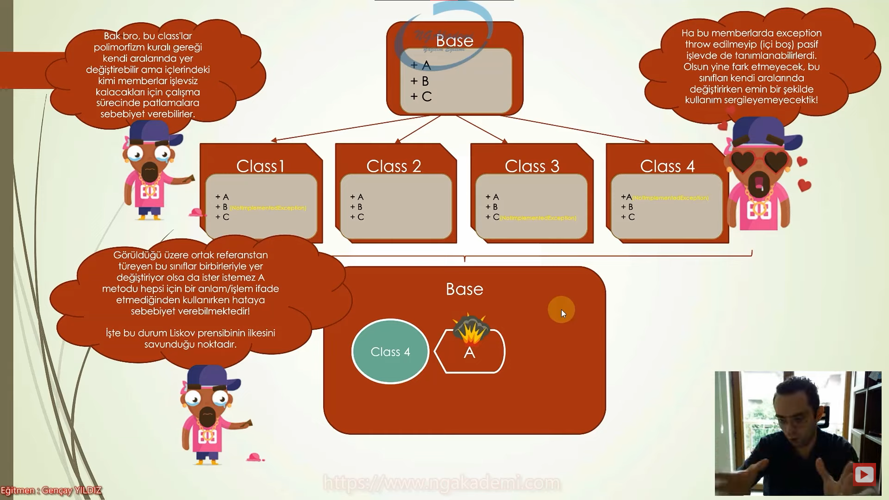
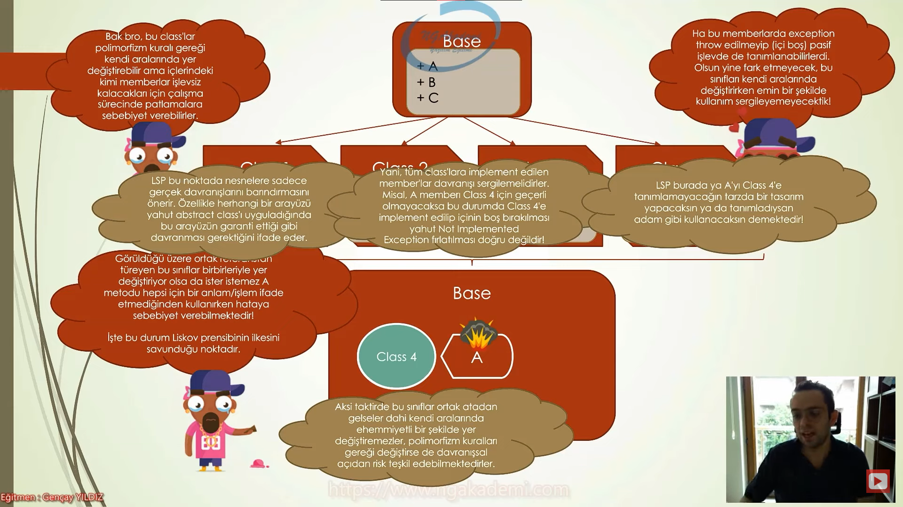

# Liskov Substition Principle (Liskov Yerine Geçme Prensibi) Nedir? 
- Liskov Substition Principle ortak bir referanstan türeyen nesnelerin hiçbir şeyi bozulmadan,patlamadan,çatlamadan birbirleriyle değiştirilebilmesi gerektiğini yani birbirlerinin yerine geçebilmesi gerektiğini öneren prensiptir.

*** 



***

- Nihayetinde Base'den türeyen tüm class'lar herhangi bir patlama çatlama olmaksızın birbirlerinin yerine geçebiliyor yani yer değiştirebiliyorlar...

*** 


***

- Eğer bir sınıf, herhangi bir interface yahut abstract class ile sözleşme yapıyorsa o zaman bu sözleşmeyi karşılamalı ve gerekli tüm memberları içerisinde tanımlamalıdır. Lakin bu memberlardam boş ve işlevsiz olanlar varsa işte orada problem var demektir.

- Hiçbir alt sınıf uygulamış olduğu base class'ın metotlarını ihlal etmemelidir. Yani implement yahut override edilen hiçbir metot boş kalmamalı veya boş kalmasın diye Not Implemented Exception gibi hatalar döndürmemelidir.

- Eğer böyle bir durum söz konusuysa bu nesneler birbirleri yerine geçebiliriler lakin ister istemez patlamalar çatlamalar meydana gelebilirler.

*** 


***

- Class'lar polimorfizm kuralı gereği kendi aralarında yer değiştirebilir ama içlerindeki kimi memberlar işlevsiz kalacakları için çalışma sürecinde patlamalara sebebiyet verebilirler.

- Ha bu memberlarda exception throw edilmeyip (içi boş) pasif işlevde de tanımlanabilirlerdi. Olsun yine fark etmeyecek bu sınıfları kendi aralarında değiştirirken emin bir şekilde kullanım sergileyemeyecektik.

- Ortak referanstan türeyen bu sınıflar birbirleriyle yer değiştiriyor olsa da ister istemez A metodu hepsi için bir anlam/işlem ifade etmediğinden kullanırken hataya sebebiyet verebilmektedir! İşte bu durum Liskov prensibinin ilkesini savunduğu noktadır.

- Liskov Substition Principle bu noktada nesnelere sadece gerçek davranışlarını barındırmasını önerir. Özellikle herahngi bir arayüzü yahut abstrac class'ı uyguladığında bu arayüzün garanti ettiği gibi davranması gerektiğini ifade eder.

- Yani tüm class'lara implement edilen member'lar davranışı sergilemelidirler.

*** 




***
- Yani bu prensip diyor ki sen herhangi bir arayüzü(interface) ya da abstract class'ı bir sınıfa uyguluyorsan bunun gerektirdiği gibi davrandığını sen onaylıyorsun/kabul ediyorsun/garanti ediyorsun. Haliyle buradaki garantiye dayanarak şunu söylemiş oluyorsun bu sınıf şu interface'i ya da abstract class'ı uyguladığından dolayı kesinlikle bu davranışları sergiyelen/ihtiyacı olan/özümseyen bir sınıftır. 

# İdeal Olmayan Kod
```C#
abstract class Cloud
{
    public abstract void Translate();
    public abstract void MachineLearning();
}
class AWS : Cloud
{
    override public void Translate()
        => Console.WriteLine("AWS Translate");
    override public void MachineLearning()
        => Console.WriteLine("AWS Machine Learning");
}

class Azure : Cloud
{
    override public void Translate()
        => throw new NotImplementedException();

    override public void MachineLearning()
        => Console.WriteLine("Azure Machine Learning");
}

class Google : Cloud
{
    override public void Translate()
        => Console.WriteLine("Google Translate");

    override public void MachineLearning()
        => Console.WriteLine("Google Machine Learning");
}
```
# İdeal Kod
```C#
abstract class Cloud
{
    public abstract void MachineLearning();
}
interface ITranslatable
{
    void Translate();
}
class AWS : Cloud, ITranslatable
{
    public void Translate()
       => Console.WriteLine("AWS Translate");
    override public void MachineLearning()
        => Console.WriteLine("AWS Machine Learning");
}

class Azure : Cloud
{
    override public void MachineLearning()
        => Console.WriteLine("Azure Machine Learning");
}

class Google : Cloud, ITranslatable
{
    public void Translate()
       => Console.WriteLine("Google Translate");

    override public void MachineLearning()
        => Console.WriteLine("Google Machine Learning");
}
```

<h1><span style ="color : greenyellow">Ortak referanstan türeyen nesneler herhangi bir davranış değişikliğine gerek duyulmaksızın birbirlerinin yerine geçebilmelidirler.</span>
</h1>
*** 


***

- Prensipleri anlamak için ne zaman ihmal edildiklerini anlamak önemlidir. Bu ilkenin ihlali ise şu noktada söz konusudur.

- Bir nesnenin, arayüz tarafından dayatılan sözleşmedeki davranışları yerine getirmediği durumlarda LSP ilkesine aykırılık söz konusudur.

*** 


***