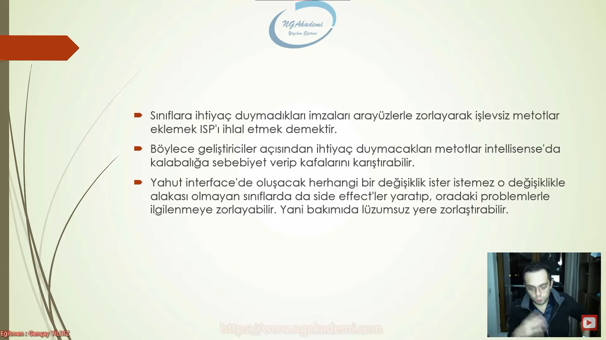
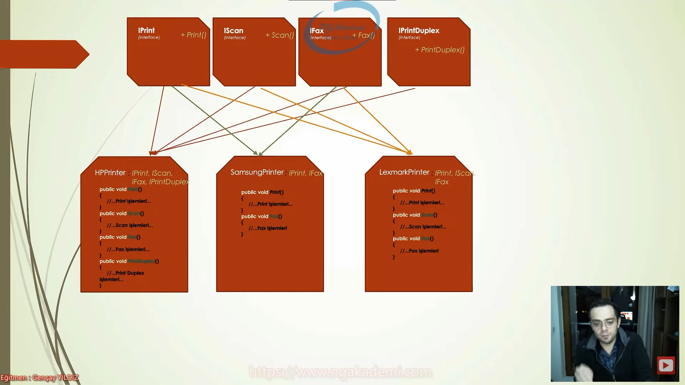

# Interface Segregation Principle (Arayüz Ayrım Prensibi) Nedir?
- Interface denilen yapılanmalar OOP'de nesenlerimiz/sınıflarımız için bir Kontrat mantığında işlev gören yapılardır. Bir sözleşmedir.

- Bir arayüz içine koymuş olduğumuz imzalar Bu arayüzü uygulayacak tüm sınıflar tarafından %100 uygulanacak anlamına gelmektedir. Yani bu bir vaatte bulunmaktır.

- Arayüzün referansı üzerinden bu arayüzü implement etmiş tüm nesneler gönül rahatlığıyla kullanılabilir. Çünkü içindeki imzaları %100 o sınıflara uygulattıracaktır ve bizde buradaki kontrattan kesinlikle eminiz.

- Interface ilgili sınıfın davranışlarını belirler.

- Interface Segregation Principle => Yani arayüzler mümkün mertebe tek bir olguya odaklı bir şekilde sözleşme/davranışlar barındırsın Amma velakin alakasız davranışların hepsini ayırabil ki ilgili sınıflar o davranışlarla ilgili herhangi bir sorumluluk üstlenmiyeceklerse lüzumsuz yere bunları uygulamak zorunda kalmasınlar.

- Günlük hayattaki sözleşme mantığının yazılıma aktarılmış haline Interface Segregation Principle diyoruz.

- Interface Segregation Principle bir nesnenin yapması gereken her farklı davranışın, odaavranışa odaklanmış özel interface'ler ile eşleşmesini öneren prensiptir.

- Böylece ihtiyaç olan davranışları temsil eden interface'ler eşliğinde ilgili sınıflara kazandırabilşir ve hiçbir sınıfın kullanmadığı bir imzayı zorla implement etmek zorunda kalmaksızın inşa sürecine devam edebiliriz.

***


***

- Sınıfların ihtiyaç duymadıkları imzaları arayüzlerle zorlayarak işlevsiz metotlar eklemek Interface Segregation Principle'ı ihlal etmek demektir.

- Geliştiriciler açısından ihtiyaç duymayacakları metotlar intellisense'da kalabalığa sebebiyet verip kafalarını karıştırabilir.

- Yahut interface'de oluşacak herhangi bir değişiklik ister istemez o değişiklikle alakası olmayan sınıflarda da side effect'ler yaratıp oradaki problemlerle ilgilenmeye zorlayabiliri. Yani bakımıda lüzumsuz yere zorlaştırabilir. 

***



***

# İdeal Olmayan
```C#
interface IPrinter
{
    void Print();
    void Scan();
    void Fax();
    void PrintDuplex();
}

class HPPrinter : IPrinter
{
    public void Fax()
    {
        //... Fax işlemleri ...
    }

    public void Print()
    {
        //... Print işlemleri ...
    }

    public void PrintDuplex()
    {
        //... Print Duplex işlemleri ...
    }

    public void Scan()
    {
        //... Scan işlemleri ...
    }
}
class SamsungPrinter : IPrinter
{
    public void Fax()
    {
        //... Fax işlemleri ...
    }

    public void Print()
    {
        //... Print işlemleri ...
    }

    public void PrintDuplex()
        => throw new NotSupportedException();

    public void Scan()
        => throw new NotSupportedException();
}
class LexmarkPrinter : IPrinter
{
    public void Fax()
    {
        //... Fax işlemleri ...
    }

    public void Print()
    {
        //... Print işlemleri ...
    }

    public void PrintDuplex()
        => throw new NotSupportedException();

    public void Scan()
    {
        //... Scan işlemleri ...
    }
}
```

- Hacmi geniş olan ve davranışsal olarak farklı yetenekleri içerisinde barındıran interface'ler mümkün mertebe yeteneklerine göre parçalanarak küçültülmelidirler.

- Kümülatif olarak yetenekleri barındıran interface'ler sınıflara uygulandığı taktirde çoğu sınıf için birçok yeteneğe ihtiyaç duyulmayacağı için anlamsız kalıp olarak tanımlanıp kalacaktırlar! Bu da istenmeyen bir durumdur!

- Genellikle bu tarz istenmeyen durumlar salt olarak NotSupportedException veya NotImplementedException gibi hataların fırlatıldığı metotlarda fark edilebilmektedirler. Bu tarz metotlar varsa ISP açısından olayın/inşanın değerlendirilmesinde fayda vardır.

***




***

# İdeal Kod
```C#
interface IPrint
{
    void Print();
}
interface IScan
{
    void Scan();
}
interface IFax
{
    void Fax();
}
interface IPrintDuplex
{
    void PrintDuplex();
}
class HPPrinter : IPrint, IScan, IFax, IPrintDuplex
{
    public void Fax()
    {
        //... Fax işlemleri ...
    }

    public void Print()
    {
        //... Print işlemleri ...
    }

    public void PrintDuplex()
    {
        //... Print Duplex işlemleri ...
    }

    public void Scan()
    {
        //... Scan işlemleri ...
    }
}
class SamsungPrinter : IPrint, IFax
{
    public void Fax()
    {
        //... Fax işlemleri ...
    }

    public void Print()
    {
        //... Print işlemleri ...
    }
}
class LexmarkPrinter : IFax, IPrint, IScan
{
    public void Fax()
    {
        //... Fax işlemleri ...
    }

    public void Print()
    {
        //... Print işlemleri ...
    }

    public void Scan()
    {
        //... Scan işlemleri ...
    }
}
```

- Bağımsız olan davranışlara göre bir ayrım ortaya koy

<h1 style="color : yellowgreen">Yazılımdaki davranışları tek bir bütün olarak tutmaktansa, birbirlerinden bağımsız olacak şekilde birden çok parçaya bölmek ideal kod yapısını ortaya çıkarır.</h1>

***


***

## Son olarak 
- ISP ihlali doğrudan LSP ve SRP'ın da ihlaline sebebiyet vermektedir.

- ISP sınıf tarafından desteklenmeyecek metotların lüzumsuz yere tanımlanmamasına karşı odaklanırken, LSP ise benzer şekilde bu tarz işlevsiz metotların barındırıldığı sınıflardan olan nesnelerin kendi aralarında olan değişimleri sürecinde patlama ya da boşa çıkma riskini ortadan kaldırmaya odaklanmaktadır.

- SRP'da ise sınıfların değişmesi için yalnızca tek bir nedenin olması gerektiği söylenirken ISP'de de hacmi büyük arayüzler yüzünden implemente edilmiş alakasız yöntemlerin değiştirilmesi gibi durumlarda ilgili sınıfta değişiklik gerekeceğinden dolaylı yoldan sınıfların sadece tek bir değişim nedeni olması desteklenmektedir.