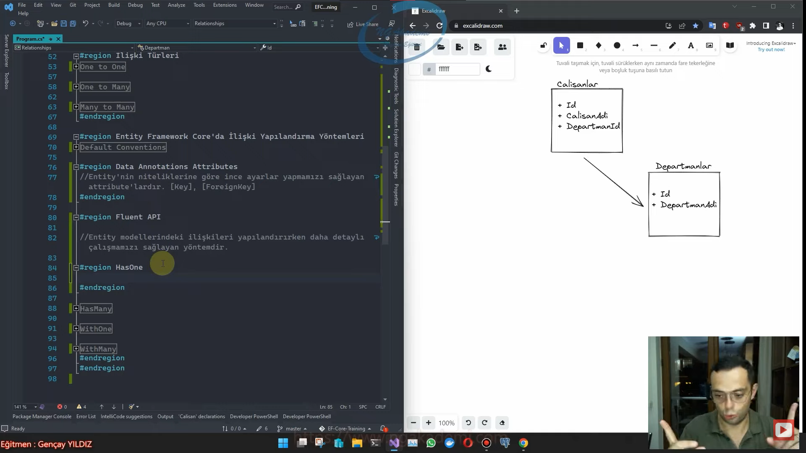
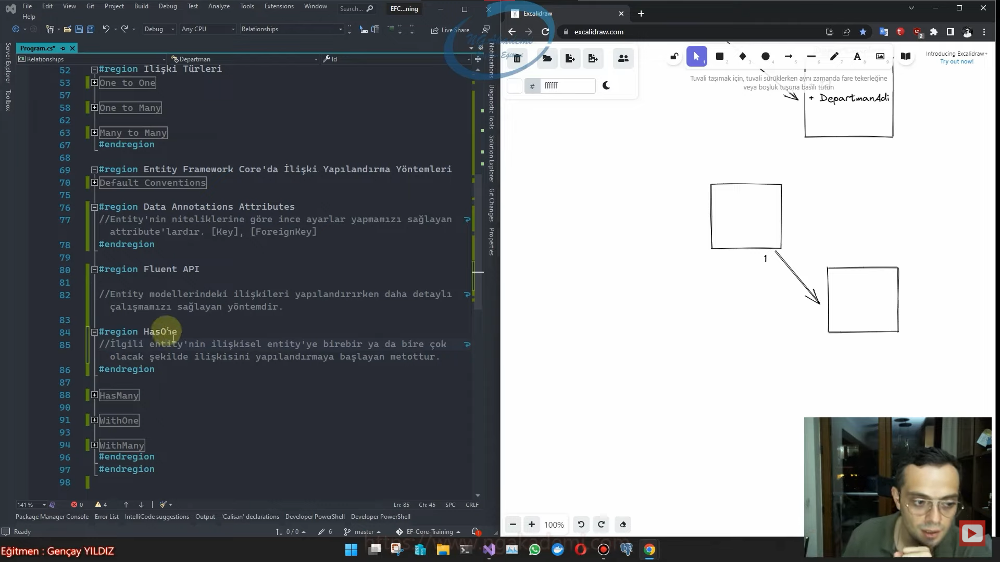

# Relationships(İlişkiler) Terimleri
# Principal Entity(Asıl Entity)
- Kendi başına/tek başına/bağımsız bir şekilde var olabilen tabloyu modelleyen entity'e denir. Yani herhangi bir tabloya bağımlılığı olmayan tablodur.

- Departmanlar tablosunu modelleyen 'Departman' entity'sidir.

# Dependent Entity(Bağımlı Entity)
- Kendi başına var olamayan bir başka tabloaya bağımlı(ilişkisel olarak bağımlı) olan tabloyu modelleyen entity'e denir.

- Çalışanlar tablosunu modelleyen 'Calisan' entity'sidir.

# Foreign Key
- Principal Entity ile Dependent Entity arasındaki ilişkiyi sağlayan key'dir.

- Entity'ler arasında bu ilişkiyi kurabilmek için kullanacağımız bir tane property var İşte bu property'e foreign key property'si diyeceğiz.

- Dependent Entity'de tanımlanır.

- Principal Entity'deki Principal Key'i tutar.


# Principal Key
- Principal Entity'deki Id'nin ta kendisidir.

- Principal Entity'nin kimliği olan kolonu ifade eder.

```C#
class Calisan
{
    public int Id { get; set; }
    public string CalisanAdi { get; set; }
    public int DepartmentId { get; set; }
    public Departman Departman { get; set; }
}
class Departman
{
    public int Id { get; set; }
    public string DepartmanAdi { get; set; }
    public ICollection<Calisan> Calisanlar { get; set; }
}
```
***



***

# Navigation Property Nedir?
- İlişkili tablolar arasındaki fiziksel erişimi entity class'ları üzerinden sağlayan property'lerdir. 

- Bir property'nin Navigation Property olabilmesi için kesinlikle entity türünden olması gerekiyor.

- Navigation property'ler entity'lerdeki tanımlarına göre n'e n yahut 1'e n şeklinde ilişki türlerini ifade etmektedirler. Sonraki derslerimizde ilişksiel yapıları tam teferruatlı pratikte incelerken navigation property'lerin bu özelliklerinden istifade ettiğimizi göreceksiniz.

# İlişki Türleri

# One To One
- Çalışan ile adresi arasındaki ilişki

- Karı koca arasındaki ilişki.(Medeni hukuk sınırları çerçevesinde)

```C#
public Departman Departman { get; set; }
public Calisan Calisan { get; set; }
```

# One To Many
- Çalışan ile Departman arasındaki ilişki,

- Anne ve çocukları arasındaki ilişki.

```C#
public Departman Departman { get; set; }
public ICollection<Calisan> Calisanlar { get; set; }
```

# Many To Many
- Çalışanlar ile projeler arasındaki ilişki,

- Kardeşler arasındaki ilişki.

```C#
public ICollection<Proje> Projeler { get; set; }
public ICollection<Calisan> Calisanlar { get; set; }
```

# EntityFramework Core'da İlişki Yapılandırma Yöntemleri
- EntityFramework Core'da ilişki yapılanmasını inşa ederken kullancağımız bazı aparatlarımız var. İşte bu aparatlara ilişki yapılandırma yöntemleri diyoruz.

# Default Conventions
- Varsayılan entity kurallarını kullanarak yapılan ilişki yapılandırma yöntemleridir. Navigation Property'leri kullanarak ilişki şablonlarını çıkarma yöntemleridir.İşte biz buna geleneksel yöntem diyoruz.

# Data Annotations Attributes
- Entity'nin niteliklerine göre ince ayarlar yapmamızı sağlayan attribute'lardır. [Key], [ForeignKey]
#endregion

# Fluent API
- Entity modellerindeki ilişkileri yapılandırırken daha detaylı çalışmamızı sağlayan yöntemlerdir.

***



***

# HasOne
- İlgili entity'nin ilişkisel entity'e birebir ya da bire-çok olacak şekilde ilişkisini yapılandırmayı başlatan fonksiyondur.

# HasMany
- İlgili entity'nin ilişkisel entity'e çoka bir ya da çoka-çok olacak şekilde ilişkisini yapılandırmayı başlatan fonksiyondur.

# WithOne
- HasOne ya da HasMany'den sonra birebir ya da çoka bir olacak şekilde ilişki yapılandırmasını tamamlayan metottur.

# WithMany
- HasOne ya da HasMany'den sonra bire-çok ya da çoka çok olacak şekilde ilişki yapılandırmasını tamamlayan metottur.

