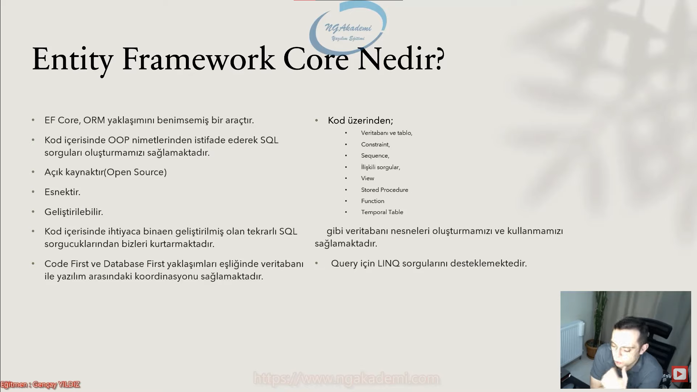

# EF Core Nedir?
- EF Core, ORM yaklaşımını benimsemiş ve bu yaklaşımı somutlaştıran bir araçtır. 
- Kod içerisinde OOP nimetlerinden istifade ederek SQL sorguları oluşturmamızı sağlamaktadır.
- Açık kaynaktır
- Esnektir.
- Geliştirilebilir.
- Kod içerisinde ihtiyaca binaen geliştirilmiş olan tekrarlı SQL sorgucuklarından bizleri kurtarmaktadır.
- Code First ve Database First yaklaşımları eşliğinde veritabanı ile yazılım arasındaki koordinasyonu sağlamaktadır.
- Kod üzerinden;
    * Veritabanı ve Tablo
    * Constraint
    * Sequence
    * İlişkili Sorgular
    * View
    * Stored Procedure
    * Function 
    * Temporal Table
- gibi veritabanı nesneleri oluşturmamızı ve kullanmamızı sağlamaktadır.
- Query için LINQ sorgularını desteklemektedir.

***

 

***

# ORM Olarak Neden EF Core Seçilmelidir?
- EF Core, her ne kadar hızlı ve performanslı bir yapıya sahip olsa da piyasadaki en hızlı ORM aracıdır diyemeyiz.
- Misal olarak; minimal özelliklere sahip olan Dapper, Raw(ham) sorgular kullandığından dolayı kelimenin tam anlamıyla EF Core'dan çok daha hızlıdır.
- Lakin her bir güncellemesinde performansının arttığı gözlemlenen EF Core'un ise birçok özelliği mevcuttur.
- OOP nimetlerinden istifade etmemizi sağlayan EF Core ile class oluşturma, nesne değişikliklerini izleme(Change Tracker) mapping vs. gibi türlü işlemler gerçekleştirebiliriz.

***

 

***

# EF Core Nasıl Yüklenir?

***

 

***

# .NET Core command-line interface (CLI) tools
- dotnet-ef ile başlayan CLI komutlarını ilgili PC'de aktif olarak kullanabilmemizi sağlayan tool'dur.

***

 

***

# Package Manager Console (PMC) tools

***

 

***