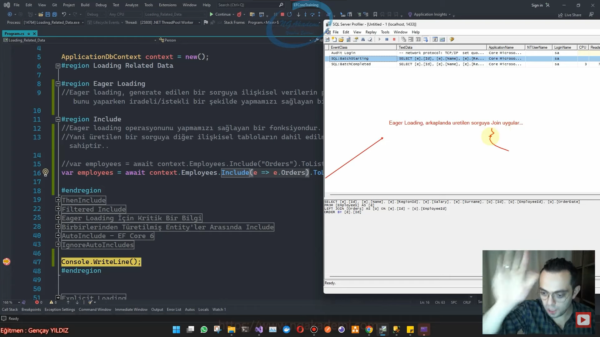
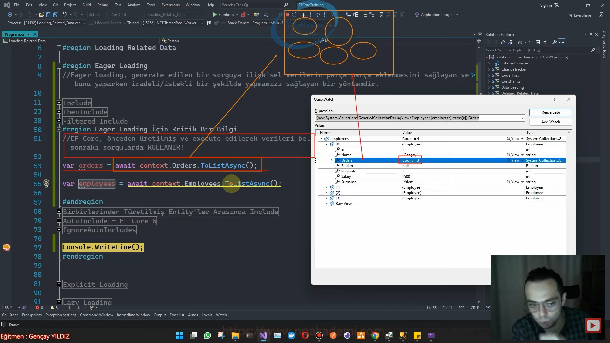

# Loading Related Data

# Eager Loading
- Bir sorgu oluşturuyorsunuz ve bu sorguyu ilişkisel diğer tablolardan verileri de bu sorguya eklemek istiyorsunuz işte böyle bir durumda diğer tabloları bu sorguya parça parça eklememizi sağlayan yöntemdir.

- Eager Loading generate edilen bir sorguya ilişkisel verilerin parça parça eklenmesini sağlayan ve bunu yaparken ireadeli/istekli bir şekilde yapmamızı sağlayan bir yöntemdir.

- Bu yöntem ilişkisel verilerin sorguya eklenmesini geliştiricinin iradesiyle yapıldığını savunur. 

#region Include
- Eager Loading operasyonunu yapmamızı sağlayan bir fonksiyondur.

- Yani üretilen bir sorguya diğer ilişkisel tabloların dahil edilmesini sağlayan bir işleve sahiptir..

- Herhangi bir tabloya dair bir sorguyu oluşturuyorsam bu sorgu salt bir şekilde oluşturulur.

- ToListAsync IEnumerable yani artık işin bellek kısmında çalışır veritabanından gelecek verilere sorguyu oluştururken bu sorguya uygun bir şekilde müdahale de bulunmamız gerekiyor. Haliyle biz veritabanından veriler belleğe gelmeksizin çalıştırılacak sorgunun üzerinde bu operasyonu yapmam lazım.

- DbSet ya da IQueryable üzerinde çalışmalarımızı yaparız. IQueryable bize netice itibariyle sorguyu oluşturacak en sonunda execute ettiğimizde oluşturduğumuz çalışmasını yaptığımız sorguyu execute edeceğiz neyse o execute edileceği için ona göre bir neticeyi elde etmiş olacağız.

- Include kullanabilmek için sorgunun IQueryable/execute edilmemiş olması gerekir. 

- Eager Loading arkaplanda üretilen sorguya hedef tabloya Join uygular.

- Include kullanarak o anki sorguya istediğiniz kadar tabloyu dahil edebilirsiniz. ORM orada ihtiyacımız olan sorgu neyse onu uygular. Inner,Left,Right join

- Include ilişkisel Navigation Property'lerde koleksiyonel olsun direkt tekil olsun farketmiyor her ikisinde de hedef tabloya uygun şekilde karşılık tablolarını join olarak sorguya eklemiş oluyor.

```C#
var employees = await context.Employees.Include("Orders").ToListAsync();
var employees = await context.Employees.Include(e => e.Orders).ToListAsync();//Üretmiş/generate etmiş olduğum sorguya Orders tablosunu parça olarak dahil etmiş oluyorum.

var employees = await context.Employees.Include("Orders").ToListAsync();
var employees = await context.Employees
   .Where(e => e.Orders.Count() > 2)
   .Include(e => e.Orders)
   .Include(e => e.Region)
   .ToListAsync();
```



# ThenInclude
- Eğer ki Navigation property tekil ise oradan property'lere erişe erişe memberların üzerinden gidebilirsin. Amma velakin bir koleksiyonel Navigation Property'den bu türün ilişkili olduğu başka bir tabloya gitmen gerekiyorsa zaten Include üzerinden gidemezsin bu yüzden burada ThenInclude fonksiyonunu kullanırsın. 

- ThenInclude bir önceki koleksiyonel olarak include edilmiş tablonun türüne karşılık bir Include operasyonu yapmamızı sağlar.

- Bir önce include yaparak buradaki sorguya dahil edilmiş olan Navigation Property'nin türünü ben ThenInclude ile sorguda elde ediyorum ve bu türün içindeki diğer ilişkili alanlara erişim sağlayabiliyorum.

- ThenInclude, üretilen sorguda Include edilen tabloların ilişkili olduğu diğer tablolarıda sorguya ekleyebilmek için kullanılan bir fonksiyondur. 

- Eğer ki, üretilen sorguya include edilen navigation property koleksiyonel bir property ise işte o zaman bu property üzerinden diğer ilişkisel tabloya erişim gösterilememektedir. Böyle bir durumda koleksiyonel property'lerin türlerine erişip o tür ile ilişkili diğer tablolarıda sorguya eklememizi sağlayan fonksiyondur.

```C#
var orders = await context.Orders
   //.Include(o => o.Employee)
   .Include(o => o.Employee.Region).ToListAsync();

var regions = await context.Regions
   .Include(r => r.Employees)
   .ThenInclude(e => e.Orders).ToListAsync();
```

# Filtered Include
- Sorgulama süreçlerinde Include yaparken sonuçlar üzerinde filtreleme ve sıralama gerçekleştirebilmemizi sağlayan bir özelliktir.

```C#
var regions = await context.Regions.Include(r => r.Employees.Where(e => e.Name.Contains("a")).OrderByDescending(e => e.Surname)).ToListAsync();
```

- Desteklenen Fonksiyon : Where, OrderBy, OrderByDescending, ThenBy, ThenByDescending, Skip, Take

- Change Tracker mekanizmasının aktif olduğu durumlarda yapılan sorgulamalarda elde edilen verilerde eğer ki FilteredInclude yapısını kullanıyorsanız oradaki verilerde değişiklikler söz konusu olabilir.

- Eğer FilteredInclude fonksiyonunu kullancaksanız ChangeTracker mekanizmasını kapatmalısınız. 

- Change Tracker mekanizmasının aktif olduğu durumlarda Include edilmiş sorgular üzerindeki sonuçları beklenmeyen olabilir. Bu durum daha önce sorgulanmış ve Change Tracker tarafından takip edilmiş veriler arasında filtrenin gereksinimi dışında kalan veriler için söz konusu olacaktır. Bundan dolayı sağlıklı bir FilteredInclude operasyonu için Change Tracker'ın kullanılmadığı sorguları tercih etmeyi düşünebilirsiniz.

# Eager Loading İçin Kritik Bir Bilgi
- Gerçek projelerde EagerLoading mekanizmasını haddinden fazla kullanmaktayız. Haliyle fazlasıyla kullandığımız için yer yer hemer performans hem de maliyet açısından mikro düzeyde optimizasyonlara ihtiyacımız olabilecektir. 

- EF Core önceden üretilmiş ve execute edilerek verileri belleğe alınmış olan sorguların verilerini sonraki sorgularda KULLANIR!

- Eğer ki gerçek operasyonda yapmış olduğun çalışmada önceden bir veriyi sorgulayıp belleğe aldığından eminsen daha sonraki operasyonlarında bir daha o tabloyu Include etmene gerek kalmadığını bil.

```C#
var orders = await context.Orders.ToListAsync();

var employees = await context.Employees.ToListAsync();
```



# AutoInclude - EF Core 6
- Eğer ki bir türe karşılık yapılacak uygulama seviyesindeki her bir sorguda kesinlikle bir tabloya karşılık Include yapılcaksa eğer bunu her sorguda özel tek tek Include işlemini gerçekleştirmektense merkezi bir hale getirmemizi sağlayan bir özelliktir.

- Uygulama seviyesinde bir entity'e karşılık yapılan tüm sorgulamalarda "kesinlikle" bir tabloya Include işlemi gerçekleştirilecekse eğer bunu her bir sorgu için tek tek yapmaktansa merkezi bir hale getirmemizi sağlayan özelliktir.

```C#
var employees = await context.Employees.ToListAsync();
protected override void OnModelCreating(ModelBuilder modelBuilder)
{
   modelBuilder.Entity<Employee>()
      .Navigation(e => e.Region)
      .AutoInclude();
}
```

# IgnoreAutoIncludes
- Bazen istediğimiz sorgularda bu AutoInclude operasyonunu pasif hale getirmek isteyebiliriz. Bu durumda IgnoreAutoIncludes fonksiyonunu kullanabiliriz.

- AutoIncludes konfigürasyonunu sorgu seviyesinde pasifize edebilmek için kullandığımız fonksiyondur.

```C#
var employees = await context.Employees.IgnoreAutoIncludes().ToListAsync();
```

# Birbirlerinden Türetilmiş Entity'ler Arasında Include
- Kalıtımsal durumlardaki Entity'ler arasında yapılan Include fonksiyonunda kullandığımız yapılar.
## Cast Operatörü İle Include
```C#
var persons = await context.Persons.Include(p=>((Employee)p).Orders).ToListAsync();
```

## As Operatörü İle Include
```C#
var persons2 = await context.Persons.Include(p => (p as Employee).Orders).ToListAsync();
```

# 2. Overload İle Include
```C#
var persons3 = await context.Persons.Include(p => ("Orders")).ToListAsync();
```


# Entities & DbContext
```C#
public class Person
{
    public int Id { get; set; }
}
public class Employee : Person
{
    //public int Id { get; set; }
    public int RegionId { get; set; }
    public string? Name { get; set; }
    public string? Surname { get; set; }
    public int Salary { get; set; }

    public List<Order> Orders { get; set; }
    public Region Region { get; set; }

}
public class Region
{
    public int Id { get; set; }
    public string Name { get; set; }
    public ICollection<Employee> Employees { get; set; }
}
public class Order
{
    public int Id { get; set; }
    public int EmployeeId { get; set; }
    public DateTime OrderDate { get; set; }

    public Employee Employee { get; set; }
}

class ApplicationDbContext : DbContext
{
    public DbSet<Person> Persons { get; set; }
    public DbSet<Employee> Employees { get; set; }
    public DbSet<Order> Orders { get; set; }
    public DbSet<Region> Regions { get; set; }

    protected override void OnModelCreating(ModelBuilder modelBuilder)
    {
        modelBuilder.ApplyConfigurationsFromAssembly(Assembly.GetExecutingAssembly());
        modelBuilder.Entity<Employee>()
            .Navigation(e => e.Region)
            .AutoInclude();
    }
    protected override void OnConfiguring(DbContextOptionsBuilder optionsBuilder)
    {
        optionsBuilder.UseSqlServer("Server=localhost,1433;Database=ApplicationDb;User ID=SA; Password=1q2w3e4r!.;TrustServerCertificate=True;");
    }
}
```