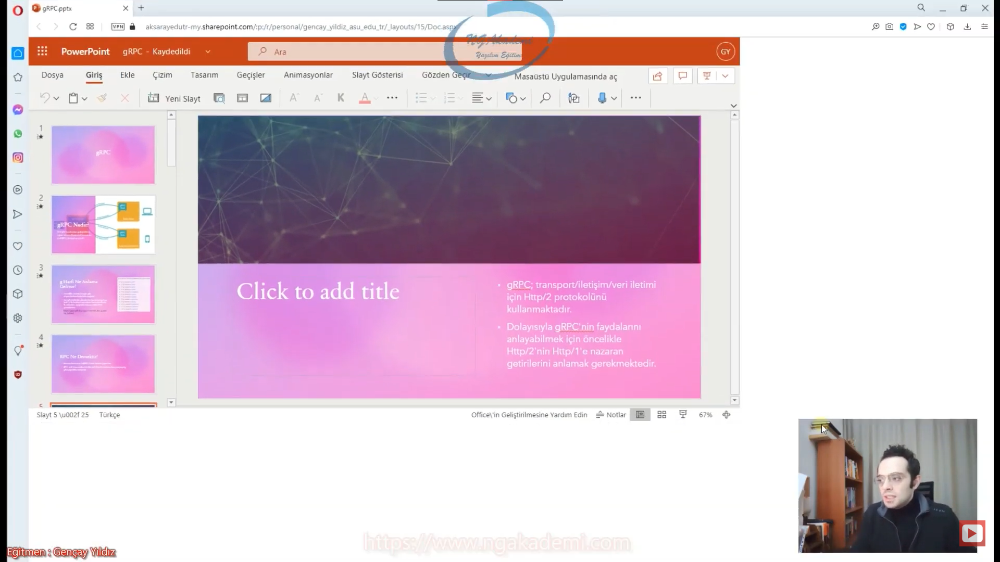

# gRPC Nedir?

- Google tarafından geliştirilmiş open source Remote-Procedure-Call(RPC) kütüphanesidir.

- Uzaktaki bir prosedürü çağırmak. Yani sen çalışmış olduğun kodun/projenin ya da bilgisayarın içinde sanki senin kodunda/senin projende/senin bilgisayarındaymış gibi aslında olmayan uzakta olan başka bir yerde olan bir fonksiyonu tetikleyebilmektir.

- Sen kendi uygulamalarında bir server yada client olarak Server'la Client arasındaki ilişkiyi biz burada fonksiyonellik üzerinden gerçekleştiriyoruz. Yani Server Client'taki ya da Client Server'daki herahngi bir fonksiyonu sanki kendisindeymiş gibi çağırabiliyor.

- Operasyonel olarak şöyle değerlendireceğiz. Server Client'taki bir fonksiyonu çağırıyor. Client'ta Server'a bir istek gönderecek.

# gRPC'de ki g Harfi Ne Anlama Geliyor?

- Genellikle üreticisi Google gibi düşünülmektedir lakin değildir!

- Google tarafından çıkarılan her bir sürüm için baş harfi 'g' ile başlayan ayrı anlamı ifade etmektedir.

# RPC Ne Demektir?

- Remote-Procedure-Call(RPC) Uzak Yordam Çağrısıdır.

- RPC; uzak sunucudaki metotları sanki kendi ortamının birer parçasıymış gibi çağırabilen sistemdir.

- gRPC; transport/iletişim/veri iletimi için Http/2 protokolünü kullanmaktadır.

- Dolayısıyla gRPC'nin faydalarını anlayabilmek için öncelikle Http/2'nin Http/1'e nazaran getirilerini anlamak gerekmektedir.

# Http1 İle Http2 Farkları Nelerdir?

| Http/1                                                                                                                                                                               | Http/2                                                                                                                                                                                                                                                                                    |
| ------------------------------------------------------------------------------------------------------------------------------------------------------------------------------------ | ----------------------------------------------------------------------------------------------------------------------------------------------------------------------------------------------------------------------------------------------------------------------------------------- |
| Her bir statik dosya için(.css, .js, .png vs.) ayrı istek göndermektedir. Bu durum ise yük ve maliyet arttıracağından dolayı ekstradan bekleme süresinin artmasına sebep olmaktadır. | Dosyalar için tüm istekler tek seferde toplu olarak yapılabilmektedir. Böylece açılış hızı artmakta, süresi düşürülmektedir.. Bu duruma Multiplexing denmektedir.Teknik olarak, tek bir TCP bağlantısı üzerinde birden çok ve paralel request ve response yeteneği olarak yorumlanabilir. |
| Web sitesinde ne kadar dosya varsa bunların yüklenebilmesi için hepsi ayrı ayrı tek tek yüklenecektir.                                                                               | Http/2'de ise tek bir istekte bulunuyor.Tüm gelecek olan dosyalar tek bir bağlantı üzerine, tek bir istek neticesinde gelecektir.                                                                                                                                                         |
| Hatta ayrı istek gönderecek bu istekler neticesinde dosyalar yüklenecektir. Dolayısıyla Http/1'de sen bir sayfayı yüklerken bir sürü istek yolluyorsun.                              | Böylelikle açılış hızı artacak. Süresi düşecektir. Http/2'de tek bir istek yapılacak ve bütün yüklenmesi gerekenler yüklenecektir.                                                                                                                                                        |
|                                                                                                                                                                                      | Yani sen tek bir istek gönderiyorsun Birden çok sanki response geliyormuş gibi düşün kimisi css'i getiriyor kimisi png dosyasını getiriyor kim javascript dosyasını getiriyor.Ama hepsi tek bir requeste karşılık olarak geliyor.                                                         |

| Http/1                                                     | Http/2                                                                                                                          |
| ---------------------------------------------------------- | ------------------------------------------------------------------------------------------------------------------------------- |
| Metin tabanlı(text based) protokoldür.                     | Client ile server arasındaki iletişim binary formatta ki küçük frame'lere ayrılmaktadır. Bu duruma Binary Protokol denmektedir. |
| Her request'e sıkıştırılmamış vaziyette header gönderilir. | Her request'te header'lar HPACK ile sıkıştırılarak gönderilmektedir. Bu duruma Header Compression denmektedir.                  |
| Bir request'e bir response döner                           | Bir request'e karşılık birden fazla response alınabilir. Server Push                                                            |

- gRPC; CPU, memory ve bandwidth kullanımının önemli ve kritik olduğu uygulamalarda JSON yerine binary formatta çalıştığı için tercih edilebilecek bir teknolojidir.

- gRPC; transfer edilecek dataları Google tarafından geliştirilmiş, binary serialization protokolü olan Protocol Buffers(Protobuf)'ı kullanarak iletmekte ve serialize ve deserialize etmektedir.

- Yani datayı JSON yahut XML gibi text yerine binary formata çevirmekte ve diğer formatlara göre hatrı sayılır miktarda hız ve performans elde edebilmektedir.

- gRPC; Server'la Client arasındaki iletişimi binary formatta yapan ve bunuda yapabilmek için Http/2 protokolünü kullanan Http/1'e nazaran daha da hızlı iletişimi sağlayan bir kütüphanedir.

- Binary format her ne kadar JSON gibi insan seviyesinde okunabilir bir format olmasa da JSON'a nazaran daha hızlı işlenebildiğinden ve ayrıca herhangi bir string parsing işleminin olmamasından dolayı tercih edilmektedir.

- Tabi ihtiyaç doğrultusunda gRPC, JSON/XML gibi text tabanlı formatları da destekleyebilmektedir.

- Nihayetinde benim için hız önemlidir. Hızın önemli olduğu bir yerde benim ihtiyaçlarım bir tık daha geri seviyeye düşer. Hızın maliyetin önemli olduğu durumlarda developer'ın anlayabileceği bir formattan ziyade varsın ki anlamayacağı bir formatta olsun ama hızlı olsun dediğimiz formattır Binary formatı/türü.

# Neden gRPC Kullanmalıyız?

- Günümüzde yoğun bir şekilde uygulama geliştirme yaklaşımı olarak benimsenen microservice yapılanması, sistemin gelişim sürecini her ne kadar dinamize etse de bir o kadar da servisler arası iletişim hızını monolithic yaklaşıma binaen oldukça düşürmektedir.

- Bu durum ise bizlere klasik Restful mimarisinden ziyade daha hızlı bir altyapı ihtiyacı hissettirmekte ve mümkün mertebe iletişim hızımızı güçlendirecek farklı teknolojilere yönlendirmektedir.

- Nihayetinde Restful Service'ler çoğunlukla external(dış) bir client tarafından consume edilemk için daha uygun bir fıtrata sahiptir ve text-based messaging'e dayandığı için internal(iç) service iletişimine pekte yatkın bir seçenek değildir. Çünkü burada hız önplandadır.

- Haliyle dış dünya tarafından tüketilmeyen internal projelerde Restful'dan ziayade binary-based messaging'i benimseyen gRPC'yi kullanmamız, bizleri iletişim hızı açısından monolithic'e en yakın seviyeye çıkarmaktadır diyebiliriz.

# gRPC RestFull'u Çöpe mi Atacak?

- gRPC sayesinde Restfull'un etkisini yitirdiğini düşünmek yanlış olacaktır. En nihayetinde external client'lar tarafından consume edilen uygulamalarda Restfull mimarisi hala en kolay, kullanışlı ve efektif çözümdür.

# IoT(Internet of Things) Çağında gRPC

- IoT(Internet of Things) Çağında cihazlar arası iletişim içinde gRPC iyi bir seçenek diyebiliriz.

- Veri transferinde mümkün mertebe sistemi yormayacak bir çalışma sergilememiz lazım.

- Ayrıca gRPC dilden bağımsız birbiriyle performanslı iletişim kurabilen uygulamalar geliştirmemizi sağlayabilmekte ve bundan daha da mühim olan birden fazla dil tarafından deskteklenebilmektedir. Desteklenen diller; C#, C++, Java, Php, Python vs. şeklinde özetlenebilir.

# gRPC'nin Avantajları Nelerdir?

- Http/1'e nazaran Http/2'yi kullanmaktadır. Böylee Http/2 stream desteği verebilmektedir.

- TCP socket haberleşmesi sağlayabilmektedir.

- Http/2 sayesinde binary serialization kullanmaktadır. Böylece text-based mesajlaşmaya nazaran oldukça hızlıdır.

- Yapılan optimizasyonlar neticesinde Http/1 kullanan Restfull servislere naaran 2.5 kat daha hızlı olduğu tespit edilmiştir. Http/1 ile Http/2 arasındaki hız farkını daha net görebilmek için [demo]("http2demo.io") adresindeki demoyu inceleyebilirsiniz.

- Aynı bağlantı üzerinden birden fazla paralel request desteği sağlamaktadır. Http/1'de ise bir request'e nazaran bir response konusudur.

- Client ile server arasında çift yönlü iletişim vardır.

- Moderndir.

- Birlikte birçok niteliğinden dolayı yüksek performanslıdır.

- Default olarak Protocol Buffers kullanarak dilden bağımsız olacak şekilde birçok uygulama tarafından kullanılabilmektedir.

# Protocol Buffers(Protobuf) Nedir?

- Google'ın geliştiriği ve hala geliştirmekte olduğu bir binary serialization protokolüdür.

- Özünde bir Arayüz Tanımlama Dili/Interface Definition Language(IDL)'dir.

- Kullanılan platform ve programlama dili farkını gözetmeksizin client ile server arasında haberleşmeyi sağlayabilmek için IDL compiler sayesinde her iki tarafa da(client ve server) 'stub' ismi verilen gerekli arayüzlerin oluşturulmasını sağlayan bir dildir.

- İçerik olarak gRPC servis tanımlarını ve import edilen paket tanımlarını ve iletişim sürecinde kullanılacak olan mesaj tanımlarını tutmaktadır.

- İki farklı sistemi ortak bir zeminde birleştirecek kontrattır.

- İki farklı sistemde gRPC üzerinden haberleşme sağlayacaksanız burada dil önemli değil ProtoBuf dosyasını arada Kontrat olarak kullanıyorsunuz. Protobuf dile uygun gerekli servisleri gerekli arayüzleri oluşturacak ve sana gerekli kontrat zemini sağlamış olacaktır.

# gRPC vs Restfull

- Rest servislerde yapılan request neticesinde response’un
  alınabilmesi için gönderilen tüm dataların topyekün işlenmesi
  gerekmektedir. Halbuki gRPC’de ise yapılan request neticesinde
  response, tüm dataların işlenmesini beklemeksizin alınabilmekte ve
  veriler parça parça işlendikçe bütünden bağımsız bir şekilde
  response edilmektedir. Bu durum gRPC’de Data Stream olarak
  nitelendirilmektedir.

- Rest servislerde gelen request'e karşılık response alınabilmesi için arada olması gereken ne kadar işlem varsa hepsinin olması gerekiyor En son response döndürülür. Halbuki gRPC'de yapılan request neticesinde Response tüm dataların işlenmesini beklemeksizin alınabilmekte ve veriler parça parça işlendikçe bütünden bağımsız bir şekilde response edilebilmektedir. bu stream demektir.Yani Restfull sistemlerde sen client'a bir sonuç döndüreceksen eğer verinin topyekün burada oluşturulmuş olması gerekiyor ve oluşturulmasını beklemen gerekiyor ve bunu topyekün olarak göndermen gerekiyor. Halbuki gRPC'de böyle bişey yok veri oluştukça sen bunu stream olarak binary formatta tek tek adım adım gönderebiliyorsun ve bunu beklemek zorunda da değilsin. Yani youtube'taki video gibi düşünebilirsiniz.

- gRPC isteklerinde encoding ve decoding işlemleri istemcide
  gerçekleştirilmektedir. Böylece bu işlemlerin yükü serverdan
  arındırılmış olmaktadır.

- gRPC’de farklı platformlar ve diller arası tür dönüşümleri için
  serialization ve deserialization yapmaya gerek yoktur. Bunun nedeni
  protokol üzerinde veri tipinin önceden belirlenmiş olmasıdır ve
  hedef dile ait kodun ilgili protokol üzerinden(protobuf)
  üretilmesindendir. Nihayetinde hem client’ın hem de server’ın
  kodlarını inşa eden protobuf protokolü her iki uygulamanın da diline
  uygun servisleri inşa edecek ve böylece iletişim sürecinde ekstra bir
  dönüşüme gerek duyulmayacaktır.

- Protobuf denilen bir kontrat sağlıyor ve bu kontrat sayesinde sen dilden bağımsız ilgili platforma uygun bir veri oluşturabiliyorsun yani oradaki arayüzleri oluşturabiliyorsun. Haliyle artık ne bir Serialization ya da deserialization yapmanıza gerek yok. Türler belli neyin gideceği ve neyin ne şekilde karşılanacağı belli dolayısıyla bu işlemler artık arındırlmış oluyor.

- gRPC avantajları olduğu kadar şimdilik dezavantajlara da sahiptir. IIS
  ve Azure App Service üzerinde barındırılamamakta lakin Kestrel
  tarafından desteklenmektedir.

- Restfull servislerde tarayıcı desteği varken, gRPC’de kısmi bir destek
  söz konusudur.

  
  

- gRPC’de server ve client arasındaki haberleşme için iletilecek mesajın
  türünü ve iletim yöntemini bildirecek bir servis sözleşmesi gerekmektedir.
  Bu sözleşme her iki uygulamada da(client ve server) ‘proto’ dosyası olarak
  ayarlanmalıdır.

- Client'ta ortak bir proto dostasını barındıracak. Server'da aynı proto dosyasını barındıracak. İkisinde de aynı proto olacak ortak zemini hazırlayacak.

- Protoda bu Client'la Server arasonda yapılacak olan iletişim sürecinde hangi servis bu sorumluluğu üstlenecek, hangi mesajlar iletilece, neşekilde iletilecek, hangi sırada binary formata dönüştürülecek vs. bunların bilgisini barındıracaktır.

# gRPC Konseptleri ve Client/Server Arasındaki İletişim Tipleri Nelerdir?

- Client ile Server arasındaki iletişim birden fazla tür üzerinde kuruludur. Çünkü CLient'la Server arasındaki iletişim normal Restfull'lardaki gibi Request Response mantığına dayalı değildir.

# Unary Yöntemiyle Client ve Server İletişimi

- Client’ın server’a tek bir istek gönderdiği ve
  normal bir işlev çağrısı gibi tek bir yanıt geri
  aldığı RPC türüdür.

- Bildiğiniz Request Response temellerine dayanmaktadır.

# Server Streaming Yöntemiyle Client ve Server İletişimi

- Client’ın servar’a tek bir istek
  gönderdiği ve server’ın stream
  dönmeye başladığı RPC
  türüdür.

- Client'ın tek bir istek göndermesi ve Server'ında birden fazla sonuç dönmesi.

# Client Streaming Yöntemiyle Client ve Server İletişimi

- Client’ın server’a stream mesaj gönderdiği
  ve server’ın tek bir response döndürüğü
  RPC türüdür. Yani client birden çok mesaj
  gönderiyor, server buna karşılık tek bir
  cevap döndürüyor. Anlayacağınız Server
  Streaming’in tam tersi bir akış söz
  konusudur.

- Yani Client bir tane request yapmıyor sanki birden fazla request yapıyormuş gibi düşünün. Yani bir Stream data gönderiyor. Gönderilen stream data adım adım alınarak işlenebiliyor ve ona göre Server tarafında istediğiniz operasyon gerçekleştirilebiliyor.

- Burada Client'tan stream ediyorsunuz Server tek bir tane Response döndürüyor.

# Bi-directional Streaming Yöntemiyle Client ve Server İletişimi

- Client’ın server’a stream mesaj gönderdiği ve
  server’ın stream response döndürdüğü RPC
  türüdür. Yani hem client hem de server karşılıklı
  message streaming gerçekleştirmektedir ve
  böylece birden çok mesaj transferi
  sağlanabilmektedir. bknz: Duplex messaging

- Client'ın Server'a Stream mesaj gönderdiği ve Server'ın Client'a Stream Response döndürdüğü RPC türüdür.

- Yani hem Client'ın hem de Server'ın karşılıklı Message Streaming gerçekleştirdiği ve böylece birden çok mesaj transferi sağlayabildiği bir RPC türü.

# gRPC Yaşam Döngüsü(Lifecycle)

- Bir Protobuf dediğimiz kontrakt dosyamız olacak ve bu dosya Proto compiler üzerinden compile edildiği zaman hangi platformdaysak o platforma uygun bir şekilde arayüzleri oluşturacak.

- Tüm Client'la Server arasındaki ilişkiyi Http/2 üzerinden sağlayacaktır.

- gRPC sistemi iletişim sağlamadan önce örneğin herhangi bir RPC veri türüyle istekte bulundunuz iletişim türlerinden herhangi biriyle bu istek başta veriyi göndermeden önce metadata dediğimiz yapılanmaları gönderecek ardından iletişim yöntemleri devreye girip veriler gönderilecektir.

***

# gRPC Kütüphanesi Veri İletim Türleri Nelerdir?

- gRPC'nin amacı Client ile Server arasındaki iletişimi sağlamaktır.

- Http/2 Client ile Server arasında taşınacak verinin streaming şekilde Stream edilebilir halde taşınabilmesine imkan veriyor.

- Proto dosyası Client ile server arasındaki mesajlaşma türlerini, servis türünü vs. yani gerekli tüm arayüzleri oluşturmamızı sağlayan ortak bir zemin sağlar. Kontrat, protokoldür.

- Proto dosyası Client ile Server arasındaki mesajlaşma türünü bildirir.

- gRPC uygulamarında ilk yapmanız gereken Proto'ya ve Proto'nun hangi mesajlaşma türünü kullanacağını tasarlamanız gerekiyor.

- Proto dil tarafından desteklenen proto compiler tarafından compile edildikten sonra ilgili projenin fıtratına uygun servisleri, mesaj türlerinin yani gerekli arayüzleri oluşturan ve böylece sözleşme gereği olan sınıfları otomatik generate eden bir yapılanmadır.

- Yani servisler ve arayüzler Proto Compiler tarafından üretildiğinden dolayı senin yapman gerekn tek işlem operasyonel yani business mantığı/iş mantığını yürütmek 

